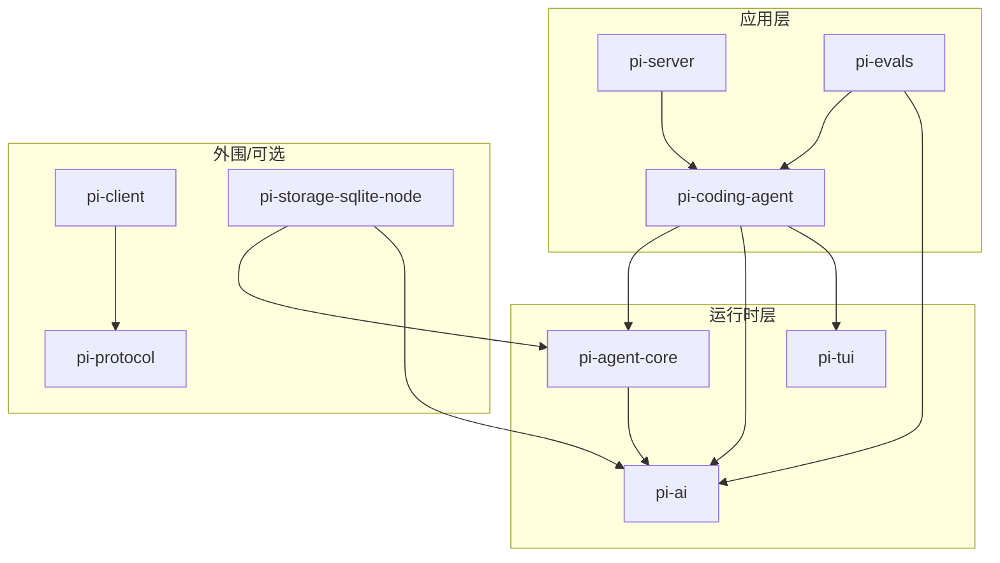

# Monorepo 布局与包依赖关系

## 工作区结构

根目录 `package.json`（`pi/package.json`）是一个 npm workspaces Monorepo：

- `packages/*`：核心包（tui、ai、agent、protocol、client、coding-agent、server、evals）
- `packages/storage/*`：存储后端（sqlite-node）
- `packages/coding-agent/examples/extensions/*`：示例扩展（with-deps、custom-provider-\*、sandbox、gondolin）

所有包使用**同步版本号（lockstep versioning）**：每个 release 一起升版，`patch` = 修复加新增，`minor` = 破坏性变更，无 major。

## 目录一览

```
pi/
├── package.json                 # Monorepo 根（workspaces、scripts、版本号）
├── scripts/                     # 构建/发布/检查脚本
├── packages/
│   ├── ai/                      # @earendil-works/pi-ai       LLM 抽象层
│   │   └── src/
│   │       ├── types.ts         #   核心类型（Model/Message/Context/事件）
│   │       ├── models.ts        #   Models 集合、createProvider
│   │       ├── providers/       #   37+ provider 工厂 + 生成的模型目录
│   │       ├── api/             #   低层 API 实现（stream/streamSimple，10 个）
│   │       ├── auth/            #   鉴权（apiKey / OAuth / credential-store）
│   │       └── utils/           #   EventStream、retry、校验等
│   ├── agent/                   # @earendil-works/pi-agent-core  Agent 运行时
│   │   └── src/
│   │       ├── agent-loop.ts    #   核心循环（runAgentLoop）
│   │       ├── agent.ts         #   Agent 类（有状态封装）
│   │       ├── harness/         #   AgentHarness + 会话/压缩/技能/工具
│   │       │   ├── agent-harness.ts
│   │       │   ├── session/     #   Session、JSONL/内存存储
│   │       │   ├── compaction/  #   上下文压缩
│   │       │   ├── tools/       #   内置工具（read/write/edit/bash）
│   │       │   └── env/         #   Node 执行环境
│   │       └── proxy.ts         #   stream 代理（SSE）
│   ├── coding-agent/            # @earendil-works/pi-coding-agent  CLI 应用
│   │   └── src/
│   │       ├── cli.ts / main.ts #   入口
│   │       ├── core/            #   AgentSession/ModelRuntime/ResourceLoader/工具
│   │       ├── modes/           #   interactive / print / rpc 三种模式
│   │       ├── extensions/      #   扩展系统（llama 等）
│   │       └── bun/             #   Bun 二进制专用入口
│   ├── tui/                     # @earendil-works/pi-tui    终端 UI 库
│   ├── protocol/                # @earendil-works/pi-protocol  CBOR 协议
│   ├── client/                  # @earendil-works/pi-client  RPC 客户端
│   ├── server/                  # @earendil-works/pi-server  守护进程（实验性）
│   ├── storage/sqlite-node/     # SQLite 会话存储后端
│   └── evals/                   # 评测（private）
├── .pi/                         # 仓库自身的 pi 配置（prompts/skills/extensions）
├── pi-test.sh                   # 从源码运行 pi（开发常用）
└── test.sh                      # 跑全部非 LLM 测试（隔离环境）
```

## 包依赖关系图



### 依赖要点

- **`pi-coding-agent`** **依赖** **`pi-agent-core`** **+** **`pi-ai`** **+** **`pi-tui`**：它是唯一"吃掉"三个运行时包的消费者，负责把 LLM 抽象、Agent 运行时与 TUI 组装成一个产品。
- **`pi-agent-core`** **依赖** **`pi-ai`**：Agent 循环在 LLM 边界使用 pi-ai 的 `Message[]` 与 `EventStream`。
- **`pi-protocol`** **/** **`pi-client`** **自成一体**：与 coding-agent **没有依赖关系**，是一套实验性的 CBOR 远程会话 RPC 栈（为未来 pi-chat 类远程 UI 准备），目前仅被浏览器冒烟测试使用。
- **`pi-server`** **反向依赖** **`pi-coding-agent`**：它消费 coding-agent 的 RPC 模式来监督子进程实例，是独立守护进程（未发布）。
- **`pi-storage-sqlite-node`** **依赖** **`pi-agent-core`**：是 JSONL 会话存储之外的可选后端，当前仅被 agent 包测试使用；coding-agent 生产路径用 JSONL。

## 构建顺序

根 `package.json` 的 `build` 脚本给出了正确的构建顺序（按依赖反向）：

```
tui → ai → agent → storage/sqlite-node → protocol → client → coding-agent → server
```

其中 `ai` 的构建会先运行模型目录生成（`npm run generate-models`），`build:offline` 用已有模型数据离线重建。

## 关键根脚本速查

| 命令                                              | 作用                           |
| ----------------------------------------------- | ---------------------------- |
| `npm install --ignore-scripts`                  | 安装依赖（不跑生命周期脚本，仓库强制）          |
| `npm run build`                                 | 全量构建                         |
| `npm run build:offline`                         | 用已有模型数据离线构建                  |
| `npm run check`                                 | Lint + 格式 + 类型检查 + 依赖/锁文件校验  |
| `./test.sh`                                     | 跑全部非 LLM 测试（无 API key 的隔离环境） |
| `./pi-test.sh`                                  | 从源码运行 pi（保留调用方 cwd）          |
| `npm run eval -- --provider openai --model ...` | 运行 evals 评测                  |

详见 [05-development/01-build-run.md](../05-development/01-build-run.md)。
