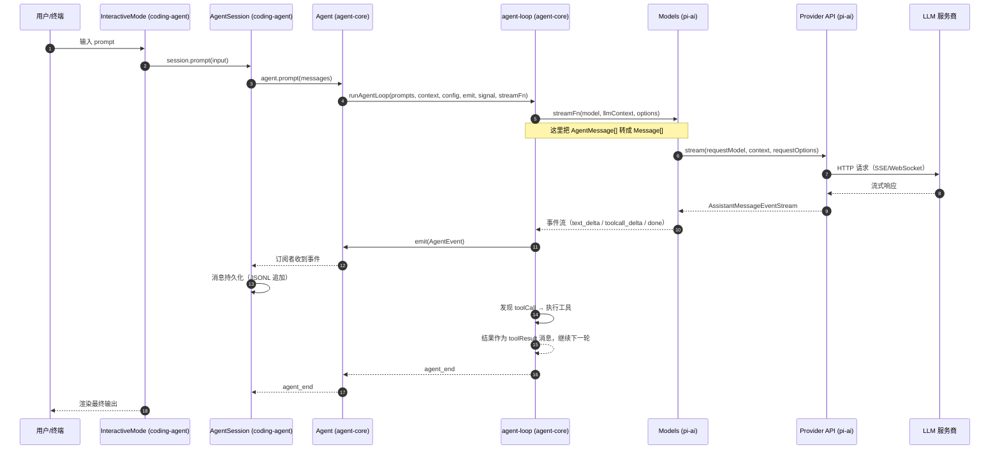

# 元素关联：整体数据流与调用链

> 第 2 层：全局结构（第二篇）。上一篇拆解了元素，这一篇把它们**关联起来**——核心是一张端到端的数据流图 + 几条贯穿系统的主链路。读完你会知道"数据从终端一路流到大模型、再流回来的完整路径"。

## 端到端总览



## 链路 1：一次 prompt 的完整生命周期

1. **输入**：用户输入到达运行模式（TUI 输入框 / 管道 stdin / RPC 命令）。
2. **会话层**：`AgentSession.prompt()`（`packages/coding-agent/src/core/agent-session.ts`）解析输入、加载技能/上下文、做认证校验与压缩检查，然后调用 `Agent.prompt()`。
3. **状态封装层**：`Agent.prompt()`（`packages/agent/src/agent.ts`）归一化输入，把消息并入内部 transcript，调用 `runAgentLoop()`。
4. **核心循环**：`runAgentLoop()`（`packages/agent/src/agent-loop.ts`）：
   - 发起 `agent_start` / `turn_start` / `message_start` 事件；
   - `streamAssistantResponse()`：把 `AgentMessage[]` 经 `convertToLlm` 转成 pi-ai 的 `Message[]`，调用 `streamFn`（默认是 `ModelRuntime.streamSimple`）；
   - 监听流事件，实时更新上下文中的 `partial` 消息并 `emit(message_update)`；
   - 流结束得到最终 `AssistantMessage`；
   - 若消息含 `toolCall` 内容块，则执行工具（并行/顺序），把 `toolResult` 消息写回上下文；
   - 循环直到没有更多工具调用与排队消息，发 `agent_end`。
5. **持久化**：`AgentSession` 在 `message_end` 事件时把 user/assistant/toolResult 消息追加写入 JSONL 会话文件（`sessionManager.appendMessage`）。
6. **输出**：TUI 渲染增量文本；print 模式输出最终文本/JSON；RPC 模式逐事件输出 JSONL。

## 链路 2：一次 LLM 调用（pi-ai 内部）

```
streamFn(model, context, options)
  → Models.stream(model, context, options)          // models.ts
      → lazyStream()                                 // 同步返回空流，后台初始化
      → applyAuth()                                  // 解析 apiKey/OAuth 凭据
      → 合并请求头（provider auth → model.headers → options.headers）
      → 按 model.api 分发到对应 ProviderStreams
      → provider api 模块（如 anthropic-messages.ts）
          → 构造 SDK client
          → 发起流式请求
          → processStream：上游 SSE → 标准事件（text_delta/thinking_delta/toolcall_delta...）
          → 计算 usage 与 cost
          → end() 终止流
```

要点：
- **返回的永远是 `AssistantMessageEventStream`，不是 Promise**。错误（网络、鉴权、SDK 异常）一律以 `error` 事件 + `stopReason:"error"` 的最终消息终止流，绝不抛出。
- **惰性加载**：provider 工厂只 import `.lazy.ts` 包装，服务商 SDK（openai、@anthropic-ai/sdk、@google/genai…）在首次请求时才动态加载，保证包体积与启动速度。

## 链路 3：工具调用执行

```
assistant 消息含 toolCall 内容块
  → executeToolCalls()                     // agent-loop.ts
      → prepareToolCall()                  // 查找工具 → prepareArguments → validateToolArguments → beforeToolCall 钩子（可 block）
      → executePreparedToolCall()          // tool.execute(id, args, signal, onUpdate)
          → coding-agent 的 ToolDefinition.execute()（如 bash spawn / read 文件）
          → 流式 onUpdate 事件（tool_execution_update）
      → finalizeExecutedToolCall()         // afterToolCall 钩子（可打补丁 / 设置 terminate）
      → 生成 toolResult 消息写回上下文
  → 下一轮循环（模型看到工具结果，继续推理）
```

- 执行策略：默认**并行**（`Promise.all`），配置 `toolExecution:"sequential"` 或某工具声明 `executionMode:"sequential"` 时顺序执行。
- 当 `stopReason === "length"`（输出被 token 上限截断）时，**所有工具调用判为失败**而非执行，避免执行被截断的残缺参数（`failToolCallsFromTruncatedMessage`）。

## 链路 4：会话持久化与压缩

```
会话（session）模型：append-only 条目树（JSONL，每行一个 JSON 条目）
  ├── message / thinking_level_change / model_change / active_tools_change
  ├── compaction（摘要条目）
  ├── branch_summary / custom / custom_message / label / leaf
  └── session_info

写入时机：message_end 事件 → session.appendMessage() → appendFile（JSONL 追加）
        （另有 pending writes + save point：忙碌期间的写入排队，在保存点/结算时刷新）

压缩触发：AgentSession 在每轮前检查 shouldCompact()
  → estimateContextTokens vs contextWindow - reserveTokens
  → prepareCompaction() 找切点（保留最近 keepRecentTokens）
  → generateSummaryWithUsage() 用 LLM 生成结构化摘要
  → session.appendCompaction()，上下文从摘要之后继续
```

## 链路 5：事件的双通道

Agent 循环产生的事件（`AgentEvent`）流向两个通道：

```
agent-loop --emit--> Agent.processEvents() --> Agent.subscribe() 的监听器
                         │
                         └---> AgentSession._handleAgentEvent()
                                ├── 队列排空（steer/followUp）
                                ├── 会话持久化（message_end → JSONL）
                                ├── 扩展事件（ExtensionRunner.emit*）
                                └── 模式订阅者（TUI 组件 / print 输出 / RPC JSONL）
```

## 进程与运行模式

- **单进程**：interactive / print / json 模式都在一个 Node/Bun 进程内完成。
- **RPC 模式**（`pi --mode rpc`）：stdin/stdout 传输 JSONL 请求与事件，供外部进程（server 守护进程、SDK、编辑器插件）驱动。
- **Server 守护进程**（实验性）：通过 Unix socket 监督多个 `pi --mode rpc` 子进程。
- **Bun 二进制 vs Node**：同一套 `main.ts`；Bun 入口额外注册 OAuth 流程、还原沙箱环境、注册 Bedrock（`packages/coding-agent/src/bun/cli.ts`）。

> 下一步：深入了解贯穿这一切的核心抽象——[03-message-and-stream.md](03-message-and-stream.md)。
