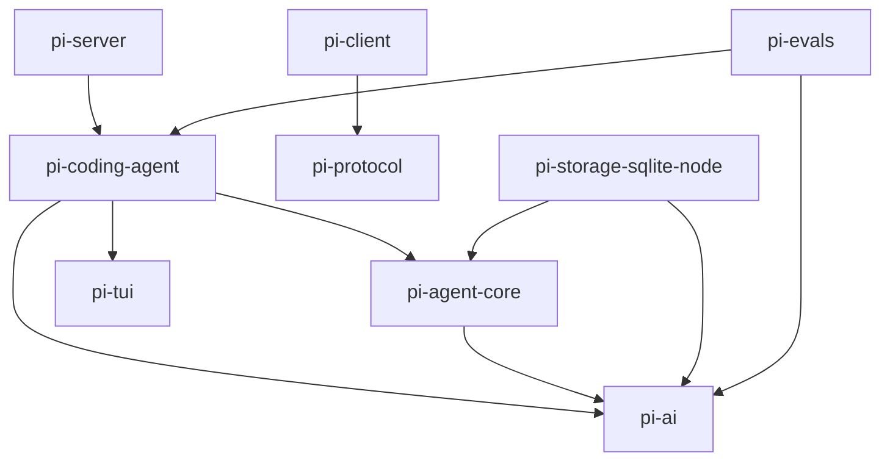

# 其他包：protocol / client / server / storage / evals

> 第 3 层：局部深入（第五篇）。这些包**不参与 coding-agent 的生产主链路**（除 tui 外），是独立或实验性组件。理解它们的定位有助于看清整个生态的全貌——先交代它们在全局中的位置，再逐个看。

## 0. 提升到全局：它们在全景中的位置

回到全局图，这几个包是**外围件**，主链路（coding-agent → agent-core → pi-ai）并不经过它们：

```
┌──────────────────────────────────────────────┐
│ 主链路（三大核心包）                            │
│   coding-agent → agent-core → pi-ai → 大模型   │
└──────────────────────────────────────────────┘
        ↑ 无运行时依赖 ↑
┌──────────────────────────────────────────────┐
│ 外围与实验组件                                 │
│   protocol + client  ← 一套独立的 CBOR 远程     │
│   │                    RPC 栈（为 pi-chat 准备）│
│   server → coding-agent（Unix socket 守护进程）│
│   storage/sqlite-node → agent-core（可选后端） │
│   evals → coding-agent + pi-ai（评测，private）│
└──────────────────────────────────────────────┘
```

阅读建议：**想理解 Pi 的核心能力，跳过本篇不影响**；**想做远程/浏览器接入或深度定制存储时再回来看**。

## 1. @earendil-works/pi-protocol（CBOR 协议）

**定位**：实验性 pi 远程会话协议的运行时无关 schema、类型、CBOR 编码与字节流分帧。协议版本 2，线格式：`[4 字节大端 uint32 长度][定长 CBOR 载荷]`。唯一依赖 `typebox`。

### 消息类型（`src/schemas.ts`）

- **客户端消息**：`hello`（version + token，必须是第一帧）、`request` 信封（`{type:"request", id, request: Command}`）。
- **命令（JSON-RPC 式方法）**：`list / create / attach / detach / prompt / steer / abort / set_model / set_thinking`；各自有对应 `CommandResult`（多数返回 `SessionSnapshot`）。
- **服务端消息**：`hello`（ServerSnapshot）、`hello_error`、`response` 信封、`event` 信封。
- **服务端事件**：`server_snapshot / session_snapshot / session_progress（TranscriptProgress：item_started/assistant_delta/item_updated/item_finished）/ session_removed`。
- **快照/模型**：`ServerSnapshot`、`SessionSnapshot`（revision + transcript + queuedSteer）、`ModelRef`、`ThinkingLevel`、`SessionPhase`（idle/turn/compaction/branch_summary/retry）。
- 所有 schema `additionalProperties: false`（拒绝未知字段）。

### 关键文件

| 文件 | 职责 |
|---|---|
| `src/codec.ts` | 编解码 + 校验 + 增量解码器（容忍任意分片/合并） |
| `src/framing.ts` | 分帧（默认最大帧 16 MiB） |
| `src/cbor/` | 严格 RFC 8949 子集实现（拒绝 tag、不定长、不安全数值） |

## 2. @earendil-works/pi-client（RPC 客户端）

**定位**：传输层无关（transport-neutral）的远程 pi 会话客户端。**不含任何 Node 特有导入，可跑在浏览器**。唯一依赖 pi-protocol。

### 架构

- **`src/transport.ts`**：`ByteTransport { send(); close() }` + `ByteTransportFactory`——任何有序字节流（WebSocket / Unix socket）都可接入。
- **`src/connection.ts`**：连接状态机 `disconnected → connecting → connected`；`connect()` 发 `hello`（版本 + token），等服务端 `hello` 完成握手；增量解码入站帧。
- **`src/client.ts`**：`PiClient`——请求按 `request-N` ID 关联；`ClientState` 持有权威快照；API：`connect/reconnect/disconnect`、`subscribe/onEvent`、`listSessions()`、`createSession()`、`attachSession()`，返回 `PiSessionHandle`（prompt/steer/abort/setModel/…）。
- **`src/state.ts`**：按 `revision` 单调合并快照；快照事件改状态，`session_progress` 只透传（临时 UI 提示）。

### 关系与现状

client + protocol 组成**独立的 CBOR 远程会话 RPC 栈**。**coding-agent 不依赖它**；当前唯一消费方是根目录 `scripts/browser-smoke-entry.ts`（浏览器冒烟测试）。为 pi-chat 类远程 UI 准备。

## 3. @earendil-works/pi-server（守护进程，实验性）

**定位**：Unix 域套接字 IPC 守护进程，负责**监督（supervise）coding-agent 的 RPC 子进程实例**。反向依赖 coding-agent。

### API

- **CLI**（`src/cli.ts`）：`server serve|list|spawn [--cwd][--label]|status <id>|stop <id>|rpc <id> <json>|rpc-stream <id>`。
- **IPC 协议**（`src/ipc/protocol.ts`）：**换行分隔 JSON（JSONL）**，非 CBOR。请求：`spawn/list/stop/status/rpc/rpc_stream`。
- **传输**（`src/ipc/server.ts` + `client.ts`）：`node:net` Unix socket，路径 `~/.pi/server/server.sock`（`PI_SERVER_DIR` 可覆盖）。

### 关键文件

| 文件 | 职责 |
|---|---|
| `src/supervisor.ts` | `ServerSupervisor`：spawn RPC 子进程、记录实例状态（starting/online/stopping/stopped/error）、多路订阅会话事件 |
| `src/rpc-process.ts` | 子进程 JSONL-over-stdio 封装 |
| `src/handler.ts` | IPC 请求分发 + rpc_stream 桥接 |
| `src/serve.ts` | 启动/关闭流程 |

仓库内没有代码反向依赖它，是独立实验守护进程（推测配合 Radius/移动端远程使用），**未发布**。

## 4. @earendil-works/pi-storage-sqlite-node（SQLite 存储后端）

**定位**：为 pi-agent-core 会话提供 Node `node:sqlite` 存储后端：`SqliteDatabase` 适配器 + SQLite 会话存储（迁移、物化视图）。依赖：pi-ai、pi-agent-core。

### Schema（`src/sqlite/migrations/001_initial.sql`，6 张表）

| 表 | 说明 |
|---|---|
| `sessions` | id、cwd、parent_session_id、metadata、active_leaf_id |
| `session_entries` | 仅追加的条目树（session_id、id、entry_seq、parent_id、type、payload） |
| `session_sequences` | 每会话单调序号 |
| `branch_entries` | 分支物化 |
| `session_materialized` / `entry_materialized` | 物化视图缓存（加速路径重建与统计） |

### 关键文件

| 文件 | 职责 |
|---|---|
| `src/index.ts` | `NodeSqliteDatabase`（把 `node:sqlite` 包成异步接口）、`createNodeSqliteFactory()` |
| `src/sqlite/repo.ts` | `SqliteSessionStore implements SessionStore` |
| `src/sqlite/storage/index.ts` | `SqliteSessionStorage implements SessionStorage`（追加时同步物化状态） |
| `src/sqlite/migrations.ts` | 迁移管理（WAL、synchronous=FULL） |

### 现状

与 JSONL 后端平级的**可选后端**（`packages/agent/README.md` 说明：拆到独立包避免核心包默认引入原生 SQLite 依赖）。**当前仅 agent 包测试使用**（`packages/agent/test/harness/sqlite-node.test.ts`）；coding-agent 生产路径走 JSONL。

## 5. @earendil-works/pi-evals（评测，private）

**定位**：模型驱动的行为评测。把真实 `AgentSession` 适配到 `vitest-evals`，在隔离的临时项目/agent 目录运行，附原生 Pi 会话 JSONL 产物（`.eval/runs.jsonl` + `sessions/`）。

- 主要源码：`src/pi-harness.ts`（`createPiCodingAgentHarness`）、`src/smoke.eval.ts`、`src/extensions.eval.ts`、`src/vitest-evals/*`（对比表、通过率 lift、judge 打分）。
- 运行：仓库根 `npm run eval -- --provider openai --model ...`。

## 依赖关系小结



- **独立栈**：protocol + client（CBOR RPC），与 coding-agent 无耦合。
- **反向依赖**：server 依赖 coding-agent；evals 依赖 coding-agent + pi-ai。
- **可选后端**：sqlite-node 只被 agent 测试引用。
