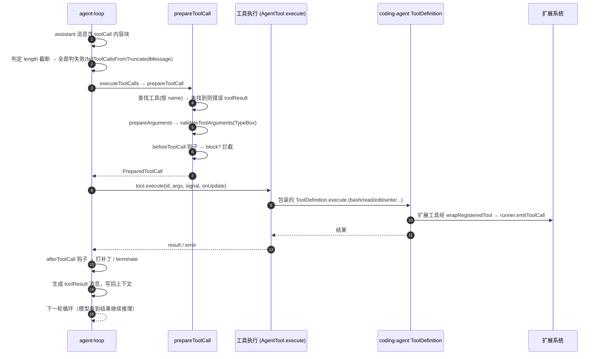

# 工具调用链路

> 第 4 层：细节链路（第四篇）。**全局定位**：这条链路发生在 agent-loop **内层循环**的每一步里——它是 agentic 工作流的核心：模型说"我要调 bash"，Pi 去执行，结果回到模型。上游触发点是 [agent-loop 的 executeToolCalls](02-agent-loop.md)，工具的实际实现则在 coding-agent 的 `core/tools/`（见 [内置工具](../03-packages/03-pi-coding-agent.md#8-内置工具)）。

从"模型发出 toolCall"到"执行结果回到模型"的完整链路。

## 概览



## 步骤 1：识别工具调用

agent-loop 从 `assistantMessage.content` 中过滤 `type === "toolCall"` 的块（`packages/agent/src/agent-loop.ts` L219）。

**截断保护**：若 `stopReason === "length"`（输出被 token 上限截断），调用 `failToolCallsFromTruncatedMessage`（L413-438）把**所有**工具调用判为失败——流式工具参数由尽力而为的 JSON 抢救解析器最终化，可能"能解析但残缺"，执行它们有风险。错误信息会提示模型重新发起完整调用。

## 步骤 2：选择执行策略

`executeToolCalls()`（[agent-loop.ts](file:///e:/MyCoding/LLMAgent/pi/packages/agent/src/agent-loop.ts#L444-L459)）：

```ts
const hasSequentialToolCall = toolCalls.some(
  (tc) => currentContext.tools?.find((t) => t.name === tc.name)?.executionMode === "sequential",
);
if (config.toolExecution === "sequential" || hasSequentialToolCall) {
  return executeToolCallsSequential(...);   // L466：逐个执行，abort 时中断
}
return executeToolCallsParallel(...);        // L522：Promise.all 并行，按原序回填
```

## 步骤 3：准备一次调用（prepareToolCall，L633-697）

```
1. context.tools 按 name 查找工具 → 未找到：{ kind:"immediate", 错误 toolResult }
2. prepareArguments（可选，工具自定义参数改写，L619-631）
3. validateToolArguments（TypeBox schema 校验，失败 → 错误 toolResult）
4. config.beforeToolCall 钩子：
   - 返回 { block: true, reason } → 拦截，生成错误 toolResult
   - signal.aborted → 中止错误
5. 返回 { kind: "prepared", toolCall, tool, args }
```

## 步骤 4：执行（executePreparedToolCall，L699-740）

```ts
const result = await prepared.tool.execute(
  prepared.toolCall.id,
  prepared.args,
  signal,
  (partialResult) => emit({ type: "tool_execution_update", ... }),  // 流式进度
);
```

- 执行期间产生的 `tool_execution_update` 事件会累积并在结束后统一 flush（保证事件顺序）。
- 执行抛错 → `createErrorToolResult(error.message)`，`isError: true`。

## 步骤 5：收尾（finalizeExecutedToolCall，L742-787）

- `config.afterToolCall` 钩子可以：改写 `content/details/usage`、覆盖 `terminate` 标志、覆盖 `isError`。钩子抛错 → 结果转为错误。
- 最终 `createToolResultMessage`（L806-822）把结果归一化为 `ToolResultMessage`（无 content 的未类型化结果补 `[]`），写入上下文并 emit `message_start/message_end`。

## 步骤 6：终止判定

`shouldTerminateToolBatch`（L615-617）：整批工具结果都 `terminate === true` 才终止循环；否则 `hasMoreToolCalls = true`，进入下一轮（模型看到 toolResult 继续推理）。

## 工具的两套形态

| 形态 | 定义处 | 说明 |
|---|---|---|
| `AgentTool` | `packages/agent/src/types.ts` | pi-agent-core 的执行协议：`name/label/description/parameters/prepareArguments/executionMode/execute` |
| `ToolDefinition` | `packages/coding-agent/src/core/tools/` | coding-agent 的定义形态：typebox `parameters` + `execute` + TUI 渲染器 |

两者通过 `wrapToolDefinition`（`packages/coding-agent/src/core/tools/tool-definition-wrapper.ts`）互相转换。扩展注册的工具经 `wrapRegisteredTool`（`packages/coding-agent/src/core/extensions/wrapper.ts`）同样转成 `AgentTool`。

## 内置工具清单（coding-agent）

| 工具 | 文件 | 说明 |
|---|---|---|
| `read` | `packages/coding-agent/src/core/tools/read.ts` | 读文件/图片 |
| `bash` | `packages/coding-agent/src/core/tools/bash.ts` | shell 执行（spawn、进程树终止、输出累积、环境注入） |
| `edit` | `edit.ts` + `edit-diff.ts` | 多目标文本替换，返回 diff |
| `write` | `write.ts` | 写文件（串行队列） |
| `grep` / `find` / `ls` | 各自文件 | 搜索/列目录 |

## 调试锚点

- `beforeToolCall` / `afterToolCall` 钩子：看"工具为什么被拦截/结果为什么被改写"。
- `tool_execution_start/update/end` 事件：观察工具执行过程与耗时。
- coding-agent 的 bash 工具：`OutputAccumulator` 用临时文件保存完整输出，TUI 的 `tool-execution.ts` 组件实时渲染。
