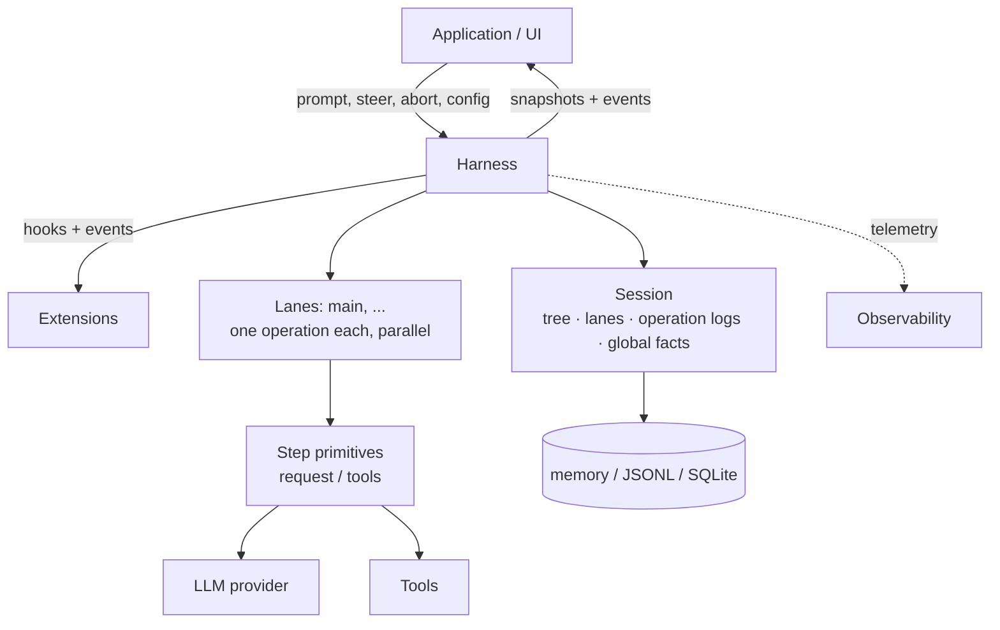
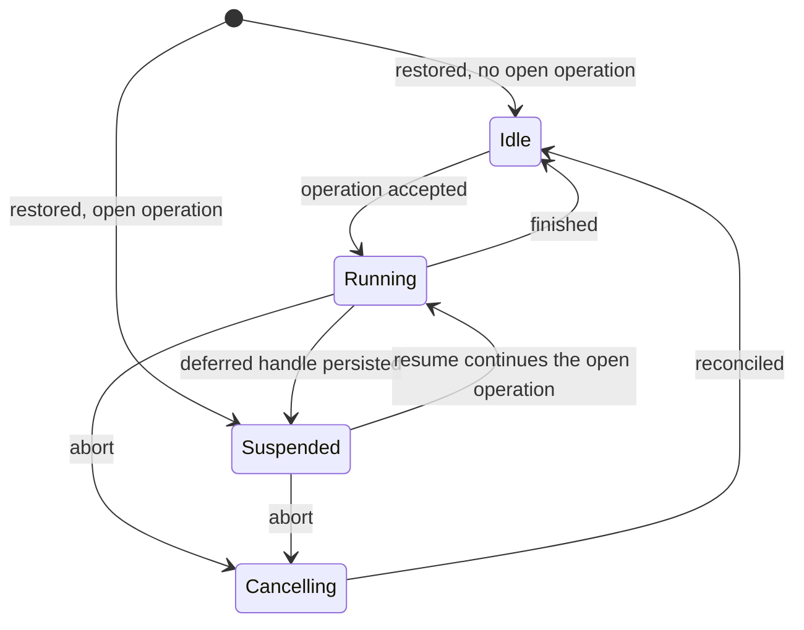

# Durable AgentHarness design 持久化 AgentHarness 设计

> **Compatibility policy.** Old coding-agent v3 JSONL sessions must open and restore idle. This is the only backward-compatibility requirement. All other formats and APIs in `packages/agent/src/harness` and `packages/storage/sqlite-node` (and their respective tests) may break. We do not write migrations, schema versioning, or conversion paths for anything else.
>
> **兼容性策略。** 旧版 coding-agent v3 的 JSONL 会话必须能够打开并恢复为空闲（idle）状态。这是唯一的向后兼容要求。`packages/agent/src/harness` 和 `packages/storage/sqlite-node` 中的所有其他格式与 API（以及各自的测试）都可以破坏性变更。我们不会为其他任何东西编写迁移、schema 版本管理或转换路径。



The harness executes runs against one session. The session holds four kinds of state (section 2). Lanes execute in parallel inside one harness (section 3). Storage backends encode the session (Part III).

harness 针对单个会话（session）执行运行（run）。会话持有四类状态（第 2 节）。多条泳道（lane）在同一个 harness 内并行执行（第 3 节）。存储后端负责编码会话（第三部分）。

# Part I — Concepts 第一部分 — 概念

## 1. Goals 目标

- **Durable runs.** An accepted prompt is a durable operation. After a crash, a new process restores the session. It resumes the run from the last safe boundary. Every state that a crash can produce is recoverable.
  - **持久化运行。** 被接受的提示词（prompt）就是一个持久化操作。崩溃之后，新进程会恢复会话，并从最后一个安全边界继续该次运行。崩溃可能产生的每一种状态都是可恢复的。
- **Lanes.** A session hosts one or more lanes. A lane is a named position in the conversation tree. Each lane runs at most one operation at a time. Lanes run in parallel. A run and its queued messages belong to the lane that accepted them. Example: a Slack channel is a session; each thread is a lane. Interactive pi uses one lane and does not show the concept in its UI. Extensions get the full harness API, including lanes. Example: a subagent tool runs on a second lane of its parent's session.
  - **泳道（lane）。** 一个会话托管一条或多条泳道。泳道是对话树中的一个具名位置。每条泳道同一时刻最多执行一个操作。多条泳道并行运行。一次运行及其排队消息属于接受它们的那条泳道。例如：一个 Slack 频道是一个会话，其中每个话题串（thread）是一条泳道。交互式 pi 只使用一条泳道，并且不在 UI 中暴露这个概念。扩展可以获得完整的 harness API，包括泳道。例如：子代理（subagent）工具运行在其父会话的第二条泳道上。
- **No partial outcomes.** A crash inside any operation — run, compaction, navigation — leaves one of two states: the operation has not happened, or recovery can complete it. Nothing in between is observable.
  - **没有部分完成的结果。** 任何操作（运行、压缩、导航）内部发生崩溃后，只会留下两种状态之一：该操作从未发生，或者恢复流程可以将其完成。中间状态是不可观测的。
- **Harness API.** Events observe execution and cannot change it. Hooks intercept execution and can change it: context, requests, tools, run boundaries. Extensions build on events and hooks.
  - **Harness API。** 事件（event）用于观测执行过程，不能改变它。钩子（hook）拦截执行过程并可以改变它：上下文、请求、工具、运行边界。扩展基于事件和钩子构建。
- **Observability.** All execution is instrumentable for logging and tracing, down to provider request and response internals. This channel is separate from the hook system.
  - **可观测性。** 所有执行过程都可被埋点用于日志与链路追踪，细致到提供方（provider）请求与响应的内部细节。该通道与钩子系统相互独立。
- **UI model.** A client gets one atomic snapshot, then a live event stream. Events are not replayed. Reconnect means a new snapshot.
  - **UI 模型。** 客户端先获得一份原子快照（snapshot），随后接收实时事件流。事件不会重放。重连意味着重新获取一份新快照。
- **Single writer.** One harness writes a session at a time. The serving layer enforces this. All lanes of a session live in that one harness. Restore treats states that a single writer cannot produce as corruption.
  - **单写者。** 同一时刻只有一个 harness 写入某个会话，这由服务层强制保证。会话的所有泳道都存在于那一个 harness 中。恢复时，凡是单写者不可能产生的状态一律视为数据损坏。
- **v3 sessions load.** Old coding-agent v3 JSONL files open unchanged and restore idle.
  - **v3 会话可加载。** 旧版 coding-agent v3 的 JSONL 文件无需改动即可打开，并恢复为空闲状态。

## Non-goals 非目标

- **Exactly-once hook side effects.** State a hook hands to the harness is durable when the call resolves: queued messages, appended entries. Side effects a hook makes on its own are invisible to the harness: HTTP calls, file writes. Interrupted handlers are not re-run on resume. A hook that needs crash-safe external effects must be idempotent, for example keyed by operation id.
  - **钩子副作用的恰好一次（exactly-once）语义。** 钩子交给 harness 的状态在调用完成时即具备持久性：排队消息、追加的条目。钩子自行产生的副作用对 harness 不可见：HTTP 调用、文件写入。被中断的处理器在恢复时不会重新执行。需要崩溃安全外部副作用的钩子必须自身幂等，例如以操作 id 作为幂等键。
- **Provider stream resumption.** Partial streams are never persisted. An interrupted streaming request is retried or abandoned. Deferred requests are different and in scope: the provider returns a handle at once and serves the result later (e.g. `background: true` on a Responses API, batch APIs). pi-ai returns an assistant message with stop reason `deferred` that carries the handle; it is persisted like any assistant message. Redeeming the handle appends a normal assistant message. Recovery sees the unredeemed handle and fetches instead of paying for a new request.
  - **提供方流式响应的续传。** 部分流（partial stream）永远不会被持久化。被中断的流式请求要么重试，要么放弃。延迟请求（deferred request）则不同，属于本设计范围：提供方立即返回一个句柄（handle），稍后再给出结果（例如 Responses API 上的 `background: true`、批量 API）。pi-ai 会返回一条停止原因为 `deferred` 的助手消息，其中携带该句柄；它像任何助手消息一样被持久化。兑现该句柄会追加一条正常的助手消息。恢复流程看到尚未兑现的句柄后会去拉取结果，而不是花钱重新发起请求。
- **Multiple writers.** Two processes on one session are out of scope. The serving layer routes all traffic for a session to the process that holds its harness. Lanes cover the workloads that look like multi-writer: parallel threads over shared history.
  - **多写者。** 两个进程操作同一会话不在范围内。服务层会把某个会话的所有流量路由到持有其 harness 的那个进程。看起来像多写者的负载由泳道来覆盖：在共享历史之上的并行话题串。
- **Replication.** A session lives in one place. Coordination-free sync of diverging copies is a different design. Parked; see open questions.
  - **复制（replication）。** 一个会话只存在于一个地方。对分叉副本进行无协调同步是另一套设计。暂时搁置，参见开放问题。

## 2. What a session is 会话是什么

A session is durable state with four parts:

会话是由四个部分组成的持久化状态：

1. **The tree** — the conversation. Entries with `parentId` links: messages, model/thinking/tool-activation changes, compaction summaries, branch summaries, custom entries. The tree is shared and passive. It belongs to no lane. It only grows; entries are never changed or deleted.
   - **树（tree）** — 即对话本身。条目（entry）之间通过 `parentId` 链接：消息、模型/思考等级/工具启用状态的变更、压缩摘要、分支摘要、自定义条目。树是共享且被动的，不属于任何泳道。它只会增长；条目永不修改或删除。
2. **Lanes** — where work happens. A lane is a name plus a leaf: the entry that future work extends. Every session has the lane `main`. Applications create more, keyed by external identity (a Slack thread id, an email thread id).
   - **泳道（lanes）** — 工作发生的地方。泳道是一个名字加上一个叶子（leaf）：后续工作将从该条目继续延伸。每个会话都有名为 `main` 的泳道。应用可以创建更多泳道，以外部身份标识作为键（Slack 话题串 id、邮件会话 id）。
3. **Lane operation logs** — what happened and what must happen. One flat, chronological record sequence per lane: operation started, task attempted, tool started, message queued, operation finished. This is where durability is implemented: records exist so that a new process can continue a lane's work after a crash. Nothing reads them during normal execution.
   - **泳道操作日志（lane operation logs）** — 记录发生了什么以及还必须发生什么。每条泳道对应一个扁平的、按时间排序的记录序列：操作已开始、任务已尝试、工具已启动、消息已入队、操作已结束。持久化正是在这里实现的：这些记录存在的意义是让新进程能在崩溃后继续该泳道的工作。正常执行期间没有任何逻辑会读取它们。
4. **Global facts** — session-scoped values where the latest write wins: the session name, entry labels. Not part of the tree. Kept as append-only history; readers see the newest value.
   - **全局事实（global facts）** — 会话范围内、后写覆盖先写的值：会话名称、条目标签。它们不属于树。以只追加的历史形式保存；读取方看到的是最新值。

All writes across the four parts share one monotonic sequence number. The sequence orders global-fact history and lets a lane's operation log refer to tree positions.

这四个部分的所有写入共享同一个单调递增的序列号。该序列既为全局事实的历史排序，也让泳道的操作日志能够引用树中的位置。

```text
tree (shared, append-only)          lanes
a ── b ── c ── d                    main            → d   (op log: …)
      └── e ── f                    slack:171943…   → f   (op log: …)

global facts: name = "Refactor auth", label(b) = "checkpoint-1"
```

### Active and passive 主动与被动

The tree and the global facts are passive: shared data, readable by anything.

树和全局事实是被动的：共享数据，任何组件都可以读取。

A lane is active. It owns its leaf, its operation log (at most one open operation), its queues, and its pending writes. Two lanes never share any of these. Every action of a lane produces entries chained to its leaf, or records in its own operation log.

泳道是主动的。它拥有自己的叶子、自己的操作日志（最多一个未关闭的操作）、自己的队列以及待处理写入。两条泳道绝不共享其中任何一项。泳道的每个动作要么产生链接到其叶子的条目，要么在它自己的操作日志中产生记录。

### Invariants 不变量

- The tree is conversation only. No lane state, no orchestration state, no pointers live in it.
  - 树中只有对话。不存放泳道状态、编排状态或任何指针。
- An entry's parent chain never changes. Branches share prefixes; nothing is copied.
  - 条目的父链永不改变。分支之间共享前缀，不做任何复制。
- A lane's leaf moves in exactly two ways: the lane appends an entry (leaf becomes that entry), or the lane navigates (leaf jumps to an existing entry).
  - 泳道的叶子只有两种移动方式：泳道追加一个条目（叶子变为该条目），或泳道执行导航（叶子跳转到某个已存在的条目）。
- Operation-log records never affect the tree. Deleting every operation log leaves a complete, valid conversation.
  - 操作日志记录永不影响树。即使删除全部操作日志，留下的仍是一份完整、有效的对话。
- At most one operation is open per lane. A state where one lane has two open operations is corruption.
  - 每条泳道最多有一个未关闭的操作。一条泳道出现两个未关闭操作的状态即为数据损坏。
- Entries are shared; records are not. Two lanes may have the same entry on their paths. A record belongs to exactly one lane.
  - 条目是共享的，记录不是。两条泳道的路径上可以包含同一个条目；而一条记录只属于唯一一条泳道。

Records are not tree entries because they describe execution, not conversation: they must never enter model context, transcripts, branch queries, or forks, and within one lane their order is already their meaning — parent links would add nothing.

记录不是树条目，因为它们描述的是执行过程而非对话内容：它们绝不能进入模型上下文、转录（transcript）、分支查询或分叉（fork）；而且在单条泳道内，它们的顺序本身就承载了全部含义——父链接不会带来任何额外信息。

## 3. Lanes 泳道

A lane is a named position in the tree plus the work serialized on it. The closest existing concept is a git branch checked out in its own worktree: a name attached to a position, advanced by new work, movable to any entry without rewriting history, and never checked out twice. One difference to git intuition: navigation moves a lane to any entry, not only forward.

泳道是树中的一个具名位置，加上在该位置上串行化执行的工作。最接近的既有概念是在独立 worktree 中检出的 git 分支：一个附着在某位置上的名字，随新工作前进，可以在不重写历史的前提下移动到任意条目，且绝不会被同时检出两次。与 git 直觉的一个差别是：导航可以把泳道移动到任意条目，而不只是向前。

Every session has the lane `main`. `main` cannot be deleted. Applications create further lanes with a name and an anchor entry. Lane names are application keys: a Slack thread id, an email thread id. No UI lists lanes in the abstract; the platform's own UI (the thread list) plays that role.

每个会话都有名为 `main` 的泳道，`main` 不可删除。应用可以用一个名字加一个锚点条目创建更多泳道。泳道名就是应用层的键：Slack 话题串 id、邮件会话 id。没有任何 UI 会抽象地罗列泳道；扮演这一角色的是平台自身的 UI（话题串列表）。

A lane owns:

泳道拥有：

- **Its leaf.** New entries chain to it and move it. Navigation jumps it.
  - **它的叶子。** 新条目链接到叶子上并推动它前进；导航则让它跳转。
- **Its operation log.** At most one open operation. A second operation on a busy lane is rejected; other lanes are unaffected.
  - **它的操作日志。** 最多一个未关闭的操作。向繁忙的泳道提交第二个操作会被拒绝，其他泳道不受影响。
- **Its queues.** Steering, follow-ups, and next-run messages target one lane.
  - **它的队列。** 引导消息（steering）、后续消息（follow-up）和下次运行消息（next-run）都只面向单条泳道。
- **Its configuration view.** Model, thinking level, and active tools are entries on the path behind the lane's leaf. Two lanes can run different models without knowing of each other. Tool implementations, resources, and stream options are harness-global; only their activation is per-lane.
  - **它的配置视图。** 模型、思考等级和已启用工具都是泳道叶子回溯路径上的条目。两条泳道可以各自运行不同的模型而互不知情。工具实现、资源和流式选项是 harness 全局的，只有它们的启用状态是按泳道区分的。

Rules:

规则：

- Lanes run operations in parallel. The harness stays the single writer; lane records and entries interleave in the shared sequence.
  - 泳道并行执行操作。harness 仍是唯一写者；泳道记录与条目在共享序列中交错排列。
- Creating a lane copies nothing. Deleting a lane deletes its name, its queues, and its operation log — never entries.
  - 创建泳道不复制任何内容。删除泳道只删除它的名字、队列和操作日志——永不删除条目。
- Two lanes at the same leaf diverge on their next append. The tree handles this; no coordination exists between lanes.
  - 处于同一叶子上的两条泳道会在各自的下一次追加时发生分叉。树本身即可处理这种情况；泳道之间不存在任何协调。
- A lane with an unfinished operation restores as suspended, independently of its siblings. Suspension has a reason: crash, or a deferred provider request (section 1).
  - 带有未完成操作的泳道会恢复为挂起（suspended）状态，与其兄弟泳道彼此独立。挂起有其原因：崩溃，或一次延迟的提供方请求（第 1 节）。

## 4. How work executes 工作如何执行

### Operations 操作

An operation is the unit of durable work on a lane. Three kinds:

操作是泳道上持久化工作的基本单位。共三种：

- **Run** — an accepted prompt, through all automatic continuations: tool calls, steering, follow-ups, auto-compaction. Ends when nothing is pending.
  - **运行（run）** — 一个被接受的提示词，贯穿所有自动续接过程：工具调用、引导、后续消息、自动压缩。当没有任何待处理项时结束。
- **Compaction** — replaces old context with a summary entry.
  - **压缩（compaction）** — 用一个摘要条目替换旧的上下文。
- **Navigation** — moves the lane's leaf to an existing entry, optionally with a branch summary.
  - **导航（navigation）** — 把泳道的叶子移动到某个已存在的条目，可选地附带一份分支摘要。

An operation is accepted before it executes. Acceptance is durable: after a crash, an accepted operation is either completed by recovery or explicitly closed. Every operation ends with one outcome: `completed`, `failed`, `aborted` (stopped by abort), or `declined` (vetoed by a hook before any effect).

操作在执行之前先被接受。接受这一动作是持久化的：崩溃之后，已被接受的操作要么由恢复流程完成，要么被显式关闭。每个操作以以下四种结果之一结束：`completed`、`failed`、`aborted`（被中止）或 `declined`（在产生任何副作用之前被钩子否决）。

### Runs, steps, tasks 运行、步骤与任务

A run is a sequence of steps. A step: one task producing an assistant message, plus the complete tool batch that message requested.

一次运行是一串步骤（step）。一个步骤是指：一个产出助手消息的任务（task），加上该消息所请求的完整工具批次。

A task is a retryable unit of work inside an operation: produce an assistant message, a compaction summary, or a branch summary. A task may make zero, one, or several provider requests. A failed attempt retries the same task; the attempt count is durable and survives restarts. A deferred provider request ends a task attempt early: the handle arrives inside a persisted assistant message, the lane suspends, and redemption later appends the real result (section 1).

任务是操作内部可重试的工作单元：产出一条助手消息、一份压缩摘要或一份分支摘要。一个任务可能发起零次、一次或多次提供方请求。失败的尝试会重试同一个任务；尝试次数是持久化的，可跨重启保留。延迟的提供方请求会提前结束一次任务尝试：句柄随一条被持久化的助手消息抵达，泳道进入挂起，随后的兑现操作再追加真正的结果（第 1 节）。

### Queues and deferred writes 队列与延迟写入

Two mechanisms carry input into a running lane. They differ in abort behavior:

有两种机制把输入送进正在运行的泳道。它们在中止（abort）行为上有所不同：

- **Queues** carry conversational intent: `steer` corrects the current work, `followUp` adds work for when the model would stop, `nextRun` seeds the lane's next run. Steering and follow-ups die on abort; their payloads are returned to the caller. Next-run messages survive.
  - **队列（queues）** 承载对话意图：`steer` 用于纠正当前工作，`followUp` 在模型本应停止时追加工作，`nextRun` 为泳道的下一次运行预置内容。引导和后续消息在中止时被丢弃，其载荷会返还给调用方；下次运行消息则得以保留。
- **Deferred writes** carry facts: entries and configuration changes requested while a step is in flight. They survive abort and are applied even during cancellation.
  - **延迟写入（deferred writes）** 承载事实：在某个步骤执行途中请求的条目与配置变更。它们在中止时依然保留，甚至在取消过程中也会被应用。

Both are durable at acceptance: the accepting call writes a record with the full payload to the lane's operation log, then resolves. The tree entry is written later, when the item is applied or consumed — the position where the model first sees it. If the process dies between acceptance and the tree write, recovery reads the record and performs the append. Accepted input is never lost.

两者都在被接受的那一刻具备持久性：接受调用会把携带完整载荷的记录写入泳道的操作日志，然后返回。树条目稍后才写入——在该项被应用或消费时，也就是模型第一次看到它的位置。如果进程在“接受”与“写入树”之间死亡，恢复流程会读取记录并完成追加。已被接受的输入永不丢失。

### Checkpoints 检查点

Between steps, the lane passes a checkpoint:

在步骤之间，泳道会经过一个检查点：

1. Apply pending deferred writes.
   - 应用待处理的延迟写入。
2. Consume queued steering messages.
   - 消费队列中的引导消息。
3. Compact if the next request would not fit.
   - 如果下一次请求放不下，就执行压缩。

A step with tool calls always forces another step; the model must see its tool results answered. Follow-up messages are consumed only when tool continuation and steering are exhausted. The run ends when a checkpoint finds nothing pending.

带有工具调用的步骤总会强制产生下一个步骤；模型必须看到它的工具结果得到回应。只有在工具续接和引导都耗尽之后，才会消费后续消息。当某个检查点发现没有任何待处理项时，本次运行结束。

### Append-only context 只追加的上下文

> Across the requests of a lane, provider context only grows at the tail. An insertion before the previous request's tail invalidates the provider's KV cache from that point on and multiplies token cost.
>
> 在一条泳道的历次请求之间，提供方上下文只在尾部增长。在上一次请求尾部之前插入内容，会使提供方的 KV 缓存从该点起全部失效，并成倍放大 token 成本。

This invariant is why mid-step writes defer to checkpoints: checkpoint application appends at the tail. Compaction is the one deliberate exception; it trades one full cache invalidation for a smaller context.

正是这一不变量导致步骤中途的写入要延迟到检查点：检查点的应用发生在尾部追加。压缩是唯一有意为之的例外；它用一次完整的缓存失效换取更小的上下文。

### Lane lifecycle 泳道生命周期



- States are per lane. One exception: a failed storage write faults the whole harness. A faulted harness stops all effects and rejects all calls; after the cause is fixed, reopening restores each lane from its records.
  - 状态是按泳道划分的。唯一的例外是：存储写入失败会让整个 harness 进入故障（faulted）状态。故障中的 harness 会停止一切副作用并拒绝所有调用；在故障原因被修复后，重新打开会依据各自的记录恢复每条泳道。
- **Suspended** means: an operation is open, nothing executes. Reached by restore after a crash, or deliberately when a deferred handle is persisted. `resume()` continues the operation; `abort()` closes it without further execution.
  - **挂起（Suspended）** 的含义是：存在一个未关闭的操作，但没有任何东西在执行。它可能来自崩溃后的恢复，也可能是持久化延迟句柄时有意进入的状态。`resume()` 继续该操作；`abort()` 则在不再执行任何工作的情况下关闭它。
- **Abort** records the cancellation durably, signals running effects, and returns. Reconciliation finishes in the background: unresolved tool calls get synthetic results, and the transcript gets a closing assistant message.
  - **中止（Abort）** 会持久化地记录本次取消，向正在进行的副作用发出信号，然后返回。收尾对账（reconciliation）在后台完成：未完结的工具调用会得到合成结果，转录中也会补上一条收尾的助手消息。

### Resume 恢复执行

Resume continues the open operation. It never starts a new one. The entry point is wherever the records end: retry an unfinished task, redeem a deferred handle, reconcile a half-finished tool batch, or continue at the next checkpoint. Queued messages and deferred writes accepted before the crash are still pending and apply normally.

恢复执行会继续那个未关闭的操作，它绝不会开启新的操作。入口点就是记录终止的地方：重试未完成的任务、兑现延迟句柄、对半完成的工具批次做收尾对账，或者从下一个检查点继续。崩溃前已被接受的排队消息和延迟写入仍处于待处理状态，并会正常生效。

# Part II — How execution is recorded 第二部分 — 执行如何被记录

Part II is backend-neutral. It defines the records a lane writes, when it writes them, and how recovery reads them back. Part III maps this onto APIs and storage.

第二部分与后端无关。它定义泳道写入哪些记录、何时写入，以及恢复流程如何读回它们。第三部分再把这些映射到 API 与存储上。

## 5. Records 记录

### The durability rule 持久化规则

> Before an effect: write an intent record that names what will happen and the ids it will produce. After the effect: append the result as an entry with exactly those ids.
>
> 在产生副作用之前：写入一条意图（intent）记录，说明将要发生什么以及它将产生哪些 id。在副作用之后：以恰好这些 id 把结果作为条目追加进去。

There is no multi-record atomicity and none is needed. Each record and each entry is durable alone. A crash between intent and result leaves the intent unfulfilled; recovery decides per intent type: complete it, retry it, or close it with a synthetic result. An intent is fulfilled if and only if an entry with its provisioned id exists. A provisioned id that exists with different content is corruption.

这里不存在跨记录的原子性，也不需要。每条记录、每个条目各自独立地具备持久性。发生在意图与结果之间的崩溃会留下一个未兑现的意图；恢复流程按意图类型决定处理方式：完成它、重试它，或用一个合成结果关闭它。当且仅当存在一个使用了其预分配 id 的条目时，该意图才算已兑现。若某个预分配 id 对应的条目内容不一致，则属于数据损坏。

### Provisioned ids 预分配 id

Intent records carry the ids of entries that do not exist yet:

意图记录携带的是尚不存在的条目的 id：

```ts
/** An entry payload with its id pre-allocated. parentId, seq, and timestamp
    are assigned by storage when the entry is appended: it chains to the
    lane's then-current leaf. */
type ProvisionedEntry<T extends Entry = Entry> = Omit<T, "parentId" | "seq" | "timestamp">;
```

### Record catalog 记录目录

Every record belongs to one lane's operation log. Records that belong to an operation carry `runId`: the id of that operation's `operation_started` record. `queue_enqueued` for the next-run queue is the one record without `runId`; it is consumed by the lane's next run.

每条记录都属于某一条泳道的操作日志。属于某个操作的记录都携带 `runId`：即该操作的 `operation_started` 记录的 id。面向下次运行队列的 `queue_enqueued` 是唯一不带 `runId` 的记录；它会被该泳道的下一次运行消费。

```ts
interface RecordBase {
  id: string;
  seq: number;            // shared sequence, section 2
  lane: string;
  timestamp: number;      // Unix ms
}

// Acceptance boundary of an operation. Everything decided before acceptance
// is persisted here. This record's own id IS the runId that all other
// records of the operation carry.
interface OperationStarted extends RecordBase {
  type: "operation_started";
  sourceLeafId: string | null;        // the lane's leaf at acceptance
  intent:
    | {
        kind: "run";
        /** Prompt plus before_run injections. Full payloads, provisioned ids. */
        initialMessages: ProvisionedEntry[];
        /** Present only when a hook overrode the system prompt; fixed for the
            whole run. Absent: the systemPrompt callback runs per request. */
        systemPromptOverride?: string;
        /** Opaque per-extension state, returned to before_resume. */
        resumeData?: Record<string, JsonValue>;
      }
    | {
        kind: "compaction";
        customInstructions?: string;
        resultEntryId: string;          // provisioned compaction entry
      }
    | {
        kind: "navigation";
        targetId: string;               // destination entry; null = root
        summarize: boolean;
        customInstructions?: string;
        label?: string;                 // global fact, written at completion
        summaryEntryId?: string;        // provisioned branch-summary entry
      };
}

// Written when abort() resolves. A request marker, not a terminal state:
// reconciliation follows, then operation_finished with outcome "aborted".
// Kills this operation's steer/follow-up queue items; next-run items survive.
interface AbortRequested extends RecordBase {
  type: "abort_requested";
  runId: string;
  reason: "user" | "shutdown";
}

// Closes the operation. failed = orderly durable failure (for example,
// retries exhausted). aborted = closed by abort. declined = vetoed by a
// hook before any effect.
interface OperationFinished extends RecordBase {
  type: "operation_finished";
  runId: string;
  outcome: "completed" | "aborted" | "failed" | "declined";
  error?: { code: string; message: string };
}

// Written before each attempt at a retryable task. Marks: we are about to
// do this, for the n-th time. Tasks are logged only because they are
// retryable: the durable count caps retries across restarts — a
// crash-restart loop cannot reset it. One record per attempt; one attempt
// may make zero or several provider requests (hook-supplied summaries make
// none, split-turn compaction makes two). Deferred results need no extra
// record: the handle lives in the persisted assistant entry (section 1).
interface TaskAttempt extends RecordBase {
  type: "task_attempt";
  runId: string;
  task: "step" | "compaction" | "branch_summary";
  attempt: number;                     // 1-based within this task
}
// The model of a resumed request is not read from records: the lane's
// effective model is derived from its path, and a deferred handle's model
// is in the persisted assistant entry.

// Written after before_tool and validation pass, before the tool executes.
// assistantEntryId + toolIndex is the durable invocation identity.
interface ToolStarted extends RecordBase {
  type: "tool_started";
  runId: string;
  assistantEntryId: string;
  toolIndex: number;
  toolCallId: string;
  toolName: string;
  effectiveArgs: Record<string, unknown>;   // after before_tool
  resultEntryId: string;                    // provisioned
  /** The tool's declared replay safety, snapshotted at execution time.
      Recovery re-executes an unfinished call only when this field AND the
      current tool declaration both say "safe"; otherwise it writes a
      synthetic "interrupted" result. */
  replay: "never" | "safe";
}

// Queue acceptance. The payload travels here; the entry appears at the
// consumption point.
interface QueueEnqueued extends RecordBase {
  type: "queue_enqueued";
  queue: "steer" | "followUp" | "nextRun";
  runId?: string;                      // absent for nextRun
  target: ProvisionedEntry;
}

// Deferred-write acceptance: an entry or configuration change requested
// while a step was in flight. Applied at the next checkpoint.
interface WriteDeferred extends RecordBase {
  type: "write_deferred";
  runId: string;
  target: ProvisionedEntry;
}
```

Blocked or invalid tool calls write no `tool_started`. No effect starts, so no intent is needed: the block is durable as a tool-result entry with `isError: true` and the block reason as content. A crash before that entry loses only the decision, and recovery makes it again — `before_tool` runs again for a call with no `tool_started` and no result.

被拦截或非法的工具调用不会写入 `tool_started`。由于没有副作用开始，也就不需要意图记录：拦截本身以一个 `isError: true`、内容为拦截原因的工具结果条目形式持久化。在该条目写入之前崩溃，只会丢失这个决策，而恢复流程会重新做出决策——对于既没有 `tool_started` 也没有结果的调用，`before_tool` 会再次运行。

### Validity 有效性

Recovery rejects a lane's log as corrupt when:

出现以下情况时，恢复流程会判定该泳道的日志已损坏：

- more than one operation is open;
  - 存在多于一个未关闭的操作；
- a record references an operation that does not exist, or follows its finish;
  - 某条记录引用了不存在的操作，或出现在该操作结束之后；
- attempt numbers are not consecutive within a task;
  - 同一任务内的尝试编号不连续；
- two `tool_started` records share an invocation identity;
  - 两条 `tool_started` 记录共享同一个调用标识；
- a provisioned id exists with different content.
  - 某个预分配 id 对应的内容与预期不符。

## 6. What each action writes 各动作分别写入什么

Traces at the storage level. All traces show one lane. Legend:

以下是存储层面的执行轨迹。所有轨迹都只展示一条泳道。图例：

```text
E   entry appended to the tree (chained to the lane's leaf)
R   record appended to the lane's operation log
G   global fact written
H   hook (awaited; hooks are Part I concepts, their API is Part III)
X   crash site
```

### Run with one tool call 含一次工具调用的运行

```text
    prompt("fix the bug")
H   before_run                        may inject entries, override system prompt
R   operation_started                 kind run; initial messages with provisioned ids
E   user message                      the provisioned id from the intent
R   task_attempt                      task step, attempt 1
E   assistant message [tool call]
H   before_tool                       may change args or block
R   tool_started                      effective args, provisioned result id, replay
E   tool result                       the provisioned result id
R   task_attempt                      next step, attempt 1
E   assistant message "done"
H   before_run_end                    nothing pending, returns nothing
R   operation_finished                completed
```

A crash between any two lines is recoverable. The general rule: an intent without its result entry is completed, retried, or closed with a synthetic result by recovery; a result entry without a consumed intent cannot exist.

任意两行之间发生的崩溃都是可恢复的。通用规则是：缺少结果条目的意图会被恢复流程完成、重试或用合成结果关闭；而没有对应已消费意图的结果条目则不可能存在。

### Retry 重试

```text
R   task_attempt                      attempt 1
    request fails
R   task_attempt                      attempt 2 — durable count
E   assistant message
```

Crash during backoff: restore counts two attempts; resume starts attempt 3. The count never resets. Attempts exhausted: an assistant message with the error is appended, then `operation_finished` failed.

在退避等待期间崩溃：恢复时会统计出两次尝试，继续执行则从第 3 次尝试开始。计数永不重置。尝试次数耗尽时：追加一条包含错误信息的助手消息，然后写入结果为 failed 的 `operation_finished`。

### Steering while a tool runs 工具运行期间的引导

```text
E   assistant message [tool call]
R   tool_started
    steer("focus on the tests")       caller resolves here
R   queue_enqueued                    steer, full payload, provisioned id
E   tool result
E   user message                      checkpoint consumes the queue item; provisioned id
R   task_attempt                      next request sees the steering message
```

Crash before `queue_enqueued`: the steer never happened; the caller's promise never resolved. Crash after: recovery finds the record without its entry and appends it at the same point the checkpoint would have.

在 `queue_enqueued` 之前崩溃：这次引导从未发生，调用方的 promise 也从未兑现。在其之后崩溃：恢复流程会发现这条没有对应条目的记录，并在检查点本该追加的同一位置补上该条目。

### Deferred write mid-step 步骤中途的延迟写入

```text
R   task_attempt                      request in flight, context ends at user message U
    session.appendMessage(M)          caller resolves here
R   write_deferred                    full payload, provisioned id
E   assistant message A               provider cached [.., U, A]
E   message M                         checkpoint applies the write; tail append
```

Appending M directly would produce [.., U, M, A]: a valid provider sequence that invalidates the KV cache from M on, and a transcript claiming A saw M when it did not. The checkpoint prevents both (append-only context, section 4).

直接追加 M 会得到 [.., U, M, A]：这虽然是一个合法的提供方序列，却会让 KV 缓存从 M 起全部失效，而且转录会声称 A 看到过 M，实际上并没有。检查点同时避免了这两个问题（只追加的上下文，第 4 节）。

### Abort during a tool 工具执行期间的中止

```text
E   assistant message [tool call]
R   tool_started
    abort()                           caller resolves here
R   abort_requested                   steer/follow-up queues die; payloads returned
E   tool result                       synthetic "interrupted", or real if it finished
E   assistant message                 closing message, stop reason aborted
R   operation_finished                aborted
```

Crash after `abort_requested`: recovery completes the same reconciliation. Pending deferred writes are applied even here; queued steer/follow-up items are not.

在 `abort_requested` 之后崩溃：恢复流程会完成同样的收尾对账。即便在这种情况下，待处理的延迟写入依然会被应用；而队列中的引导/后续消息则不会。

### Tool execution crash sites 工具执行的崩溃点

```text
E   assistant message, calls c1, c2
X1  before before_tool                nothing durable for c1
H   before_tool(c1)
X2  decision made, nothing written    same as X1
R   tool_started(c1)
X3  tool executing
H   after_tool(c1)
X4  hook interrupted                  same durable state as X3
E   tool result c1
X5  result durable                    c1 finished
```

| crash site | durable state | recovery |
|---|---|---|
| X1, X2 | no record, no result | full normal path; `before_tool` runs (again) |
| X3, X4 | `tool_started`, no result | replay safe (record AND current declaration): re-execute persisted args, `after_tool` on the fresh result. Otherwise: synthetic "interrupted" result, no hooks |
| X5 | result entry exists | skip c1; c2 is at X1 |

| 崩溃点 | 持久化状态 | 恢复方式 |
|---|---|---|
| X1、X2 | 无记录，无结果 | 走完整的正常路径；`before_tool` 会（再次）运行 |
| X3、X4 | 有 `tool_started`，无结果 | 若可安全重放（记录**与**当前声明均标记可重放）：用持久化的参数重新执行，并对新结果调用 `after_tool`。否则：写入合成的 "interrupted" 结果，不触发任何钩子 |
| X5 | 结果条目已存在 | 跳过 c1；c2 处于 X1 的状态 |

Reconciliation handles each call of a batch at its own site, in source order. The step then ends normally.

收尾对账会按源顺序、依据各自所处的崩溃点分别处理批次中的每个调用。之后该步骤正常结束。

### Auto-compaction at a checkpoint 检查点处的自动压缩

```text
E   tool result                       step ends
    checkpoint: next request would not fit
H   before_compaction                 may decline or supply the summary
R   task_attempt                      task compaction — skipped if hook supplied
E   compaction entry
R   task_attempt                      task step; run continues on compacted context
```

Auto-compaction writes no `operation_started`; it belongs to the run. Manual `compact()` is its own operation: `operation_started` (kind compaction, provisioned result id) → hook → attempt → compaction entry → `operation_finished`.

自动压缩不写入 `operation_started`，因为它隶属于当前运行。手动调用 `compact()` 则是一个独立的操作：`operation_started`（kind 为 compaction，带预分配的结果 id）→ 钩子 → 尝试 → 压缩条目 → `operation_finished`。

### Navigation 导航

```text
    navigateTree(target, { summarize: true, label: "before-refactor" })
R   operation_started                 kind navigation; target, provisioned summary id
H   before_navigation                 may decline or supply the summary
R   task_attempt                      task branch_summary — skipped if hook supplied
E   branch summary entry              chained to the target
G   label                             from the intent
R   operation_finished                completed; the lane's leaf moves here,
                                      atomically with this record
```

The leaf move and `operation_finished` are one atomic write. Crash before: the lane is still at the old position; recovery completes the navigation. Crash after: the navigation is complete. No half-moved state exists.

叶子的移动与 `operation_finished` 是一次原子写入。在其之前崩溃：泳道仍停留在原位置，恢复流程会完成这次导航。在其之后崩溃：导航已经完成。不存在“移动到一半”的状态。

### Deferred provider request 延迟的提供方请求

```text
R   task_attempt                      stream options request deferred execution
E   assistant message                 stop reason deferred, carries the handle
    lane suspends; prompt() resolves with outcome "suspended"
    ... hours pass, maybe a different process ...
    resume()                          newest entry on the lane's path is a deferred
                                      assistant message with no successor
                                      → the attempt is outstanding, redeem it
    fetchDeferred(model, handle)      model and handle from that entry
E   assistant message                 the real result
    run continues normally
```

The suspended lane is indistinguishable from a crashed one in storage: an open operation whose newest entry is a deferred assistant message with no successor. Restore lists it as suspended; `resume()` redeems the handle. Redemption is an effect-free read and writes no records: still-pending re-suspends the lane (poll cadence is application policy), and a crash during the fetch owes nothing.

在存储层面，挂起的泳道与崩溃的泳道无法区分：都是一个未关闭的操作，其最新条目是一条没有后继的延迟助手消息。恢复时会把它列为挂起状态；`resume()` 负责兑现该句柄。兑现是一次无副作用的读取，不写入任何记录：若结果仍未就绪则泳道重新挂起（轮询节奏由应用策略决定），拉取过程中崩溃也不会遗留任何债务。

A terminal redemption answer — expired, unknown, already consumed — completes the original attempt as failed. The task then starts a fresh attempt with a new request and a new `task_attempt` record; task attempts are what the durable cap bounds. As with any failed attempt, an error assistant message is appended only when the cap is exhausted, followed by `operation_finished` failed.

终态的兑现结果（已过期、未知、已被消费）会把原来的尝试判定为失败。随后该任务以新的请求和新的 `task_attempt` 记录开启一次全新的尝试；持久化的上限约束的正是任务尝试次数。与任何失败尝试一样，只有在上限耗尽时才会追加一条错误助手消息，随后写入结果为 failed 的 `operation_finished`。

`abort()` on a suspended lane: `abort_requested` record, best-effort cancellation of the handle at the provider, then normal reconciliation and `operation_finished` aborted. The deferred entry stays in the transcript.

对挂起的泳道调用 `abort()`：写入 `abort_requested` 记录，尽力而为地在提供方侧取消该句柄，然后进行常规的收尾对账并写入结果为 aborted 的 `operation_finished`。延迟条目仍保留在转录中。

Deferred assistant messages carry a handle, not content; they project to nothing in provider context.

延迟助手消息携带的是句柄而非内容；它们在投影到提供方上下文时不产生任何内容。

## 7. Recovery 恢复

### Restore 还原

Opening a session restores every lane independently. Restore reads; it never appends and never starts effects.

打开会话时会独立还原每一条泳道。还原过程只做读取，绝不追加，也绝不触发任何副作用。

Per lane, one question: does the operation log hold an `operation_started` without a matching `operation_finished`? No: the lane is idle. Its only remaining state is pending next-run queue items. Next-run messages can be enqueued at any time; only the acceptance of a run consumes them — compaction and navigation pass over the queue. Pending items are therefore the `queue_enqueued` records after the lane's most recent run-kind `operation_started` whose provisioned entries do not exist; nothing older can still be pending. Yes: the lane is suspended, and its state is reduced from two bounded reads:

对每条泳道只问一个问题：操作日志中是否存在一个没有对应 `operation_finished` 的 `operation_started`？若否：该泳道处于空闲状态，其唯一残留状态是待处理的下次运行队列项。下次运行消息可以在任何时刻入队，只有运行的“接受”动作才会消费它们——压缩与导航会跳过该队列。因此待处理项就是：位于该泳道最近一次 run 类型 `operation_started` 之后、且其预分配条目尚不存在的那些 `queue_enqueued` 记录；比这更早的记录不可能仍处于待处理状态。若是：该泳道处于挂起状态，其状态由两次有界读取归约（reduce）得出：

1. **The lane's records** since that `operation_started`. Everything after the finish of the previous operation is irrelevant history.
   - **该泳道自那条 `operation_started` 以来的记录。** 上一个操作结束之后的其余内容都是无关的历史。
2. **The lane's own entries**: the path from its leaf back to the operation's anchor (`sourceLeafId`). These are exactly the entries this operation appended.
   - **该泳道自身的条目**：从它的叶子回溯到该操作锚点（`sourceLeafId`）的那条路径。这些恰好就是本操作追加的条目。

Both reads are bounded by the size of the open operation, not by the size of the session or the activity of other lanes.

两次读取的规模都受限于这个未关闭操作的大小，而与会话总体积或其他泳道的活跃程度无关。

### The reduction 归约

From those two reads, the lane's state:

由这两次读取归约出泳道的状态：

- **aborting** — an `abort_requested` record exists.
  - **正在中止（aborting）** — 存在 `abort_requested` 记录。
- **attempts used** — `task_attempt` records newer than the lane's newest own entry. An entry landing ends its task; attempts before it belong to finished work.
  - **已用尝试次数** — 比该泳道最新自有条目更新的 `task_attempt` 记录数量。条目落地即意味着其任务结束；在它之前的尝试属于已完成的工作。
- **tool batch** — the newest assistant entry with tool calls, each call matched against `tool_started` records and result entries (section 6, crash-site table).
  - **工具批次** — 最新一条带工具调用的助手条目，其中每个调用都与 `tool_started` 记录及结果条目做匹配（第 6 节，崩溃点表格）。
- **deferred handle** — the newest own entry is a deferred assistant message with no successor.
  - **延迟句柄** — 最新的自有条目是一条没有后继的延迟助手消息。
- **pending queue items** — `queue_enqueued` records whose provisioned entry does not exist.
  - **待处理队列项** — 预分配条目尚不存在的 `queue_enqueued` 记录。
- **pending writes** — `write_deferred` records whose provisioned entry does not exist.
  - **待处理写入** — 预分配条目尚不存在的 `write_deferred` 记录。
- **missing initial messages** — provisioned ids from the run intent without entries.
  - **缺失的初始消息** — 运行意图中尚无对应条目的预分配 id。
- **structural targets** — for compaction and navigation: does the provisioned result entry exist.
  - **结构性目标** — 针对压缩与导航：预分配的结果条目是否已存在。

The same rules run live: during normal execution the harness updates this state in memory as it writes; restore recomputes it from storage. State and records cannot disagree, because the state is defined as their reduction.

同样的规则在运行时也生效：正常执行期间，harness 在写入的同时于内存中更新该状态；还原时则从存储重新计算它。状态与记录不可能相互矛盾，因为状态本就被定义为记录的归约结果。

### Resume 继续执行

`resume()` continues the open operation from what the reduction says:

`resume()` 依据归约结果继续那个未关闭的操作：

- missing initial messages → append them (accepted input is never lost), even when aborting.
  - 缺失初始消息 → 追加它们（已接受的输入永不丢失），即使处于中止过程中也是如此。
- aborting → reconcile: synthetic tool results, closing assistant message, `operation_finished` aborted.
  - 正在中止 → 执行收尾对账：合成工具结果、收尾助手消息、写入结果为 aborted 的 `operation_finished`。
- unresolved tool batch → per call: skip, re-execute, or synthesize (section 6).
  - 未完结的工具批次 → 按调用逐个处理：跳过、重新执行或合成结果（第 6 节）。
- deferred handle → redeem (section 6).
  - 延迟句柄 → 兑现（第 6 节）。
- unfinished task → next attempt, if the cap allows; else fail the operation.
  - 未完成的任务 → 若上限允许则进入下一次尝试；否则将操作判为失败。
- otherwise → continue at the next checkpoint; pending writes and queue items apply normally there.
  - 其他情况 → 从下一个检查点继续；待处理写入与队列项会在那里正常生效。

Recovery appends are ordinary appends with one extra rule: skip any provisioned id that already exists. A crash during recovery therefore leaves less to recover; re-running recovery is always safe. Recovery never repeats an effect whose outcome is unknown, and interrupted hook handlers are not re-run (section 1).

恢复过程中的追加就是普通追加，只多一条规则：跳过任何已存在的预分配 id。因此恢复期间再次崩溃只会让待恢复的内容更少；重复执行恢复始终是安全的。恢复流程绝不重复执行结果未知的副作用，被中断的钩子处理器也不会重新运行（第 1 节）。

Old v3 sessions contain no records. Every lane question answers "idle"; the file restores as `main` at its last entry.

旧版 v3 会话不包含任何记录。对每条泳道的判定结果都是“空闲”；该文件会以 `main` 泳道停在其最后一个条目的形式还原。

# Part III — API and implementation 第三部分 — API 与实现

## 8. Public API 公开 API

### The lane surface 泳道接口

`AgentLane` is the operation surface of one lane. `AgentHarness` implements it for `main`: `harness.prompt(...)` is main's prompt. Every method is async, including getters an in-process implementation answers from memory: the interface must be implementable by a remote proxy, so no signature may promise synchronicity that only the local implementation can keep. Sync exceptions: `name`, and listener registration (`hooks.on`, `events.on`) — a server bridges events over its own transport, not registrations.

`AgentLane` 是单条泳道的操作接口。`AgentHarness` 为 `main` 实现了该接口：`harness.prompt(...)` 就是 main 泳道的 prompt。所有方法都是异步的，包括那些进程内实现可以直接从内存作答的 getter：该接口必须能由远程代理实现，因此任何签名都不得承诺只有本地实现才能兑现的同步性。同步的例外是：`name`，以及监听器注册（`hooks.on`、`events.on`）——服务端通过自己的传输通道桥接事件，而不是桥接注册动作。

```ts
interface AgentLane {
  readonly name: string;                 // "main" on the harness itself
  getLeafId(): Promise<string | null>;

  // Operations. Never throw; every call resolves with a result (see below).
  // At most one operation per lane; other lanes are unaffected.
  prompt(text: string, images?: ImageContent[]): Promise<RunResult>;
  prompt(message: AgentMessage | AgentMessage[]): Promise<RunResult>;
  skill(name: string, additionalInstructions?: string): Promise<RunResult>;
  promptFromTemplate(name: string, args?: string[]): Promise<RunResult>;
  compact(options?: { customInstructions?: string }): Promise<CompactionResult>;
  navigateTree(targetId: string, options?: NavigateOptions): Promise<NavigationResult>;
  resume(): Promise<ResumeResult>;       // continue this lane's open operation
  abort(): Promise<AbortResult>;         // durable on resolve; reconciliation runs in background

  // Queues. Durable on resolve (queue_enqueued record). steer/followUp
  // require an active run; nextRun works anytime.
  steer(text: string, images?: ImageContent[]): Promise<QueueResult>;
  steer(message: AgentMessage): Promise<QueueResult>;
  followUp(text: string, images?: ImageContent[]): Promise<QueueResult>;
  followUp(message: AgentMessage): Promise<QueueResult>;
  nextRun(text: string, images?: ImageContent[]): Promise<QueueResult>;
  nextRun(message: AgentMessage): Promise<QueueResult>;

  waitForIdle(): Promise<void>;
  runWhenIdle(callback: () => void | Promise<void>): Promise<void>;   // runtime-only

  // Persisted configuration — entries on the path behind this lane's leaf,
  // resolved by point queries. Setters resolve on durable acceptance;
  // mid-step they become deferred writes on this lane.
  getModel(): Promise<Model>;                 setModel(model: Model): Promise<void>;
  getThinkingLevel(): Promise<ThinkingLevel>; setThinkingLevel(level: ThinkingLevel): Promise<void>;
  getActiveTools(): Promise<string[]>;        setActiveTools(names: string[]): Promise<void>;

  /** This lane's view of the tree: reads default to this lane's leaf,
      appends chain to it (deferred while this lane has a step in flight). */
  session: SessionTree;

  /** Scoped: this lane's transcript, state, queues, and events (section 9). */
  watch(): Promise<{ snapshot: LaneSnapshot; start: (listener) => void; unsubscribe: () => void }>;
}
```

### The harness Harness 本体

```ts
class AgentHarness implements AgentLane {
  /** Opens the session, restores every lane, starts no effects.
      One suspended entry per lane with an open operation. */
  static create(options: AgentHarnessOptions): Promise<{
    harness: AgentHarness;
    suspended: SuspendedOperation[];
  }>;

  // Lane management. Names are application keys ("slack:1719432.0021").
  // Handles are stateless facades bound to the name: any number may exist,
  // all equivalent; identity is the name, never the object. deleteLane
  // invalidates all handles of that name; createLane under the same name
  // rebinds them — names are external identities, so that is the intent.
  lane(name: string): Promise<AgentLane | undefined>;    // lookup, never creates
  createLane(name: string, at: string | null): Promise<LaneResult>;
  /** Rejected while the lane's operation is active or suspended.
      "main" cannot be deleted. */
  deleteLane(name: string): Promise<LaneResult>;
  /** Inventory. Always includes "main". */
  lanes(): Promise<LaneInfo[]>;

  // Harness-global configuration: registries and runtime capabilities.
  // Tool implementations are code and cannot persist; the active set
  // (names) persists per lane.
  getTools(): Promise<AgentTool[]>;      setTools(tools: AgentTool[], activeNames?: string[]): Promise<void>;
  getResources(): Promise<Resources>;    setResources(r: Resources): Promise<void>;
  getStreamOptions(): Promise<StreamOptions>;  setStreamOptions(o: StreamOptions): Promise<void>;
  getRetryPolicy(): Promise<RetryPolicy>;      setRetryPolicy(p: RetryPolicy): Promise<void>;
  getCompactionSettings(): Promise<CompactionSettings>; setCompactionSettings(s): Promise<void>;
  getSteeringMode(): Promise<QueueMode>;       setSteeringMode(m: QueueMode): Promise<void>;
  getFollowUpMode(): Promise<QueueMode>;       setFollowUpMode(m: QueueMode): Promise<void>;

  /** Session-wide observer: lane inventory snapshot plus the unfiltered
      event stream. No transcripts; compose with lane.watch(). */
  watchSession(): Promise<{ snapshot: SessionSnapshot; start; unsubscribe }>;

  // Harness-global. Every hook and event payload carries `lane`.
  hooks: Hooks;
  events: Events;

  /** Detach cleanly. Signals in-flight effects, waits for the append in
      progress, releases the writer claim. Open operations stay resumable;
      no shutdown record is needed. */
  close(): Promise<void>;
}

interface LaneInfo {
  name: string;
  leafId: string | null;
  operation: null | { id: string; kind: "run" | "compaction" | "navigation";
                      status: "running" | "suspended" | "aborting" };
}

type LaneResult = { ok: true; lane: AgentLane } | { ok: false; error: ErrorInfo };
```

### Options 配置选项

```ts
interface AgentHarnessOptions {
  // Identity and providers
  session: Session;
  models: Models;                        // provider collection for all requests

  // Initial lane configuration — used when a lane's path has no persisted
  // config entries; persisted config wins otherwise.
  model: Model;
  thinkingLevel?: ThinkingLevel;
  activeToolNames?: string[];

  // Runtime capabilities — harness-global, reconstructed at create()
  tools?: AgentTool[];
  toolContext?: TContext | (() => TContext | Promise<TContext>);
  systemPrompt?: string | ((ctx) => string | Promise<string>);   // evaluated per request
  resources?: Resources;                 // skills, prompt templates

  // Execution policy
  streamOptions?: StreamOptions;         // transport, headers, timeouts, deferred
  retry?: RetryPolicy;                   // task attempt cap; the durable count
  compaction?: CompactionSettings;
  steeringMode?: QueueMode;
  followUpMode?: QueueMode;

  // Projection
  /** AgentMessage → provider messages, before each request. Default handles
      bash executions, custom messages, summaries; validates at acceptance
      that queued/prompted messages convert to user messages. */
  toProviderMessages?: (messages: AgentMessage[]) => Message[] | Promise<Message[]>;
  /** Custom entry → context messages, at context build. Entries without a
      projector never enter provider context. */
  entryProjectors?: Record<string, EntryProjector>;
}
```

### Results, not exceptions 用结果值而非异常

Operation and queue methods never throw. A rejection of the returned promise is a bug, not an outcome. Result shapes are discriminated unions; `ok: true` carries the payload, `ok: false` carries `outcome`.

操作方法与队列方法永不抛出异常。返回 promise 被 reject 属于 bug，而不是一种结果。结果类型是可辨识联合（discriminated union）：`ok: true` 携带载荷，`ok: false` 携带 `outcome`。

```ts
interface ErrorInfo { code: string; message: string }

/** Shared failures. rejected: the call never became an operation; no record
    exists. faulted: storage stopped accepting writes; the harness is dead
    until reopened, open operations restore as suspended. */
type Failure =
  | { ok: false; outcome: "rejected"; error: ErrorInfo }
  | { ok: false; outcome: "faulted"; runId?: string; error: ErrorInfo };

type RunResult =
  | { ok: true; runId: string; leafId: string; finalEntryId: string; finalMessage: AssistantMessage }
  | { ok: false; outcome: "aborted";   runId: string; leafId: string; finalEntryId: string; finalMessage: AssistantMessage }
  | { ok: false; outcome: "failed";    runId: string; leafId: string; error: ErrorInfo; finalEntryId?: string; finalMessage?: AssistantMessage }
  | { ok: false; outcome: "suspended"; runId: string; deferred: DeferredHandle }   // parked on a deferred request
  | Failure;

type CompactionResult =
  | { ok: true; runId: string; entry: CompactionEntry }
  | { ok: false; outcome: "declined" | "aborted"; runId: string }
  | { ok: false; outcome: "failed"; runId: string; error: ErrorInfo }
  | Failure;

type NavigationResult =
  | { ok: true; runId: string; newLeafId: string | null; summaryEntry?: BranchSummaryEntry }
  | { ok: false; outcome: "declined" | "aborted"; runId: string }
  | { ok: false; outcome: "failed"; runId: string; error: ErrorInfo }
  | Failure;

type QueueResult = { ok: true } | Failure;

type ResumeResult =
  | ({ kind: "run" } & RunResult)
  | ({ kind: "compaction" } & CompactionResult)
  | ({ kind: "navigation" } & NavigationResult);
```

Rejection codes: `busy` (this lane), `no_active_run`, `nothing_to_resume`, `missing_identities`, `invalid_message`, `unknown_skill`, `unknown_template`, `unknown_target`, `unknown_lane`, `lane_exists`, `invalid_lane`, `nothing_to_compact`, `closed`, `faulted`.

拒绝（rejection）错误码包括：`busy`（指本泳道繁忙）、`no_active_run`、`nothing_to_resume`、`missing_identities`、`invalid_message`、`unknown_skill`、`unknown_template`、`unknown_target`、`unknown_lane`、`lane_exists`、`invalid_lane`、`nothing_to_compact`、`closed`、`faulted`。

`finalMessage` is the run's newest entry that projects to an assistant message; `finalEntryId` is that entry's id. `leafId` is the lane's leaf when the operation finished — the race-free anchor for branch queries (`findEntriesOnBranch({ start: leafId })`). The two differ when a deferred write was applied after the final assistant message. Full transcripts are not duplicated into results; they are in the session and were delivered as events.

`finalMessage` 是本次运行中最新的、可投影为助手消息的条目；`finalEntryId` 是该条目的 id。`leafId` 是操作结束时泳道所处的叶子——它是做分支查询（`findEntriesOnBranch({ start: leafId })`）时无竞态的锚点。当最终助手消息之后又应用了延迟写入时，两者会不一致。完整转录不会被复制进结果中：它们已存在于会话内，并已通过事件投递过。

### Suspended operations 挂起的操作

```ts
interface SuspendedOperation {
  lane: string;
  kind: "run" | "compaction" | "navigation";
  id: string;
  startedAt: number;                             // Unix ms, from the operation_started record
  reason: "crash" | "deferred";
  prompt?: (TextContent | ImageContent)[];       // runs: original prompt, for display
  deferred?: DeferredHandle;                     // reason "deferred"
  aborting?: { steer: AgentMessage[]; followUp: AgentMessage[] };  // abort accepted pre-crash;
                                                 // cleared payloads, offered for requeue
  missing: { tools: string[]; models: string[] };  // non-empty: resume() rejects
}
```

### Examples 示例

```ts
// Interactive pi. suspended has 0 or 1 entries, always "main".
const { harness, suspended } = await AgentHarness.create({ session, models, model });
for (const s of suspended) await (await harness.lane(s.lane))!.resume();
await harness.prompt("fix the bug");
await harness.steer("focus on the tests");
await harness.setModel(opus);

// Slack bot. Channel = session + main; thread = lane, keyed by thread id.
const key = `slack:${threadTs}`;
const t = (await harness.lane(key)) ?? (await harness.createLane(key, pingedEntryId)).lane;
await t.prompt("summarize this thread");     // parallel to main and other threads
await t.setModel(haiku);                     // this thread only
await t.session.appendMessage(msg);          // this thread's branch

// Thread renderer: this lane only.
const { snapshot, start } = await t.watch();
render(snapshot.transcript);
start((event) => update(event));

// Deferred run (batch pricing). prompt() parks; a webhook or timer resumes.
const r = await t.prompt("analyze this mailbox");
if (!r.ok && r.outcome === "suspended") schedulePoll(t);
// later: const done = await t.resume();     // suspended again, or the final result

// Dashboard: inventory + firehose, no transcripts.
const s = await harness.watchSession();
for (const lane of s.snapshot.lanes) {
  if (lane.operation?.status === "suspended") await (await harness.lane(lane.name))!.resume();
}
```

## 9. Snapshots and subscription 快照与订阅

A UI needs current state plus every change after it, with no gap. This includes the transport gap: a server that proxies a harness must deliver the snapshot to its client before any event reaches the wire. `watch()` buffers until the consumer arms delivery:

UI 需要拿到当前状态，以及此后发生的每一次变更，中间不能有空隙。这也包括传输层面的空隙：代理某个 harness 的服务端必须先把快照送达客户端，任何事件才能上线传输。`watch()` 会一直缓冲，直到消费方启用投递：

```ts
const { snapshot, start, unsubscribe } = await lane.watch();   // harness.watch() = main's

await send(client, { kind: "snapshot", snapshot });   // snapshot is on the wire
start((event) => send(client, event));                // flush buffer in order, then live
```

`watch()` captures the snapshot and starts buffering in one step. `start(listener)` flushes the buffer in order and switches to live delivery. Each event arrives exactly once, in order. No sequence numbers, no registration race. `unsubscribe()` drops the subscription and its buffer; a watcher that never calls `start()` buffers without bound.

`watch()` 在同一步骤内捕获快照并开始缓冲。`start(listener)` 会按序冲刷缓冲区，然后切换到实时投递。每个事件恰好按序到达一次。无需序列号，也不存在注册竞态。`unsubscribe()` 会取消订阅并丢弃其缓冲区；从不调用 `start()` 的观察者会无上限地缓冲下去。

`watch()` is lane-scoped: this lane's transcript, operation state, queues, pending writes, and only this lane's events. A Slack thread renderer sees its thread and nothing else. `watchSession()` is the session-wide observer: lane inventory, no transcripts, unfiltered event stream. A dashboard composes both: `watchSession()` for the overview, `lane.watch()` per opened thread.

`watch()` 的作用域是单条泳道：本泳道的转录、操作状态、队列、待处理写入，以及仅属于本泳道的事件。Slack 话题串渲染器只会看到自己的话题串，别的什么都看不到。`watchSession()` 则是会话级观察者：泳道清单、不含转录、未经过滤的事件流。仪表盘可以把两者组合起来使用：用 `watchSession()` 看总览，对每个打开的话题串用 `lane.watch()`。

```ts
interface LaneSnapshot {
  lane: string;
  /** This lane's branch, oldest first: the context window plus its
      compaction entry. Older history is paged via session queries. */
  transcript: Entry[];
  leafId: string | null;

  operation: null | {
    id: string;
    kind: "run" | "compaction" | "navigation";
    status: "running" | "suspended" | "aborting";
    startedAt: number;                   // Unix ms
    /** status "suspended": everything a client needs to offer resume/abort.
        The same data create() returned; a remote UI only sees snapshots. */
    suspended?: SuspendedOperation;
    /** Live progress, when mid-step. What the watcher would have
        accumulated from streaming events. */
    streamingMessage?: AssistantMessage;
    runningTools: {
      toolCallId: string;
      toolName: string;
      args: unknown;
      partialResult?: AgentToolResult;
    }[];
    retry?: { attempt: number; maxAttempts: number; nextAttemptAt: number };
  };

  queues: { steer: AgentMessage[]; followUp: AgentMessage[]; nextRun: AgentMessage[] };
  pendingWrites: { id: string; entry: Entry }[];

  faulted: boolean;                      // harness-wide, mirrored into every snapshot
}

interface SessionSnapshot {
  lanes: (LaneInfo & { suspended?: SuspendedOperation })[];
  faulted: boolean;
}
```

Rules:

规则：

- Configuration is not in snapshots. Getters return the current value; `config_update` events (section 10) tell a UI when to re-read. One source of truth.
  - 配置不包含在快照中。getter 返回当前值；`config_update` 事件（第 10 节）告诉 UI 何时该重新读取。只有一个事实来源。
- `streamingMessage` and `runningTools` let a client that attaches mid-step render immediately, without replaying events.
  - `streamingMessage` 与 `runningTools` 让在步骤中途接入的客户端可以立即渲染，无需重放事件。
- Reconnect means a new `watch()`. Against a living harness the new snapshot includes live progress. Only process death loses stream state: a restored harness has no partial streams to report, and the snapshot shows the suspended operation instead. The durable transcript is complete either way. Surviving transport drops is the serving layer's job.
  - 重连意味着重新调用 `watch()`。对存活的 harness 而言，新快照会包含实时进度。只有进程死亡才会丢失流式状态：还原后的 harness 没有部分流可上报，快照转而展示挂起的操作。无论哪种情况，持久化的转录都是完整的。承受传输中断是服务层的职责。
- A lane watcher receives the section 10 event vocabulary filtered to its lane. `watchSession()` and `events.on(type, listener)` receive everything; `events.on` is live-only — no snapshot, no buffer.
  - 泳道观察者会收到第 10 节所定义的事件词表中属于本泳道的那部分。`watchSession()` 和 `events.on(type, listener)` 则接收全部事件；`events.on` 只提供实时投递——没有快照，也没有缓冲。
- Watchers are independent; each has its own buffer and its own `start()` gate.
  - 各个观察者相互独立；每个都有自己的缓冲区和自己的 `start()` 开关。

## 10. Events 事件

One flat stream. `events.on(type, listener)` receives everything; lane watchers receive their lane's events (section 9).

只有一条扁平的事件流。`events.on(type, listener)` 接收全部事件；泳道观察者只接收本泳道的事件（第 9 节）。

Guarantees:

保证：

- Passive. A throwing listener is caught and reported as a `handler_error` event plus telemetry; it never affects execution. A listener that throws while handling `handler_error` goes to telemetry only.
  - 被动。抛出异常的监听器会被捕获，并以 `handler_error` 事件加遥测的形式上报；它绝不影响执行。若监听器在处理 `handler_error` 时又抛出异常，则只记入遥测。
- Ordered. Delivery follows process order, identical for watchers and `events.on`.
  - 有序。投递遵循处理顺序，对观察者和 `events.on` 而言完全一致。
- Not persisted, not replayed. Reconnect means a new `watch()`.
  - 不持久化，不重放。重连意味着重新调用 `watch()`。
- Events that report durable facts fire after the fact is committed; what an event announces is already queryable.
  - 报告持久化事实的事件在该事实提交之后才触发；事件所宣告的内容此时已可查询。
- Events report final values, after hook transformation.
  - 事件报告的是经过钩子变换后的最终值。
- Payloads are JSON-serializable and secret-free; a server can proxy them verbatim. Live objects (models, tools) are referenced by name, never embedded.
  - 载荷可 JSON 序列化且不含机密，服务端可以原样代理。活动对象（模型、工具）一律按名字引用，绝不内嵌。
- Every event carries `lane: string` (omitted below). Operation-scoped events carry `runId`; step-scoped events carry `stepId`; recovered work carries `recovery: true`.
  - 每个事件都带有 `lane: string`（下文省略）。操作作用域的事件携带 `runId`；步骤作用域的事件携带 `stepId`；由恢复流程产生的工作携带 `recovery: true`。

### Catalog 事件目录

```ts
// Run lifecycle
{ type: "run_start";   runId }
{ type: "run_resume";  runId }                       // resume() entered
{ type: "run_suspend"; runId; deferred: DeferredHandle }   // lane parked
{ type: "run_abort";   runId; steer: AgentMessage[]; followUp: AgentMessage[] }  // abort accepted; cleared payloads
{ type: "run_end";     runId; outcome: "completed" | "aborted" | "failed";
                       leafId; finalEntryId?; finalMessage?; error? }
{ type: "fault";       code; message }               // harness-wide
{ type: "handler_error"; error; stack? } & ({ kind: "hook"; hook } | { kind: "event"; event })

// Steps and retries. First-try success emits no retry events.
{ type: "step_start"; runId; stepId }
{ type: "step_end";   runId; stepId; message: AssistantMessage; toolResults: ToolResultMessage[] }
{ type: "retry_scheduled"; runId; task; attempt; maxAttempts; delayMs; errorMessage }
{ type: "retry_start";     runId; task; attempt }
{ type: "retry_end";       runId; task; attempt; success: boolean; finalError? }

// Messages. Every message entering the tree fires these, regardless of
// source. message_end means committed; entryId is the tree entry.
{ type: "message_start";  runId?; message: AgentMessage }
{ type: "message_update"; runId; message: AgentMessage; event: AssistantMessageEvent }  // streaming only
{ type: "message_end";    runId?; message: AgentMessage; entryId: string }

// Tools
{ type: "tool_start";  runId; stepId; toolCallId; toolName; args }      // effective args
{ type: "tool_update"; runId; stepId; toolCallId; toolName; partialResult }
{ type: "tool_end";    runId; stepId; toolCallId; toolName; result; isError }

// Tree, queues, facts
{ type: "entry_added";   entry: Entry }              // non-message entries
{ type: "write_pending"; runId; entryId; entry }     // deferred write accepted; entry_added
                                                     // or message_end follows with the same id
{ type: "queue_update";  steer: AgentMessage[]; followUp: AgentMessage[]; nextRun: AgentMessage[] }
{ type: "fact_update" } & (
  | { fact: "name";  name: string }
  | { fact: "label"; targetId: string; label: string | undefined })

// Configuration. Compact payloads; clients re-read via getters.
{ type: "config_update" } & (
  | { property: "model"; value: { provider; modelId }; previous }
  | { property: "thinkingLevel"; value; previous }
  | { property: "activeTools"; value: string[]; previous: string[] }
  | { property: "tools" | "resources" | "streamOptions" | "retryPolicy"
              | "compactionSettings" | "steeringMode" | "followUpMode" })

// Structural operations. End events mirror operation outcomes.
{ type: "compaction_start"; runId; reason: "manual" | "threshold" | "overflow" }
{ type: "compaction_end";   runId; reason; outcome: "completed" | "declined" | "aborted" | "failed";
                            entry?: CompactionEntry; fromHook: boolean; error? }
{ type: "navigation_start"; runId; targetId }
{ type: "navigation_end";   runId; outcome: "completed" | "declined" | "aborted" | "failed";
                            oldLeafId; newLeafId; summaryEntry?; error? }

// Lanes
{ type: "lane_created"; at: string | null }
{ type: "lane_deleted" }
```

### Nesting 事件嵌套结构

```text
run_start
  step_start
    message_start / message_update* / message_end     assistant committed
    tool_start / tool_update* / tool_end              per call
    message_end                                       tool results, source order
  step_end
  compaction_start ... compaction_end                 auto, at a checkpoint, when needed
  step_start ... step_end                             until nothing is pending
run_end
```

A UI's busy indicator spans `run_start`..`run_end`, and the `compaction_start`/`navigation_start` brackets for standalone operations. Resumed structural operations re-emit their start event (`recovery: true`) so brackets always balance.

UI 的忙碌指示器覆盖 `run_start`..`run_end` 区间，对于独立操作则覆盖 `compaction_start`/`navigation_start` 这对括号。被恢复的结构性操作会重新发出其 start 事件（带 `recovery: true`），因此括号始终成对配平。

Failed attempts emit `retry_scheduled`, then `retry_start`, then `retry_end` when retrying resolves either way. `run_suspend` ends event flow for the parked lane; the next `run_resume` continues it.

失败的尝试会依次发出 `retry_scheduled`、`retry_start`，并在重试有了结果（无论成败）时发出 `retry_end`。`run_suspend` 结束被停泊泳道的事件流；下一次 `run_resume` 将其续接上。

## 11. Hooks 钩子

Hooks are awaited interception points. Registration mirrors events:

钩子是需要 await 的拦截点。其注册方式与事件一致：

Semantics, uniform across all hooks:

所有钩子统一遵循的语义：

- Registration is harness-global. Every hook event carries `lane` (omitted below); a handler scopes itself. Per-lane registration is an open question (section 19).
  - 注册是 harness 全局的。每个钩子事件都携带 `lane`（下文省略）；处理器自行判断作用范围。按泳道注册尚属开放问题（第 19 节）。
- Handlers run sequentially in registration order. Each transformation handler sees the output of the previous one.
  - 处理器按注册顺序串行执行。每个变换类处理器看到的是上一个处理器的输出。
- A throwing handler does not fail the run: it is skipped, reported via `handler_error`, and the remaining handlers run. One exception: `before_tool` fails closed — a throwing handler blocks the tool. A skipped policy handler must not allow a tool it might have blocked.
  - 处理器抛出异常不会让运行失败：该处理器被跳过，通过 `handler_error` 上报，其余处理器继续执行。唯一的例外是 `before_tool`，它采用失败即拒绝（fail closed）策略——抛出异常的处理器会拦截该工具。被跳过的策略处理器绝不能放行一个它本可能拦截的工具。
- Hook results that feed durable state are persisted before execution proceeds: `before_run` output lands in the `operation_started` record, `before_tool` effective arguments in the `tool_started` record.
  - 会写入持久化状态的钩子返回值，会在执行继续之前先被持久化：`before_run` 的输出落入 `operation_started` 记录，`before_tool` 的生效参数落入 `tool_started` 记录。
- Events report post-hook values; observers never see pre-hook state.
  - 事件报告的是钩子处理之后的值；观察者永远看不到钩子处理之前的状态。

### Catalog 钩子目录

```ts
// Run boundaries ------------------------------------------------------

// Once per run, before acceptance. Not re-run on retry or resume; its
// output is persisted in the operation_started record.
before_run: {
  event:  { prompt: (TextContent | ImageContent)[]; systemPrompt: string; resources };
  result: {
    messages?: AgentMessage[];       // persisted as entries after the prompt
    systemPrompt?: string;           // persisted override, fixed for the run
    resumeData?: JsonValue;          // per extension id; handed to before_resume
  } | undefined;
}

// On resume(), before any effect. Rebuilds process-local extension state.
// Must be idempotent: a crash can rerun it. Cannot rewrite the prompt.
before_resume: {
  event:  { runId; kind; prepared: { prompt; systemPromptOverride? }; resumeData? };
  result: void;
}

// When nothing is pending: no tool continuation, no queued messages.
// Returned or enqueued follow-ups continue the same run. May fire again
// after a crash at the same boundary; handlers that must not double-fire
// keep their own durable marker.
before_run_end: {
  event:  { runId; messages: AgentMessage[] };
  result: { followUp?: string } | undefined;
}

// Request pipeline ----------------------------------------------------

// Per request. AgentMessage level, before toProviderMessages. Pruning,
// injection, custom-message handling. Ephemeral: shapes what the provider
// sees, never what the session contains.
transform_context: {
  event:  { messages: AgentMessage[] };
  result: { messages: AgentMessage[] } | undefined;
}

// Per request. Provider-neutral request options.
before_request: {
  event:  { model: Model; task: "step" | "compaction" | "branch_summary"; attempt; streamOptions };
  result: { streamOptions?: StreamOptionsPatch } | undefined;
}

// Per request. Provider-specific wire payload. Last stop.
before_payload: {
  event:  { model: Model; payload: unknown };
  result: { payload: unknown } | undefined;
}

// Per response, after the stream finishes, before the assistant message
// is committed. The committed message is what events and the session see.
after_response: {
  event:  { status: number; headers: Record<string, string>; message: AssistantMessage };
  result: { message?: AssistantMessage } | undefined;   // must keep role
}

// Tools ---------------------------------------------------------------

// After validation, before execution. Effective args are persisted in the
// tool_started record. Not re-run for a call whose tool_started exists.
before_tool: {
  event:  { toolCallId; toolName; args: Record<string, unknown> };
  result: { args?: Record<string, unknown>; block?: { reason: string } } | undefined;
}

// After execution, before the result entry is committed. Patch semantics,
// field by field. Runs on safe replay; not on synthetic results.
after_tool: {
  event:  { toolCallId; toolName; args; content; details; isError; usage? };
  result: { content?; details?; isError?; usage?; terminate?: boolean } | undefined;
}

// Structural operations ------------------------------------------------

// Decline, adjust, or supply the summary. Runs after operation_started,
// live and on resume alike; not re-run if the result entry exists.
before_compaction: {
  event:  { reason: "manual" | "threshold" | "overflow"; preparation: CompactionPreparation; customInstructions? };
  result: { decline?: boolean; compaction?: CompactResult } | undefined;
}

before_navigation: {
  event:  { targetId; preparation: NavigationPreparation };
  result: {
    decline?: boolean;
    summary?: { summary: string; details?; usage? };
    customInstructions?: string;
    label?: string;
  } | undefined;
}
```

### Replay across retry and resume 重试与恢复时的钩子重放

Hooks re-run only where the work itself re-runs. Persisted outputs are never recomputed.

只有当工作本身重新执行时，钩子才会重新运行。已持久化的输出绝不会被重新计算。

| hook | fresh | retry | resume |
|---|---|---|---|
| `before_run` | once | no | no (persisted) |
| `before_resume` | no | no | yes, idempotent |
| `transform_context`, `before_request`, `before_payload` | per request | yes | yes |
| `after_response` | per response | per response | per response |
| `before_tool` | per call | — | not when `tool_started` exists |
| `after_tool` | per executed result | — | on safe replay only |
| `before_compaction`, `before_navigation` | per operation | no | not when the result entry exists |
| `before_run_end` | per finish boundary | — | at the boundary resume reaches (may repeat) |

| 钩子 | 首次执行 | 重试时 | 恢复时 |
|---|---|---|---|
| `before_run` | 一次 | 否 | 否（已持久化） |
| `before_resume` | 否 | 否 | 是，需幂等 |
| `transform_context`、`before_request`、`before_payload` | 每次请求 | 是 | 是 |
| `after_response` | 每次响应 | 每次响应 | 每次响应 |
| `before_tool` | 每次调用 | — | 已存在 `tool_started` 时不执行 |
| `after_tool` | 每个已执行的结果 | — | 仅在可安全重放时执行 |
| `before_compaction`、`before_navigation` | 每个操作 | 否 | 结果条目已存在时不执行 |
| `before_run_end` | 每个结束边界 | — | 在恢复所到达的边界执行（可能重复） |

## 12. Session and SessionTree 会话与会话树

### Entries 条目

The tree content. No other entry types exist; pointers and global facts are not entries (section 2).

这就是树的全部内容。不存在其他条目类型；指针和全局事实都不是条目（第 2 节）。

```ts
interface EntryBase {
  type: string;
  id: string;
  seq: number;                 // shared sequence; read-side, storage-assigned
  parentId: string | null;     // storage-assigned: the appending lane's leaf
  timestamp: number;           // Unix ms, storage-assigned
}

interface MessageEntry           extends EntryBase { type: "message"; message: AgentMessage }
interface ModelChangeEntry       extends EntryBase { type: "model_change"; provider: string; modelId: string }
interface ThinkingLevelEntry     extends EntryBase { type: "thinking_level_change"; thinkingLevel: string }
interface ActiveToolsEntry       extends EntryBase { type: "active_tools_change"; activeToolNames: string[] }
interface CompactionEntry        extends EntryBase { type: "compaction"; summary: string; firstKeptEntryId?: string;
                                                     tokensBefore: number; details?; usage? }
interface BranchSummaryEntry     extends EntryBase { type: "branch_summary"; fromId: string; summary: string;
                                                     details?; usage? }
interface CustomEntry            extends EntryBase { type: "custom"; customType: string; data? }

type Entry = MessageEntry | ModelChangeEntry | ThinkingLevelEntry | ActiveToolsEntry
           | CompactionEntry | BranchSummaryEntry | CustomEntry;
```

v3 files additionally contain `custom_message`, `label`, and `session_info` entries. They convert on read: `custom_message` to a custom agent message, the other two to global facts (latest by file position wins). Their `parentId` carries no meaning and is ignored.

v3 文件还额外包含 `custom_message`、`label` 和 `session_info` 三类条目。它们在读取时被转换：`custom_message` 转为自定义 agent 消息，另外两类转为全局事实（以文件中位置最靠后者为准）。它们的 `parentId` 没有任何含义，会被忽略。

### SessionTree 会话树

The tree-facing contract. Each lane exposes one view (`lane.session`); `Session` itself implements it for `main`. Reads pass through always. Writes on a lane view defer while that lane has a step in flight; writes on a standalone `Session` apply immediately.

这是面向树的契约。每条泳道暴露一个视图（`lane.session`）；`Session` 自身则为 `main` 实现该契约。读取总是直接透传。当某条泳道有步骤正在执行时，通过该泳道视图发起的写入会被延迟；而在独立的 `Session` 上发起的写入会立即生效。

```ts
interface EntryQuery {
  type?: Entry["type"];
  customType?: string;                     // for type "custom"
  order?: "newestFirst" | "oldestFirst";   // default newestFirst
  limit?: number;
  cursor?: EntryCursor;
}

/** Bounds of a branch scan. Default: the whole path, leaf to root. */
interface BranchBounds {
  start?: string;              // default: the view's lane leaf
  stopAtType?: Entry["type"];  // scan ends after the first match, inclusive
  stopAtId?: string;
}

interface SessionTree {
  getLeafId(): Promise<string | null>;
  getEntry(id: string): Promise<Entry | undefined>;
  getStats(): Promise<SessionStats>;

  // Global facts. Latest wins; not branch-scoped. "set", not "append":
  // append vocabulary is reserved for tree writes.
  getName(): Promise<string | undefined>;
  setName(name: string): Promise<void>;
  getLabel(targetId: string): Promise<string | undefined>;
  setLabel(targetId: string, label: string | undefined): Promise<void>;

  /** Session-wide, all branches, sequence order. */
  findEntries(query?: EntryQuery): Promise<Entry[]>;
  findEntry(query?: EntryQuery): Promise<Entry | undefined>;

  /** Branch-scoped: the path from start toward root. */
  findEntriesOnBranch(query?: EntryQuery & BranchBounds): Promise<Entry[]>;
  findEntryOnBranch(query?: EntryQuery & BranchBounds): Promise<Entry | undefined>;

  // Writes. Resolve on durable acceptance; the returned id is the entry's
  // id (provisioned when the write defers).
  appendMessage(message: AgentMessage): Promise<string>;
  appendCustomEntry(customType: string, data?: unknown): Promise<string>;
}
```

Query semantics: a branch scan takes the path from `start` to root, walks it in `order` direction, stops after a `stopAt` match (inclusive), filters, then applies `limit` and `cursor`.

查询语义：分支扫描取从 `start` 到根的路径，按 `order` 指定的方向遍历，在命中 `stopAt` 之后停止（含命中项），再进行过滤，最后应用 `limit` 与 `cursor`。

- `newestFirst` with `stopAtType: "compaction"` ends at the newest compaction: the context window.
  - `newestFirst` 配合 `stopAtType: "compaction"` 会在最新的压缩条目处结束：这正是上下文窗口（context window）。
- `type` and `customType` filter results; a `stopAt` entry is returned only if it passes the filter.
  - `type` 与 `customType` 用于过滤结果；`stopAt` 命中的条目只有通过过滤才会被返回。
- Extension patterns: effective state = `findEntryOnBranch({ type: "custom", customType })`; collections = `findEntriesOnBranch(...)`; global inventory = `findEntries(...)`.
  - 扩展的常用模式：取生效状态用 `findEntryOnBranch({ type: "custom", customType })`；取集合用 `findEntriesOnBranch(...)`；取全局清单用 `findEntries(...)`。
- Context build is a branch scan with `stopAtType: "compaction"`, projected through `entryProjectors` and `toProviderMessages`.
  - 上下文构建就是一次带 `stopAtType: "compaction"` 的分支扫描，再经由 `entryProjectors` 和 `toProviderMessages` 投影得到。
- `SessionTree` has no navigation; moving a lane is `navigateTree()` on the lane.
  - `SessionTree` 不提供导航能力；移动泳道要在泳道上调用 `navigateTree()`。

Read consistency: finders and `getEntry` return committed entries only. A deferred write is not in the tree until applied; a handler that appends and immediately queries does not see its own write. Pending writes are visible in the snapshot, correlated by provisioned id.

读一致性：各类查找方法和 `getEntry` 只返回已提交的条目。延迟写入在被应用之前不在树中；某个处理器若先追加再立即查询，是看不到自己那次写入的。待处理写入可以在快照中看到，并通过预分配 id 关联。

### Session 会话

`Session` adds the lane surface and the record log. It is usable standalone — no harness required; the harness is the only writer of records, but lanes, entries, and facts are Session-level.

`Session` 在会话树之上增加了泳道接口和记录日志。它可以独立使用，不需要 harness；harness 是记录的唯一写者，但泳道、条目和事实都属于 Session 层面。

```ts
class Session implements SessionTree {          // bound to "main"
  /** SessionTree bound to a lane: reads default to its leaf, appends chain
      to it and advance it. The only write-binding mechanism; no SessionTree
      method takes a lane parameter. view("main") behaves like the Session. */
  view(lane: string): SessionTree;

  // Lanes — pointer management. Durable via storage (section 13).
  getLanes(): Promise<{ lane: string; leafId: string | null }[]>;
  createLane(lane: string, at: string | null): Promise<void>;   // rejects existing names
  deleteLane(lane: string): Promise<void>;                      // "main" rejected
  moveLane(lane: string, to: string | null): Promise<void>;

  // Records — harness and recovery only. The moveLane option serves
  // navigation: the leaf move and the operation_finished record are one
  // atomic write (section 6).
  appendRecord(record: NewRecord, options?: { moveLane?: { lane: string; to: string | null } }): Promise<Record>;
  findRecords(query?: { lane?: string; type?: Record["type"]; runId?: string;
                        afterSeq?: number; order?; limit? }): Promise<Record[]>;
  /** Full chronological view: entries, records, facts, lane moves,
      merged by seq. Debugging and tests. */
  getLog(options?: { afterSeq?: number; limit?: number }): Promise<LogItem[]>;
}
```

The old `getStorage()` escape hatch is gone: all writes flow through `Session`, which is the single writer the storage contract assumes.

旧的 `getStorage()` 后门已经取消：所有写入都经由 `Session`，它正是存储契约所假定的那个单写者。

## 13. Storage 存储

### Contract 契约

One session per storage instance. Storage persists and answers queries; `Session` owns validation and view binding. Storage knows nothing about operations, queues, or recovery; record payloads are opaque except for indexed columns.

每个存储实例对应一个会话。存储只负责持久化和响应查询；校验与视图绑定由 `Session` 负责。存储对操作、队列和恢复一无所知；除被索引的列之外，记录载荷对它是不透明的。

```ts
interface SessionStorage {
  getMetadata(): Promise<SessionMetadata>;

  // Lanes
  getLanes(): Promise<{ lane: string; leafId: string | null }[]>;
  createLane(lane: string, at: string | null): Promise<void>;
  deleteLane(lane: string): Promise<void>;
  moveLane(lane: string, to: string | null): Promise<void>;

  /** Durable on resolve. Input carries no parentId, seq, or timestamp;
      storage assigns all three. parentId is the lane's current leaf; the
      entry becomes the lane's new leaf, in the same transaction. Callers
      cannot pass a stale parent because they never pass one. */
  appendEntry(entry: NewEntry, lane: string): Promise<Entry>;
  appendRecord(record: NewRecord, options?: { moveLane? }): Promise<Record>;
  createEntryId(): Promise<string>;

  // Reads
  getEntry(id: string): Promise<Entry | undefined>;
  findEntries(query?: EntryQuery): Promise<Entry[]>;
  /** start is mandatory here; defaulting to a lane's leaf is view sugar. */
  findEntriesOnBranch(query: EntryQuery & BranchBounds & { start: string }): Promise<Entry[]>;
  findRecords(query?: RecordQuery): Promise<Record[]>;
  getLog(options?): Promise<LogItem[]>;

  // Global facts
  getName(): Promise<string | undefined>;      setName(name: string): Promise<void>;
  getLabel(id: string): Promise<string | undefined>;  setLabel(id, label): Promise<void>;
  getStats(): Promise<SessionStats>;
}
```

Contract rules, all backends:

所有后端共同遵守的契约规则：

- One monotonic `seq` across entries, records, facts, and lane moves.
  - 条目、记录、事实和泳道移动共用一个单调递增的 `seq`。
- A write is durable when its promise resolves; events fire after.
  - 写入在其 promise 兑现时即具备持久性；事件在此之后才触发。
- Ids are unique per session, enforced at append.
  - id 在会话内唯一，在追加时强制校验。
- Reads return immutable data.
  - 读取返回不可变数据。
- One writer per session, enforced by the serving layer; SQLite additionally rejects a second writer itself. Per session, not per backend: one SQLite database hosts many sessions, each with its own single writer.
  - 每个会话只有一个写者，由服务层强制保证；SQLite 还会在自身层面拒绝第二个写者。这是按会话而非按后端来约束的：一个 SQLite 数据库可以承载多个会话，每个会话各有自己的唯一写者。
- Any write failure faults the harness (section 4). The store is left a valid prefix.
  - 任何写入失败都会让 harness 进入故障状态（第 4 节）。存储中留下的是一个有效的前缀。
- Global-fact and lane-move history is kept, never rewritten: latest by `seq` wins. History is the cheaper implementation (insert, never update), and lane-move history is a reflog if anyone ever wants one.
  - 全局事实与泳道移动的历史会被保留，永不重写：以 `seq` 最大者为准。保留历史是更廉价的实现方式（只插入、从不更新），而且泳道移动历史天然就是一份 reflog，将来若有人需要即可使用。

### Memory 内存后端

Plain structures: entry map, record list, lane map, fact lists, one seq counter. Append validates, clones, commits; reads clone out. The reference implementation: the parity test suite runs against it first.

使用朴素的数据结构：条目 map、记录列表、泳道 map、事实列表，以及一个 seq 计数器。追加时校验、克隆、提交；读取时克隆输出。它是参考实现：一致性（parity）测试套件首先针对它运行。

### JSONL JSONL 后端

One file per session: a header line, then one JSON object per line, in `seq` order. Every logical mutation is exactly one line; a line is the atomic unit.

每个会话一个文件：先是一行头部，随后每行一个 JSON 对象，按 `seq` 顺序排列。每次逻辑变更恰好对应一行；行就是原子单位。

```text
{"kind":"header", "version":4, id, createdAt, cwd, parentSessionId?}
{"kind":"entry",  "lane":"main", id, parentId, type, timestamp, ...}
{"kind":"record", "lane":"main", id, runId?, type, timestamp, ...}
{"kind":"lane",   "lane":"slack:t1", "leafId":"e42"}        // create/move; "deleted":true deletes
{"kind":"fact",   "fact":"name",  "name":"Refactor auth"}
{"kind":"fact",   "fact":"label", "targetId":"e17", "label":"checkpoint"}
```

- Open reads the whole file into memory; all queries run against that state. Appends serialize through the instance, one line each. `seq` is the line position.
  - 打开时把整个文件读入内存，所有查询都基于该内存状态执行。追加操作在实例内串行化，每次一行。`seq` 就是行的位置。
- The `lane` field on entry lines is envelope metadata: replay derives each lane's leaf from it (last entry line per lane, overridden by later `lane` lines). It dies at decode; entries expose `seq` but no lane.
  - 条目行上的 `lane` 字段属于信封（envelope）元数据：回放时据此推导出每条泳道的叶子（每条泳道的最后一个条目行，并被后续的 `lane` 行覆盖）。它在解码阶段即被丢弃；条目对外暴露 `seq`，但不暴露泳道。
- Torn tail: a malformed final line is the append that died mid-write. Open truncates it; the write was never acknowledged, nothing is lost. A malformed line anywhere else is corruption; open rejects.
  - 撕裂的尾部：格式错误的最后一行意味着某次追加写到一半就死掉了。打开时会截断它；由于该写入从未被确认，因此不会丢失任何东西。出现在其他任何位置的格式错误行都属于数据损坏，打开时会被拒绝。
- Durability is process-crash level: a resolved append call. No fsync promise; if power-loss durability is ever needed, it becomes an explicit capability.
  - 持久性保证的级别是进程崩溃：追加调用兑现即视为持久。不承诺 fsync；如果将来确实需要抗断电的持久性，会以显式能力（capability）的形式提供。
- v3 files: entries only, no `kind` tags. Read conversions per section 12; the lane of every entry is `main`; the leaf is the last entry. Before the first v4 append, the file is rewritten once with a v4 header (write temp, rename). This is the single conversion the compatibility policy allows. Read-only opens never rewrite.
  - v3 文件：只有条目，没有 `kind` 标签。读取转换见第 12 节；所有条目的泳道都是 `main`，叶子是最后一个条目。在第一次 v4 追加之前，该文件会被带上 v4 头部重写一次（写临时文件后重命名）。这是兼容性策略所允许的唯一一次转换。只读方式打开时绝不重写。

### SQLite SQLite 后端

Greenfield schema; existing WIP databases are discarded. The engine design is the current engine's, with one persisted leaf per lane instead of the single implicit active leaf.

全新设计的 schema；已有的半成品（WIP）数据库一律丢弃。引擎设计沿用当前引擎，区别在于为每条泳道各持久化一个叶子，而不是只有一个隐式的活动叶子。

```sql
entries        (session_id, seq, id, parent_id, type, timestamp, payload)
records        (session_id, seq, id, lane, run_id, type, op_kind, timestamp, payload)
lanes          (session_id, lane, leaf_id)          -- current pointer per lane
lane_moves     (session_id, seq, lane, leaf_id)     -- history; getLog parity
facts          (session_id, seq, kind, key, value)  -- name, labels; latest by seq
branch_entries (session_id, branch_id, entry_id, entry_seq, entry_type, custom_type)
branch_tips    (session_id, branch_id, tip_id)      -- PRIMARY KEY (session_id, tip_id)
leases         (session_id, owner, heartbeat)       -- writer claim

-- indexes
records:        (session_id, lane, type, seq), (session_id, lane, type, op_kind, seq)
branch_entries: (session_id, branch_id, entry_type, entry_seq)
                (session_id, entry_id)              -- reverse lookup: entry → branches
```

`branch_entries` and `branch_tips` are a private read cache. No interface exposes them; no other backend has them; rebuilding them from parent pointers is an explicit repair operation, never a runtime fallback.

`branch_entries` 和 `branch_tips` 是私有的读缓存。没有任何接口暴露它们；其他后端也没有它们；从父指针重建它们属于显式的修复操作，绝不是运行时的兜底回退。

Two invariants carry the whole design:

有两条不变量支撑起整个设计：

- **Every entry is in at least one branch.** Every append inserts its entry into a branch (extend or copy, below). A branch holds a full root path; below any entry it contains, it agrees with every other branch containing that entry, because parent chains are unique.
  - **每个条目至少属于一个分支。** 每次追加都会把条目插入某个分支（扩展或复制，见下）。一个分支保存一条完整的到根路径；在它所包含的任意条目之下，它与包含该条目的其他所有分支完全一致，因为父链是唯一的。
- **Tips are unique.** A branch only ever ends in the entry that was just created — extension and copy both place a brand-new entry at the end — so no two branches share a tip. `branch_tips` answers "does a branch end at X" with one point lookup, 0 or 1 rows.
  - **分支末端（tip）是唯一的。** 一个分支的末端永远是刚刚创建的那个条目——扩展和复制都会把一个全新条目放在末尾——因此不会有两个分支共享同一个末端。`branch_tips` 只需一次点查（返回 0 或 1 行）即可回答“是否有分支以 X 结尾”。

**Read plan** — `findEntriesOnBranch({ start })`, any entry, tip or not:

**读取方案** —— `findEntriesOnBranch({ start })`，`start` 可以是任意条目，无论它是否为分支末端：

1. Reverse index: look up `start` → any containing branch.
   - 通过反向索引：由 `start` 查出任一包含它的分支。
2. Range scan that branch, `entry_seq <= start.seq` (parent-before-child makes path order equal seq order), join entries, apply filters and stops.
   - 对该分支做范围扫描，条件为 `entry_seq <= start.seq`（父先于子，因此路径顺序等同于 seq 顺序），联表取出条目，再应用过滤与停止条件。

**Append plan** — `appendEntry(entry, lane)`, one transaction:

**追加方案** —— `appendEntry(entry, lane)`，单个事务内完成：

1. `leaf = lanes[lane].leaf_id`; allocate `seq`; insert the entry with `parent_id = leaf`.
   - 取 `leaf = lanes[lane].leaf_id`；分配 `seq`；以 `parent_id = leaf` 插入该条目。
2. `branch_tips` lookup: does a branch end at `leaf`?
   - 查 `branch_tips`：是否有分支以 `leaf` 结尾？
   - Yes → insert one `branch_entries` row there; update that tip to the new entry.
     - 是 → 在该分支插入一行 `branch_entries`；把该末端更新为新条目。
   - No → new branch: copy rows `entry_seq <= leaf.seq` from any branch containing `leaf`, insert the new entry's row, insert its tip. (Empty lane: no copy, just the new branch.)
     - 否 → 新建分支：从任一包含 `leaf` 的分支复制 `entry_seq <= leaf.seq` 的行，插入新条目所在行，并插入其末端记录。（空泳道则无需复制，直接建新分支。）
3. `lanes[lane].leaf_id = entry.id`. Update fact/stats projections. Commit, then events.
   - 令 `lanes[lane].leaf_id = entry.id`。更新事实/统计投影。提交，然后发出事件。

The four cases, `Bn: [...]` are one branch's rows in seq order:

以下是四种情形，其中 `Bn: [...]` 表示某个分支按 seq 顺序排列的行：

```text
Case 1 — plain append. The overwhelmingly common case: one lookup, one row.

  tree: a(1)─b(2)─c(3)      lanes: main→c       cache: B1:[a b c]
  main appends d(4):        a branch ends at c → extend
  tree: a─b─c─d             lanes: main→d       cache: B1:[a b c d]

Case 2 — two lanes, one leaf. First extends, second copies.

  lanes: main→c, t1→c                           cache: B1:[a b c]
  t1 appends u(4):          B1 ends at c → extend        B1:[a b c u]
    (B1 now runs past main's leaf — harmless: main's reads stop at seq ≤ 3)
  main appends d(5):        no branch ends at c → copy   B2:[a b c d]
  tree: a─b─c─u                                 lanes: main→d, t1→u
            └─d

Case 3 — lane parked mid-history. createLane("t2", at=b), then append.

  lanes: main→d, t2→b                           cache: B1:[a b c u], B2:[a b c d]
  t2 reads:                 b found in B1 (or B2), scan seq ≤ 2 — nothing built
  t2 appends x(6):          no branch ends at b → copy   B3:[a b x]

Case 4 — a branch still ends at an entry that has children.

  From case 2: B1:[a b c u], B2:[a b c d]; t1 navigates away, main navigates to c.
  main appends e(7):        c has children (u, d) — but the tip test asks the
                            right question: does a branch END at c? No → copy.
  If instead a branch DID end there (its continuation had gone to another
  branch's copy), the tip test extends it — one row instead of a path copy.
  The has-children test would copy needlessly; the tip test never does.
```

Stale branches (no lane resolves through them) are kept, matching the current engine. Deleting a lane drops its pointer; branch rows stay.

陈旧分支（没有任何泳道经由它们解析）会被保留，与当前引擎的行为一致。删除泳道只会丢弃它的指针，分支行仍然保留。

Every restore query is an index seek plus a bounded scan: a lane's open operation via `(lane, type, seq)`, its last run-kind start via `(lane, type, op_kind, seq)`, its records above the operation via the same index, its own entries via the read plan from its leaf. No query touches another lane's traffic.

每一次还原查询都是一次索引定位加一次有界扫描：通过 `(lane, type, seq)` 找到泳道的未关闭操作，通过 `(lane, type, op_kind, seq)` 找到它最近一次 run 类型的开始记录，通过同一索引找到该操作之后的记录，再通过从其叶子出发的读取方案取得它自己的条目。没有任何查询会触及其他泳道的数据。

## 14. Agent-loop building blocks Agent 循环的构建块

`agent-loop.ts` is split into building blocks. Blocks own no durable state and know nothing about sessions, records, or lanes. The harness composes them and inserts its durability writes between their phases. The existing `agentLoop` / `runAgentLoop` API stays in the file as a thin composition of the same blocks, with its current signature and behavior — existing consumers do not change.

`agent-loop.ts` 被拆分成若干构建块。构建块不持有任何持久化状态，也完全不了解会话、记录或泳道。harness 负责把它们组合起来，并在各阶段之间插入自己的持久化写入。现有的 `agentLoop` / `runAgentLoop` API 仍保留在该文件中，作为这些构建块的一层薄组合，签名与行为维持不变——现有调用方无需改动。

### Streaming one assistant response 流式产出一条助手响应

```ts
export interface StreamAssistantConfig {
  model: Model;
  systemPrompt?: string;
  tools?: AgentTool[];
  /** AgentMessage[] → AgentMessage[]. Pruning, injection. */
  transformContext?: (messages: AgentMessage[], signal?: AbortSignal) => Promise<AgentMessage[]>;
  /** AgentMessage[] → provider messages. */
  toProviderMessages: (messages: AgentMessage[]) => Message[] | Promise<Message[]>;
  /** Dispatch. models.streamSimple resolves auth per request (credential
      store, expiring tokens, header merge, env, baseUrl) — no auth surface
      on this config. streamFn overrides dispatch for tests. */
  models: Models;
  streamFn?: StreamFn;
  /** SimpleStreamOptions carries apiKey/headers/env overrides, transport,
      timeouts, metadata, deferred — and onPayload/onResponse, the mounting
      points for the before_payload and after_response hooks. */
  streamOptions?: SimpleStreamOptions;
  signal?: AbortSignal;
}

/** One provider request. Emits message_start / message_update / message_end
    to the sink; returns the final assistant message. Provider errors are
    in-band: stopReason "error" | "aborted" | "deferred". Does not mutate
    its inputs — persistence is the caller's job. */
export function streamAssistant(
  messages: AgentMessage[],
  config: StreamAssistantConfig,
  emit: AgentEventSink,
): Promise<AssistantMessage>;
```

### Tool execution 工具执行

Three phases per call, exposed separately because the harness needs to write between them and recovery needs phase 2 and 3 without phase 1:

每次调用分三个阶段，之所以分别暴露，是因为 harness 需要在阶段之间写入数据，而恢复流程需要在不执行阶段 1 的情况下执行阶段 2 和阶段 3：

```ts
type PreparedToolCall  = { kind: "prepared"; toolCall: AgentToolCall; tool: AgentTool; args: unknown };
type ImmediateOutcome  = { kind: "immediate"; result: AgentToolResult; isError: true };
                         // unknown tool, invalid args, blocked, aborted
type FinalizedToolCall = { toolCall: AgentToolCall; result: AgentToolResult; isError: boolean };

/** Phase 1 — clearance. Tool lookup, prepareArguments, schema validation,
    beforeToolCall (may block), abort checks. No effect starts here. */
export function prepareToolCall(
  toolCall: AgentToolCall, tools: AgentTool[], callbacks: ToolCallbacks, signal?: AbortSignal,
): Promise<PreparedToolCall | ImmediateOutcome>;

/** Phase 2 — the effect. Streams tool_execution_update via the sink and
    drains pending update events before resolving. Never throws; failures
    become error results. */
export function executeToolCall(
  prepared: PreparedToolCall, emit: AgentEventSink, signal?: AbortSignal,
): Promise<{ result: AgentToolResult; isError: boolean }>;

/** Phase 3 — afterToolCall patch, field by field; a throwing callback
    becomes an error result. */
export function finalizeToolCall(
  prepared: PreparedToolCall, executed: { result; isError }, callbacks: ToolCallbacks, signal?: AbortSignal,
): Promise<FinalizedToolCall>;

/** content ?? [] normalization, addedToolNames passthrough, timestamp. */
export function createToolResultMessage(finalized: FinalizedToolCall): ToolResultMessage;
export function createErrorToolResult(text: string): AgentToolResult;

export interface ToolCallbacks {
  beforeToolCall?(call, args, signal): Promise<{ block?: { reason: string } } | undefined>;
  afterToolCall?(call, result, isError, signal): Promise<ToolResultPatch | undefined>;
  /** Between phases 1 and 2: the durability point. The harness writes its
      tool_started record here. Called in source order in both modes —
      preparation is always sequential. */
  onToolStart?(call: AgentToolCall, effectiveArgs: unknown): Promise<void>;
  /** After phase 3, before the result message is emitted; source order.
      The harness appends the result entry here. */
  onToolResult?(message: ToolResultMessage): Promise<void>;
}

/** The batch driver. Rules, preserved from the current loop:
    - stopReason "length" fails every call without executing: streamed
      arguments are salvage-parsed and can validate while silently
      truncated; none are safe.
    - Mode: sequential when options.toolExecution === "sequential" or when
      any called tool declares executionMode "sequential"; else parallel.
    - Parallel mode: phase 1 and onToolStart run sequentially in source
      order; phase 2 runs concurrently; phases 3, onToolResult, and message
      emission happen in source order after all executions settle.
    - Abort: no further calls are prepared; already-executing calls settle.
    - terminate: true when every finalized result sets terminate. */
export function executeToolBatch(
  assistant: AssistantMessage, tools: AgentTool[], callbacks: ToolCallbacks,
  options: { toolExecution?: "sequential" | "parallel" }, emit: AgentEventSink, signal?: AbortSignal,
): Promise<{ messages: ToolResultMessage[]; terminate: boolean }>;
```

### Compatibility wrapper 兼容性包装层

The existing public interface of `agent-loop.ts` must not break. Every current export keeps its signature and behavior: `agentLoop`, `agentLoopContinue`, `runAgentLoop`, `runAgentLoopContinue`, `AgentEventSink`, and the config surface they consume (`getSteeringMessages`, `getFollowUpMessages`, `prepareNextTurn`, `shouldStopAfterTurn`, `beforeToolCall`, `afterToolCall`, event order included). They are reimplemented as thin compositions of `streamAssistant` and `executeToolBatch` — no durability, no new semantics. Acceptance criterion: the existing `agent-loop` and `agent` test suites pass unchanged.

`agent-loop.ts` 现有的公开接口不得破坏。当前所有导出都保持签名与行为不变：`agentLoop`、`agentLoopContinue`、`runAgentLoop`、`runAgentLoopContinue`、`AgentEventSink`，以及它们所使用的配置接口（`getSteeringMessages`、`getFollowUpMessages`、`prepareNextTurn`、`shouldStopAfterTurn`、`beforeToolCall`、`afterToolCall`，事件顺序也包含在内）。它们被重新实现为 `streamAssistant` 与 `executeToolBatch` 之上的一层薄组合——不涉及持久化，也不引入新语义。验收标准是：现有的 `agent-loop` 与 `agent` 测试套件无需修改即可通过。

## 15. Harness internals Harness 内部实现

The code below is the specification of harness behavior, composed from the section 14 blocks. Live calls and resume run the same procedures: `prompt()` runs `runProcedure()` after appending `operation_started`; `resume()` runs it with the operation already recorded. Everything is lane-scoped; procedures of different lanes run concurrently and meet only at the storage append path.

下面的代码就是 harness 行为的规格说明，由第 14 节的构建块组合而成。实时调用与恢复执行走的是同一套过程：`prompt()` 在追加 `operation_started` 之后运行 `runProcedure()`；`resume()` 则在操作已被记录的前提下运行它。所有内容都以泳道为作用域；不同泳道的过程并发执行，只在存储追加路径上交汇。

Two internal error classes carry control flow. `RunFailed` converts to `operation_finished` failed; `AppendFailed` converts to the faulted harness. Neither escapes to a caller. A third signal, `Park`, is not an error: it unwinds the run when a deferred handle was persisted.

有两个内部错误类承载控制流。`RunFailed` 转换为结果 failed 的 `operation_finished`；`AppendFailed` 转换为 harness 进入故障状态。两者都不会外泄给调用方。第三种信号 `Park` 不是错误：当延迟句柄已被持久化时，它用于展开（unwind）本次运行。

```ts
/** In-memory state per lane. Always equal to the reduction of the lane's
    records (section 7): live appends update it; restore recomputes it. */
interface LaneState {
  leafId: string | null;
  operation: null | {
    id: string;
    kind: "run" | "compaction" | "navigation";
    intent: OperationStarted["intent"];
    aborting: boolean;
    attempts: number;                       // current task
    toolBatch: null | ToolBatchState;       // calls × { started?, resultExists }
    missingInitialMessages: ProvisionedEntry[];
    pendingSteer: ProvisionedEntry[];
    pendingFollowUp: ProvisionedEntry[];
    pendingWrites: ProvisionedEntry[];
    deferred: DeferredHandle | null;        // unredeemed handle
    targets: { result?: boolean; summary?: boolean };   // structural ops
  };
  pendingNextRun: ProvisionedEntry[];
}

/** Append a provisioned entry unless it already exists. Recovery-safe
    re-entry everywhere. Appends go through this lane's view. */
async function appendIfMissing(target: ProvisionedEntry): Promise<void> {
  if (!(await session.getEntry(target.id))) await view.append(target);
}

// ── dispatch ────────────────────────────────────────────────────────────

async function resume(): Promise<ResumeResult> {
  if (missing.tools.length || missing.models.length) return rejected("missing_identities");
  emit({ type: "run_resume", runId: op.id, recovery: true });
  switch (op.kind) {
    case "run":        return { kind: "run",        ...await runProcedure() };
    case "compaction": return { kind: "compaction", ...await compactionProcedure() };
    case "navigation": return { kind: "navigation", ...await navigationProcedure() };
  }
}

async function runProcedure(): Promise<RunResult> {
  try {
    for (const m of op.missingInitialMessages) await appendIfMissing(m);  // never dropped
    if (op.aborting) return await abortPath();
    if (op.deferred) await redeemDeferred();                              // may Park again
    if (op.toolBatch?.unresolved) await reconcileToolBatch(op.toolBatch);
    return await driverLoop();
  } catch (e) {
    return await handleRunError(e);   // RunFailed → finished failed; Park → suspended; else fault
  }
}

// ── the loop ────────────────────────────────────────────────────────────

async function driverLoop(): Promise<RunResult> {
  while (true) {
    // checkpoint
    for (const w of op.pendingWrites) await appendIfMissing(w);
    for (const m of takeSteering()) await appendIfMissing(m);
    if (await contextOverLimit()) await autoCompact();          // may throw RunFailed

    // step
    if (needsAssistant()) {                                     // newest own entry is user/tool result
      const assistant = await stepTask();                       // may throw RunFailed, Park
      if (hasToolCalls(assistant) && assistant.stopReason !== "aborted") {
        await runToolBatch(assistant);
      }
      continue;                                                 // fresh checkpoint
    }

    // follow-ups
    const followUps = takeFollowUps();
    if (followUps.length) { for (const m of followUps) await appendIfMissing(m); continue; }

    // finish boundary
    const r = await hooks.run("before_run_end", { runId: op.id, messages: runMessages() });
    if (r?.followUp) await lane.followUp(r.followUp);
    if (hasPendingWork()) continue;

    await appendRecord({ type: "operation_finished", outcome: "completed" });
    return finished("completed");
  }
}

// ── steps: streamAssistant with durability around it ────────────────────

async function stepTask(): Promise<AssistantMessage> {
  while (true) {
    const attempt = op.attempts + 1;
    if (attempt > retry.maxAttempts) {
      await view.append(errorAssistantEntry());                 // transcript records the give-up
      throw new RunFailed("retries_exhausted");
    }
    const options = await hooks.run("before_request", { model, task: "step", attempt, streamOptions });

    await appendRecord({ type: "task_attempt", task: "step", attempt });
    try {
      const final0 = await streamAssistant(await contextMessages(), {
        model,
        systemPrompt: op.intent.systemPromptOverride ?? await evalSystemPrompt(),
        tools: activeTools(),
        transformContext: (m, s) => hooks.run("transform_context", { messages: m }, s),
        toProviderMessages,
        models,
        streamOptions: {
          ...options.streamOptions,
          onPayload:  (p, m) => hooks.run("before_payload", { model: m, payload: p }),
          onResponse: (r, m) => captureForAfterResponse(r),     // status/headers for after_response
        },
        signal: abortSignal,
      }, emitLaneEvents);

      const final = (await hooks.run("after_response", final0))?.message ?? final0;
      await view.append(assistantEntry(final));
      if (final.stopReason === "deferred") {
        emit({ type: "run_suspend", runId: op.id, deferred: final.deferred });
        throw new Park(final.deferred);                         // unwind; lane suspends
      }
      if (final.stopReason === "error" && isRetryable(final)) {
        await backoff(attempt);                                 // retry events around this
        continue;
      }
      return final;                                             // incl. terminal error, aborted:
    } catch (e) {                                               // the loop closes the run normally
      if (e instanceof Park || e instanceof RunFailed) throw e;
      throw new AppendFailed(e);                                // only appends throw here
    }
  }
}

async function redeemDeferred(): Promise<void> {
  const stream = provider.fetchDeferred(model, op.deferred);    // effect-free; no records
  const final = await stream.result();
  if (final.stopReason === "deferred") throw new Park(op.deferred);   // still pending; re-suspend
  if (final.stopReason === "error") return;                     // attempt failed; loop retries
  await view.append(assistantEntry(final));                     // redeemed
}

// ── tools: executeToolBatch with durability callbacks ───────────────────

/** The live path. tool_started records and result entries are written by
    the callbacks, in source order in both execution modes. */
async function runToolBatch(assistant: AssistantMessage): Promise<void> {
  const resultIds = new Map<string, string>();                  // toolCallId → provisioned id

  const { messages } = await executeToolBatch(assistant, activeTools(), {
    beforeToolCall: async (call, args, signal) => {
      const r = await hooks.run("before_tool", { toolCallId: call.id, toolName: call.name, args });
      return r?.block ? { block: r.block } : undefined;         // hook may also patch args
    },
    onToolStart: async (call, effectiveArgs) => {
      const resultEntryId = createEntryId();
      resultIds.set(call.id, resultEntryId);
      await appendRecord({ type: "tool_started",
        assistantEntryId: op.newestAssistantId, toolIndex: indexOf(call),
        toolCallId: call.id, toolName: call.name,
        effectiveArgs, resultEntryId, replay: declaredReplay(call) });
    },
    afterToolCall: (call, result, isError, signal) =>
      hooks.run("after_tool", { toolCallId: call.id, toolName: call.name, ...result, isError }),
    onToolResult: async (message) => {
      // Blocked/invalid calls have no tool_started and no provisioned id;
      // their error result entry gets a fresh id (section 5).
      await appendIfMissing(resultEntry(resultIds.get(message.toolCallId) ?? createEntryId(), message));
    },
  }, { toolExecution: config.toolExecution }, emitLaneEvents, abortSignal);
  // messages are already persisted via onToolResult; terminate feeds hasPendingWork()
}

/** The recovery path: per call, at its crash site. Uses phases 2 and 3
    directly — phase 1 already happened; its outcome is the tool_started
    record or its absence. */
async function reconcileToolBatch(batch: ToolBatchState): Promise<void> {
  for (const call of batch.calls) {                             // source order
    if (call.resultExists) continue;
    if (call.started) {
      if (call.started.replay === "safe" && currentDeclaration(call) === "safe") {
        const prepared = { kind: "prepared", toolCall: call.toolCall,
                           tool: toolByName(call.started.toolName),
                           args: call.started.effectiveArgs };   // persisted, not re-derived
        const executed  = await executeToolCall(prepared, emitLaneEvents, abortSignal);
        const finalized = await finalizeToolCall(prepared, executed, { afterToolCall }, abortSignal);
        await appendIfMissing(resultEntry(call.started.resultEntryId, createToolResultMessage(finalized)));
      } else {
        await appendIfMissing(syntheticResult(call.started.resultEntryId, "interrupted"));
      }
    } else {
      await runToolBatchForSingleCall(call);   // full path: phase 1 → record → 2 → 3
    }
  }
}

// ── abort ───────────────────────────────────────────────────────────────

async function abortPath(): Promise<RunResult> {
  if (op.deferred) await provider.cancelDeferred?.(model, op.deferred);   // best effort
  for (const call of op.toolBatch?.calls ?? []) {
    if (call.resultExists) continue;
    await appendIfMissing(syntheticResult(idFor(call), call.started ? "interrupted" : "aborted"));
  }
  for (const w of op.pendingWrites) await appendIfMissing(w);   // facts survive abort
  if (!newestOwnAssistantIsAborted()) await view.append(abortClosureEntry());
  await appendRecord({ type: "operation_finished", outcome: "aborted" });
  return finished("aborted");
}

// ── structural operations ───────────────────────────────────────────────

async function compactionProcedure(): Promise<CompactionResult> {
  try {
    if (!op.persisted) await appendRecord(operationStarted());
    emit({ type: "compaction_start", runId: op.id, reason });    // re-emitted on resume
    if (!op.targets.result) {
      const hook = await hooks.run("before_compaction", { reason, preparation });
      if (hook?.decline) {
        await appendRecord({ type: "operation_finished", outcome: "declined" });
        return declined();
      }
      const result = hook?.compaction ?? await summaryTask("compaction");   // task_attempt records
      await appendIfMissing(compactionEntry(op.intent.resultEntryId, result));
    }
    await appendRecord({ type: "operation_finished", outcome: "completed" });
    return completed();
  } catch (e) { return await handleStructuralError(e); }
}

async function navigationProcedure(): Promise<NavigationResult> {
  try {
    if (!op.persisted) await appendRecord(operationStarted());
    emit({ type: "navigation_start", runId: op.id, targetId });
    let summary;
    if (op.intent.summarize && !op.targets.summary) {
      const hook = await hooks.run("before_navigation", { targetId, preparation });
      if (hook?.decline) {
        await appendRecord({ type: "operation_finished", outcome: "declined" });
        return declined();
      }
      summary = hook?.summary ?? await summaryTask("branch_summary");
      await appendIfMissing(summaryEntry(op.intent.summaryEntryId, summary));
    }
    if (op.intent.label !== undefined) await session.setLabel(targetId, op.intent.label);
    await appendRecord({ type: "operation_finished", outcome: "completed" },
                       { moveLane: { lane: lane.name, to: targetId } });   // atomic move
    return completed();
  } catch (e) { return await handleStructuralError(e); }
}
```

Hook-to-block wiring, in one table:

钩子到构建块的接线关系，汇总为一张表：

| harness hook | block insertion point |
|---|---|
| `transform_context` | `StreamAssistantConfig.transformContext` |
| `before_request` | before `streamAssistant`, patches stream options |
| `before_payload` | inside the stream function, provider level |
| `after_response` | on `streamAssistant`'s return value, before the entry is appended |
| `before_tool` | `ToolCallbacks.beforeToolCall` (phase 1) |
| `after_tool` | `ToolCallbacks.afterToolCall` (phase 3) |
| — (record write) | `ToolCallbacks.onToolStart` / `onToolResult` |

| harness 钩子 | 构建块中的插入点 |
|---|---|
| `transform_context` | `StreamAssistantConfig.transformContext` |
| `before_request` | 在 `streamAssistant` 之前，用于修改流式选项 |
| `before_payload` | 在流函数内部，提供方层面 |
| `after_response` | 作用于 `streamAssistant` 的返回值，在条目被追加之前 |
| `before_tool` | `ToolCallbacks.beforeToolCall`（阶段 1） |
| `after_tool` | `ToolCallbacks.afterToolCall`（阶段 3） |
| —（写入记录） | `ToolCallbacks.onToolStart` / `onToolResult` |

Notes:

说明：

- Auto-compaction inside a run is `summaryTask("compaction")` plus the compaction entry, under the run's own records; no nested operation.
  - 运行内部的自动压缩由 `summaryTask("compaction")` 加上压缩条目构成，归入该运行自身的记录之下；不存在嵌套操作。
- There is no "crashed mid-task" case in the code: an interrupted attempt is simply an attempt without a result entry, and the loop's cap check decides retry versus `RunFailed`.
  - 代码中不存在“任务执行到一半崩溃”这种特例：被中断的尝试无非就是一次没有结果条目的尝试，由循环中的上限检查决定是重试还是抛出 `RunFailed`。
- Parallel batches and crash sites compose: `tool_started` records are written in source order during the sequential phase 1 pass, so a crash mid-batch leaves a source-order prefix of records — some with results (their executions finished), some without (section 6 table applies per call).
  - 并行批次与崩溃点可以自然组合：`tool_started` 记录是在串行的阶段 1 遍历中按源顺序写入的，因此批次执行到一半崩溃只会留下按源顺序排列的记录前缀——其中有些已带结果（其执行已完成），有些没有（第 6 节的表格逐个调用适用）。
- An aborted assistant message (`stopReason: "aborted"`) skips tool execution; `abortPath()` owns the synthetic results.
  - 被中止的助手消息（`stopReason: "aborted"`）会跳过工具执行；合成结果由 `abortPath()` 负责产出。
- `before_run_end` fires at every finish boundary actually reached, including a boundary re-reached after a crash. Handlers that must not double-fire keep their own durable marker.
  - `before_run_end` 会在每一个实际到达的结束边界触发，包括崩溃后再次到达的同一边界。不允许重复触发的处理器需自行维护持久化标记。
- One policy knob deferred to implementation: whether `resume()` waits inside `fetchDeferred` when the provider is not ready (`wait` option) or re-parks immediately.
  - 有一个策略开关留待实现阶段决定：当提供方尚未就绪时，`resume()` 是在 `fetchDeferred` 内部等待（`wait` 选项），还是立即重新停泊。

## 16. pi-ai: deferred requests pi-ai：延迟请求

The provider-level interface the harness builds on. Everything is per-request; batch APIs can implement the same shape through a custom provider.

这是 harness 所依赖的提供方层接口。一切都以单次请求为粒度；批量 API 可以通过自定义提供方实现相同的形态。

```ts
// Request. Providers map this to their native mechanism, e.g.
// background: true on a Responses API, or a batch submission.
interface SimpleStreamOptions {
  deferred?: boolean | { window?: "15m" | "1h" | "24h" };
  // ... existing options
}

// Response. A deferred request resolves quickly with a handle instead of
// content. The message is persisted like any assistant message; the handle
// is the durable fact recovery needs.
type StopReason = "stop" | "length" | "toolUse" | "error" | "aborted" | "deferred";

interface DeferredHandle {
  provider: string;
  api: string;
  id: string;                    // provider token: response id, batch id + row
  expiresAt?: number;            // Unix ms
  pollAfterMs?: number;          // provider hint
}

interface AssistantMessage {
  // ... existing fields
  stopReason: StopReason;
  deferred?: DeferredHandle;     // present iff stopReason === "deferred"
}

// Redemption lives on the provider. The two methods are optional: their
// presence is the capability signal. A provider without them never returns
// stopReason "deferred" and ignores the deferred request option.
export interface ProviderStreams {
  stream(model: Model<Api>, context: Context, options?: StreamOptions): AssistantMessageEventStream;
  streamSimple(model: Model<Api>, context: Context, options?: SimpleStreamOptions): AssistantMessageEventStream;

  /** Redeem a handle. Same return type as streamSimple; downstream code is
      identical. Polls or re-attaches until terminal, then emits the normal
      events and final message. Resolution states, all in-band:
      - ready:          normal message (stop | toolUse | length)
      - still pending:  stopReason "deferred" with the same handle (after
                        `wait` expires; wait: 0 checks once)
      - terminal:       stopReason "error" (expired, unknown, consumed)     */
  fetchDeferred?(model: Model<Api>, handle: DeferredHandle,
                 options?: { wait?: number; signal?: AbortSignal }): AssistantMessageEventStream;

  /** Best effort; providers without cancellation omit it. */
  cancelDeferred?(model: Model<Api>, handle: DeferredHandle): Promise<void>;
}
```

Deferred assistant messages carry a handle, not content: they project to nothing in provider context, and the default `toProviderMessages` drops them.

延迟助手消息携带的是句柄而非内容：它们在提供方上下文中投影为空，默认的 `toProviderMessages` 会把它们丢弃。

## 17. Forks and subagents 分叉与子代理

One copy primitive on the session repository:

会话仓库上只有一个复制原语：

```ts
type ForkOptions =
  | { scope?: "branch"; entryId?: string; position?: "before" | "at" }  // one path, root to fork point
  | { scope: "tree" };                                                  // all entries, every branch

repo.fork(source, options & { id?, parentSessionId? }): Promise<Session>;
repo.create({ id?, parentSessionId? }): Promise<Session>;
```

- Entries only. No records, no queues: a fork starts idle, every lane question answers "no open operation".
  - 只复制条目。不复制记录，也不复制队列：分叉出来的会话以空闲状态启动，对每条泳道的判定结果都是“没有未关闭的操作”。
- Lanes: `scope: "branch"` → the fork has only `main`, at the fork point. `scope: "tree"` → TBD: current proposal copies all lanes as-is.
  - 泳道方面：`scope: "branch"` → 分叉结果只有 `main`，位于分叉点。`scope: "tree"` → 待定：当前提案是原样复制所有泳道。
- Facts: `scope: "tree"` copies all; `scope: "branch"` copies the name always, labels only when their target entry was copied.
  - 事实方面：`scope: "tree"` 复制全部；`scope: "branch"` 总是复制名称，而标签只在其目标条目被复制时才复制。
- The fork point may be any message entry. A copy whose tip sits mid-tool-batch is still promptable: pi-ai's transformMessages inserts synthetic empty results for orphaned tool calls at request build time.
  - 分叉点可以是任意消息条目。即使副本的末端正处于某个工具批次中间，它依然可以被 prompt：pi-ai 的 transformMessages 会在构建请求时为孤立的工具调用插入合成的空结果。
- The source is untouched; copying while it runs reads the committed prefix.
  - 源会话不受影响；在其运行期间复制读取的是已提交的前缀。
- Linkage is `parentSessionId`, set by `fork()` and settable on `create()` — the basis for subagent parent/child tracking and export bundles.
  - 关联关系由 `parentSessionId` 承载，它由 `fork()` 设置，也可在 `create()` 时指定——这是子代理父子关系追踪与导出打包的基础。
- A subagent tool derives its child session id deterministically from its invocation (`f(parentSessionId, toolCallId)`): a safe replay reattaches to the same child instead of spawning a twin, and the child stays discoverable from the parent even when a crash swallowed the tool result.
  - 子代理工具会从其调用信息确定性地推导出子会话 id（`f(parentSessionId, toolCallId)`）：安全重放时会重新挂接到同一个子会话，而不是再生出一个孪生副本；而且即使崩溃吞掉了工具结果，父会话依然能够找到该子会话。
- Policy, restated from Part I: a platform thread that shares history with its channel is a lane; a fork is for isolation — subagents, exports, clones. A subagent can also run on a lane of its parent's session when isolation is not wanted.
  - 重申第一部分中的策略：与所在频道共享历史的平台话题串应当用泳道表示；分叉则用于隔离——子代理、导出、克隆。当不需要隔离时，子代理也可以直接运行在其父会话的一条泳道上。

## 18. Telemetry 遥测

In-process diagnostics, separate from events (public observation) and hooks (control). Vendor-neutral: pi emits structured span events; subscribers convert to OTel, logs, or metrics. Core packages never import OTel or Node-only APIs. Mechanism and adapters: `packages/agent/docs/observability.md`; its event names are superseded by this document's vocabulary.

这是进程内的诊断机制，与事件（公开观测）和钩子（控制）相互独立。它与厂商无关：pi 发出结构化的 span 事件，由订阅者转换为 OTel、日志或指标。核心包绝不引入 OTel 或仅限 Node 的 API。机制与适配器详见 `packages/agent/docs/observability.md`；其中的事件命名以本文档的词表为准。

Span tree, aligned to the execution model; every span carries `lane` plus the ids public events carry (`runId`, `stepId`, `toolCallId`), so traces, events, and records correlate without translation:

span 树与执行模型对齐；每个 span 都携带 `lane`，以及公开事件所携带的各个 id（`runId`、`stepId`、`toolCallId`），因此链路、事件与记录之间无需任何转换即可相互关联：

```text
pi.harness.run           runId, lane, recovery
├─ pi.harness.step        stepId
│  ├─ pi.harness.task      task, attempt
│  │  └─ pi.ai.request      physical provider request(s)
│  └─ pi.harness.tool      toolName, toolCallId, replay
├─ pi.harness.checkpoint
└─ pi.harness.hook         hook type

pi.harness.compaction    manual operation; auto nests under its run
pi.harness.navigation
pi.harness.resume
pi.session.append        entry/record type, seq
```

Safety: default payloads carry identifiers, counts, durations, stop reasons, status codes — never prompts, completions, tool arguments, tool output, or headers. Content capture is opt-in via redaction hooks at subscriber configuration. Subscribers are passive: their errors are swallowed; exporting, sampling, and scrubbing are their job.

安全性：默认载荷只携带标识符、计数、时长、停止原因和状态码——绝不包含提示词、补全内容、工具参数、工具输出或请求头。内容采集需在订阅者配置中通过脱敏钩子显式开启。订阅者是被动的：它们的错误会被吞掉；导出、采样和脱敏都由它们自己负责。

## 19. Open questions 开放问题

1. **Per-lane hooks and events.** Registration is harness-global; every payload carries `lane`, handlers scope themselves. Enough, or do we want `lane.hooks.on(...)` with scoped delivery — for example a `before_tool` policy for one Slack thread? Global-with-lane is more general but pushes filtering onto every scoped consumer.
   - **按泳道注册钩子与事件。** 目前注册是 harness 全局的；每个载荷都携带 `lane`，由处理器自行限定作用范围。这样够用吗，还是我们希望提供 `lane.hooks.on(...)` 以实现按作用域投递——例如为某个 Slack 话题串单独设置 `before_tool` 策略？“全局注册 + lane 字段”更加通用，但把过滤的负担推给了每一个有作用域需求的消费方。
2. **Records and replication.** Lane operation logs are flat sequences without parent links, because a single writer per lane makes order equal causality (section 2). Replicating or merging diverged copies of a session would need explicit causality — parent links or equivalent. Out of scope (section 1); recorded here so the flat encoding is a known, deliberate bet.
   - **记录与复制。** 泳道操作日志是没有父链接的扁平序列，因为每条泳道只有一个写者，顺序即等价于因果关系（第 2 节）。若要复制或合并分叉的会话副本，则需要显式的因果关系——父链接或等价机制。这不在范围内（第 1 节）；此处记录下来，是为了让“扁平编码”成为一个被清楚认知、有意为之的取舍。
3. **Fork × lanes.** `scope: "tree"` lane handling is TBD (section 17).
   - **分叉与泳道的组合。** `scope: "tree"` 时的泳道处理方式待定（第 17 节）。

## 20. Testing strategy 测试策略

TODO after the document is reviewed end to end. Fixed points: the in-memory backend is the reference; the parity suite runs against all three backends; crash-site tests follow the section 6 traces.

待本文档从头到尾评审后补充。已确定的要点：内存后端作为参考实现；一致性测试套件针对全部三个后端运行；崩溃点测试依照第 6 节的执行轨迹编写。

## 21. Implementation sequence 实施顺序

TODO after the document is reviewed end to end.

待本文档从头到尾评审后补充。

## 22. Required reading 必读材料

For a fresh implementation session, in this order. This document wins over anything older; `harness.md` (v1 of this design) is superseded and must not be followed where they disagree.

开启一次全新的实现工作时，请按以下顺序阅读。本文档的效力高于任何更早的文档；`harness.md`（本设计的 v1 版本）已被取代，凡有冲突之处一律不得沿用。

1. `packages/agent/docs/harness-v2.md` — this document.
   - 本文档。
2. `packages/agent/src/agent-loop.ts` — the loop to split into the section 14 building blocks.
   - 待拆分为第 14 节各构建块的那个循环。
3. `packages/agent/src/agent.ts` — queues, continuation, abort, settlement to preserve in spirit.
   - 队列、续接、中止与结算逻辑，需在精神上予以保留。
4. `packages/agent/src/harness/agent-harness.ts` — the harness being replaced.
   - 即将被替换的 harness。
5. `packages/agent/src/harness/types.ts` — current entry union and storage contract.
   - 当前的条目联合类型与存储契约。
6. `packages/agent/src/harness/session/session.ts` — context build, projectors, entry creation.
   - 上下文构建、投影器、条目创建。
7. `packages/agent/src/harness/session/jsonl-storage.ts` — v3 format and reload.
   - v3 格式与重新加载。
8. `packages/agent/src/harness/session/memory-storage.ts` — in-memory parity.
   - 内存后端的一致性实现。
9. `packages/agent/src/harness/messages.ts` — message conversion (toProviderMessages default).
   - 消息转换（`toProviderMessages` 的默认实现）。
10. `packages/agent/src/harness/compaction/compaction.ts` — preparation, split-turn summaries.
    - 压缩前的准备工作、跨轮次拆分的摘要。
11. `packages/ai/src/utils/transform-messages.ts` — orphaned-tool-call healing.
    - 孤立工具调用的修复。
12. `packages/coding-agent/src/core/agent-session.ts` — old behavior to preserve in spirit.
    - 需在精神上予以保留的旧有行为。
13. `packages/coding-agent/src/core/extensions/runner.ts` — old extension error isolation.
    - 旧的扩展错误隔离机制。
14. `packages/storage/sqlite-node/src/sqlite/storage/index.ts` — current engine: transactions, sequences, branch materialization.
    - 当前引擎：事务、序列、分支物化。
15. `packages/storage/sqlite-node/src/sqlite/storage/branch-entries.ts` — the branch cache being generalized.
    - 即将被泛化的分支缓存。
16. `packages/storage/sqlite-node/src/sqlite/repo.ts` — create/open/fork.
    - 创建 / 打开 / 分叉。
17. `packages/coding-agent/docs/session-format.md` — v3 JSONL, the compatibility target.
    - v3 JSONL，即兼容性目标。
