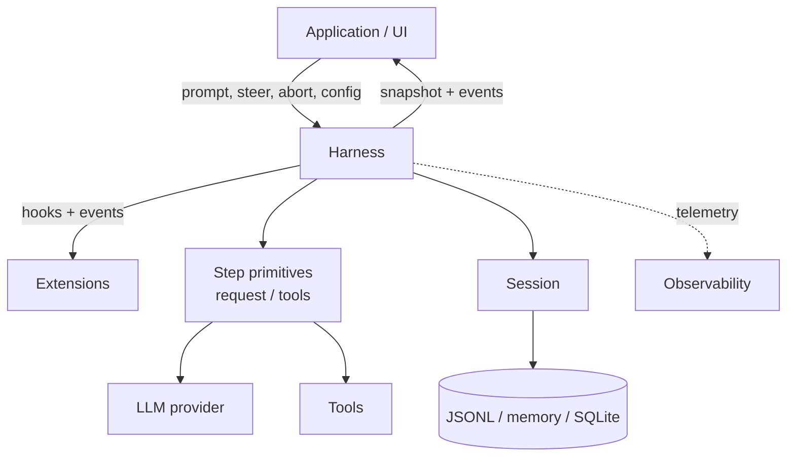
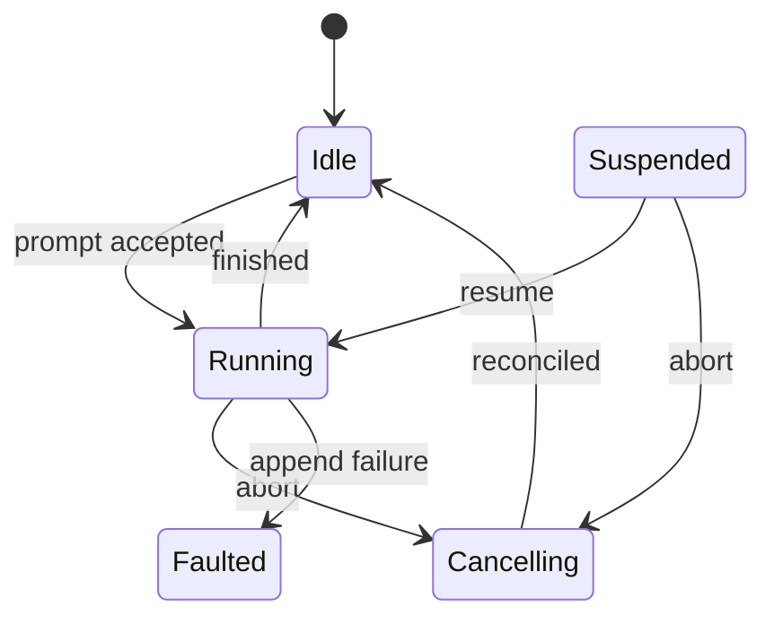
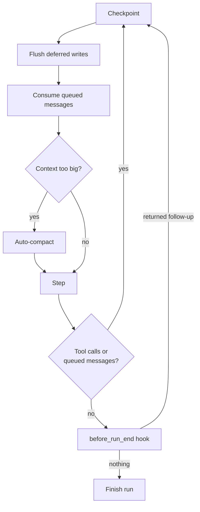
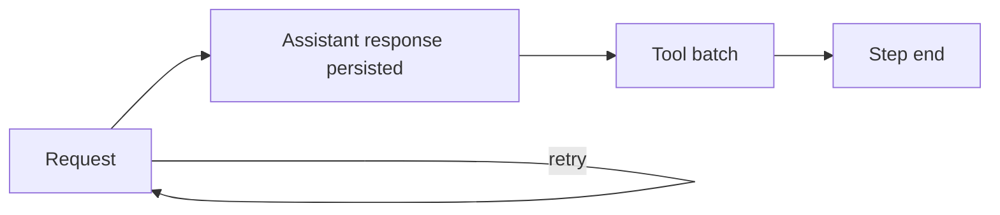
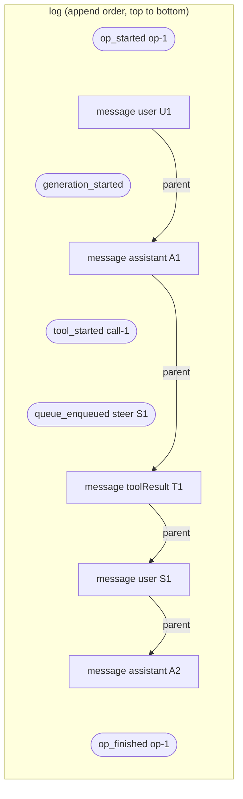
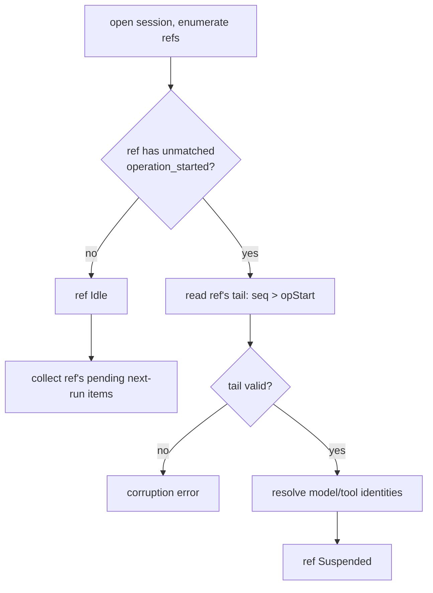

# Durable AgentHarness plan 持久化 AgentHarness 方案

## 1. Goals 目标

- **Durable runs.** An accepted prompt is a durable operation. After a process crash, a new process restores the session and resumes the run from the last safe boundary. Every valid session prefix is a recoverable state.
  - **持久化运行(Durable runs)。** 一个被接受的提示词(prompt)就是一次持久化操作。进程崩溃后,新进程会恢复会话(session)并从最后一个安全边界继续该次运行。任何合法的会话前缀都是一个可恢复状态。
- **Correct branch semantics.** Runs and queued messages are anchored to the branch they were accepted on. Navigation and compaction write multiple records; a crash between records must leave either a valid pre-operation state or one that recovery completes — never a half-moved cursor or a summary on the wrong branch.
  - **正确的分支语义。** 运行与排队消息都锚定在它们被接受时所处的分支上。导航(navigation)与压缩(compaction)会写入多条记录;记录之间发生崩溃时,必须要么留下一个合法的操作前状态,要么留下一个可由恢复流程补完的状态 —— 绝不能出现游标移动到一半、或摘要落在错误分支上的情况。
- **Harness API.** Passive events to observe execution; awaited hooks to transform harness behavior (context, requests, tools, run boundaries). Extensions build on these.
  - **Harness API。** 用被动事件(event)观察执行过程;用可等待的钩子(hook)改变 harness 行为(上下文、请求、工具、运行边界)。扩展(extension)构建于二者之上。
- **Observability.** Everything is instrumentable — down to provider request/response internals — for logging and tracing (e.g. OTel), without going through the hook system.
  - **可观测性。** 一切皆可埋点 —— 细至提供方(provider)请求/响应的内部细节 —— 用于日志与链路追踪(如 OTel),且无需经过钩子系统。
- **UI model.** Atomic snapshot plus live event stream. No event replay; reconnect means new snapshot.
  - **UI 模型。** 原子快照(snapshot)加实时事件流。不做事件重放;重新连接即意味着获取新的快照。
- **Single writer, parallel refs.** Exactly one harness writes a session at a time, enforced by the serving layer; restore treats impossible states from interleaved writers as corruption. Within that one writer, a session hosts one or more **refs** — named movable leaf pointers, each running at most one operation at a time, in parallel with its siblings (section 6). Interactive use never sees more than the default ref.
  - **单写入者,并行 ref。** 同一时刻只有一个 harness 写入某个会话,由服务层强制保证;恢复时若发现交错写入才可能产生的非法状态,一律视为日志损坏。在这唯一的写入者内部,一个会话可承载一个或多个 **ref** —— 具名的、可移动的叶子指针,每个 ref 同一时刻最多执行一个操作,并可与其兄弟 ref 并行(见第 6 节)。交互式使用场景只会看到默认 ref。
- **Old sessions load.** Existing session files open unchanged and restore as idle. Session entry types and tree semantics are unchanged.
  - **旧会话可加载。** 已有的会话文件无需改动即可打开,并恢复为空闲(idle)状态。会话条目类型与树语义保持不变。

## Non-goals 非目标

- **Exactly-once hook side effects.** What a hook hands to the harness (queue a message, append an entry) is durable once the call resolves and survives crashes. What a hook does on its own (HTTP calls, file writes) is invisible to the harness: after a crash it cannot know how far an interrupted handler got, so handlers are never re-run on resume. Hooks needing crash-safe external effects must be idempotent themselves, e.g. keyed by operation ID.
  - **钩子副作用的恰好一次(exactly-once)语义。** 钩子交给 harness 的东西(排队一条消息、追加一个条目)在调用完成后即持久化,并可在崩溃后存活。而钩子自行产生的副作用(HTTP 调用、写文件)对 harness 不可见:崩溃后 harness 无从得知被中断的处理器执行到了哪一步,因此恢复时绝不会重新运行这些处理器。需要崩溃安全外部副作用的钩子必须自身保证幂等,例如以操作 ID 作为键。
- **Provider stream resumption.** An interrupted provider request is retried or abandoned; partial streams are never persisted.
  - **提供方流式响应的续传。** 被中断的提供方请求要么重试要么放弃;不完整的流永不落盘。

## 2. Terminology 术语

The onion, outside in:
由外到内的层层结构:

- **Harness** — executes runs against one session: drives provider requests and tools, manages queues, emits events, applies hooks. Exactly one harness writes a session at a time.
  - **Harness** —— 针对单个会话执行运行:驱动提供方请求与工具、管理队列、发出事件、应用钩子。同一时刻只有一个 harness 写入某个会话。
- **Session** — the durable state: an ordered, append-only log of entries. Two views over the same log: the tree (session entries, conversational state) and orchestration history (harness entries).
  - **Session(会话)** —— 持久状态:一份有序、仅追加(append-only)的条目日志。同一份日志有两个视图:树(会话条目,对话状态)与编排历史(harness 条目)。
- **Session entry** — an entry in the session tree (`message`, `compaction`, `leaf`, ...). Defines conversational ancestry via `parentId`; visible in transcripts and model context.
  - **Session entry(会话条目)** —— 会话树中的条目(`message`、`compaction`、`leaf` 等)。通过 `parentId` 定义对话祖先关系;在转录记录与模型上下文中可见。
- **Harness entry** — a private orchestration fact (operation started, tool started, ...) used to resume a run after abnormal termination. Lives in the same log, never in the tree: no parent, never the leaf, never in model context, never emitted publicly.
  - **Harness entry(harness 条目)** —— 一条私有的编排事实(操作已开始、工具已开始……),用于在异常终止后恢复运行。它与会话条目同处一份日志,但从不进入树:没有父节点、永不作为叶子、不进入模型上下文、也不对外发出。
- **Ref** — a named, movable pointer to a leaf of the tree plus the work serialized on it: one active operation, its own queues, its persisted config derived from the path behind its leaf. Every session has the default ref `main`; embedders may create more (section 6).
  - **Ref** —— 指向树中某个叶子的具名可移动指针,外加在其上串行化的工作:一个活跃操作、自己的队列、以及由其叶子背后路径推导出的持久化配置。每个会话都有默认 ref `main`;嵌入方(embedder)可以创建更多(见第 6 节)。

Execution:
执行相关:

- **Operation** — a run, a manual compaction, or a tree navigation, executed on one ref. At most one operation is active per ref at any time; restore treats a log with two unmatched operation starts on the same ref as corruption.
  - **Operation(操作)** —— 一次运行、一次手动压缩或一次树导航,在某个 ref 上执行。任一时刻每个 ref 最多有一个活跃操作;若恢复时发现同一 ref 上存在两个未配对的操作开始记录,则判定日志损坏。
- **Run** — one accepted prompt through all automatic continuations (tool calls, steering, follow-ups, auto-compaction) until the harness is idle again. Durable; may span process restarts.
  - **Run(运行)** —— 一个被接受的提示词经历全部自动续跑(工具调用、引导(steering)、后续消息(follow-up)、自动压缩)直到 harness 再次空闲的整个过程。它是持久的,可跨进程重启。
- **Step** — one generation (plus retries), the resulting assistant response, and the complete tool batch it requested. A run is a sequence of steps.
  - **Step(步)** —— 一次生成(generation,含重试)、由此产生的助手响应,以及它请求的完整工具批次(tool batch)。一次运行就是一连串的步。
- **Generation** — one billable cycle of producing a result (assistant response, compaction or branch summary); may span several physical provider requests. A step contains one or more generations (retries).
  - **Generation(生成)** —— 一个可计费的结果产出周期(助手响应、压缩摘要或分支摘要);可能跨越多个物理的提供方请求。一个步包含一次或多次生成(重试)。
- **Checkpoint** — the safe point between steps where queued messages are consumed, deferred writes flush, and compaction is considered.
  - **Checkpoint(检查点)** —— 步与步之间的安全点,在此处消费排队消息、刷写延迟写入(deferred write)、并评估是否压缩。
- **Deferred write** — a session write requested while a ref has a step in flight: hooks or the application appending a custom message, or changing model/thinking level/active tools. Applying it immediately would insert content before the in-flight request's tail — splitting an assistant tool-call message from its tool results, and violating the append-only context invariant (section 5) that keeps provider KV caches valid. So it is accepted durably on request and applied at the next checkpoint of that ref. While the ref is idle, the same writes apply immediately.
  - **Deferred write(延迟写入)** —— 在某个 ref 有步进行中时请求的会话写入:钩子或应用追加自定义消息,或修改模型/思考级别/启用工具。若立即应用,内容会被插到进行中请求的尾部之前 —— 把助手的工具调用消息与其工具结果割裂开,并破坏保证提供方 KV 缓存有效的仅追加上下文不变式(见第 5 节)。因此该写入在请求时即被持久化接受,并在该 ref 的下一个检查点应用。当 ref 空闲时,同样的写入会立即生效。
- **Resume** — continuing an unfinished run in a new process, possibly mid-step.
  - **Resume(恢复运行)** —— 在新进程中继续一次未完成的运行,可能是从某一步的中途继续。

API:
API 相关:

- **Event** — a passive public observation. Cannot alter execution; not persisted or replayed.
  - **Event(事件)** —— 一次被动的公开观察。不能改变执行;不持久化也不重放。
- **Hook** — an awaited public interception point. Can transform or block execution.
  - **Hook(钩子)** —— 一个可等待的公开拦截点。可以改变或阻断执行。
- **Snapshot** — an atomic capture of current harness state, delivered race-free with every event after it (section 8).
  - **Snapshot(快照)** —— 对当前 harness 状态的原子捕获,与其后的每个事件一并无竞态地交付(见第 8 节)。
- **Config** — model, thinking level, system prompt, active tools, resources. Getters return the latest accepted value. Setters while a step is in flight become deferred writes; the in-flight request and tool batch are not affected.
  - **Config(配置)** —— 模型、思考级别、系统提示词、启用工具、资源。getter 返回最近被接受的值。在步进行中调用 setter 会变成延迟写入;进行中的请求与工具批次不受影响。

Central invariant:
核心不变式:

> Session entries define what the conversation is. Harness entries define what the harness did, in what order. Log order determines orchestration history; `parentId` and per-ref leaf pointers determine branches; harness entries never alter tree topology.
>
> 会话条目定义对话是什么。harness 条目定义 harness 做了什么、以什么顺序做的。日志顺序决定编排历史;`parentId` 与每个 ref 的叶子指针决定分支;harness 条目永远不改变树的拓扑结构。

## 3. Architecture 架构



- **Step primitives** — the low-level building blocks split out of today's monolithic loop: one provider request, one tool batch, one step. Own no durable state; `runAgentLoop()` remains as a compatibility wrapper over them.
  - **步原语(Step primitives)** —— 从当前单体循环中拆分出的底层构件:一次提供方请求、一个工具批次、一个步。它们不持有任何持久状态;`runAgentLoop()` 作为兼容性包装层保留在其之上。
- **Harness** — the driver: accepts operations, sequences steps and checkpoints, owns queues, retry, compaction, navigation, cancellation, recovery. The only writer of harness entries.
  - **Harness** —— 驱动器:接受操作、编排步与检查点的顺序、拥有队列、重试、压缩、导航、取消与恢复。它是 harness 条目的唯一写入者。
- **Session** — owns the log and the tree view; validates and appends entries, answers branch/context queries.
  - **Session** —— 拥有日志与树视图;校验并追加条目,回应分支/上下文查询。
- **Storage** — append + read for one session. No orchestration knowledge.
  - **Storage(存储)** —— 针对单个会话的追加与读取。不了解任何编排逻辑。

The public surface is harness methods, events, hooks, snapshots, config, session tree queries/writes, and the telemetry stream. Harness entries, their schemas, and recovery logic are private: nothing outside harness and storage reads or depends on them.
公开接口面包括:harness 方法、事件、钩子、快照、配置、会话树查询/写入,以及遥测流。harness 条目、其 schema 以及恢复逻辑均为私有:harness 与存储之外的任何组件都不读取、也不依赖它们。

## 4. Run and step lifecycle 运行与步的生命周期

### Run states 运行状态

States are per ref: each ref is independently Idle, Running, Cancelling, or Suspended. Faulted is the exception — an append failure faults the whole harness, every ref included, because none of them can record what it does.
状态是按 ref 划分的:每个 ref 独立地处于 Idle、Running、Cancelling 或 Suspended 状态。Faulted 是例外 —— 一次追加失败会让整个 harness 进入故障状态,所有 ref 概莫能外,因为此时没有任何一个 ref 还能记录自己所做的事。



- **prompt accepted** — the operation start is durable. Before that, a crash means the prompt never happened.
  - **prompt accepted(提示词已接受)** —— 操作开始记录已持久化。在此之前发生崩溃,则视为该提示词从未发生。
- **finished** — outcome `completed` or `failed`; the finish is durable, then the harness is idle.
  - **finished(已结束)** —— 结果为 `completed` 或 `failed`;结束记录持久化后,harness 转为空闲。
- **abort** — cancellation is recorded durably, active effects are signalled, `abort()` returns. Reconciliation (tool results for unresolved calls, closing aborted assistant message) runs to completion in the background.
  - **abort(中止)** —— 取消被持久化记录,活跃的副作用收到信号,`abort()` 返回。对账(reconciliation,为未完成的调用补上工具结果、闭合被中止的助手消息)在后台运行至完成。
- **Suspended** — restore found an unfinished run. Nothing executes until `resume()`; `abort()` cancels without resuming execution.
  - **Suspended(挂起)** —— 恢复流程发现了一次未完成的运行。在调用 `resume()` 之前不会执行任何东西;调用 `abort()` 则直接取消而不恢复执行。
- **Faulted** — a session append failed (disk full, I/O error). The harness stops all effects and rejects everything: it can no longer record what it does. The log is not corrupted, just a valid prefix, as after a crash. Fix the cause, reopen, restore: the run shows as Suspended. Log corruption is different: restore rejects it, no automatic path forward.
  - **Faulted(故障)** —— 一次会话追加失败(磁盘已满、I/O 错误)。harness 停止所有副作用并拒绝一切请求:它已无法记录自己的行为。此时日志并未损坏,只是一个合法前缀,与崩溃后的情形相同。修复原因、重新打开、执行恢复:该运行会显示为 Suspended。日志损坏则是另一回事:恢复流程会直接拒绝,没有自动的前进路径。

### Steps and checkpoints 步与检查点

A running operation alternates between steps and checkpoints:
一个运行中的操作在步与检查点之间交替进行:



A step:
一个步:



- A step with tool calls always forces another checkpoint + step; the model must see its tool results answered.
  - 含有工具调用的步一定会强制触发下一个检查点加下一个步;模型必须看到自己的工具结果得到回应。
- `steer()` and `followUp()` enqueue durably at any time during a run — acceptance appends a harness entry (tree-neutral, so mid-step is fine); the message itself becomes a session entry at its consumption point. Steering is injected at the next checkpoint, before the next request. Follow-ups are consumed only when tool continuation and steering are exhausted — when the model would otherwise stop.
  - `steer()` 与 `followUp()` 可在运行期间的任意时刻持久化入队 —— 接受时会追加一条 harness 条目(它对树中立,因此在步中途也没问题);消息本身则在被消费的那一刻才成为会话条目。引导消息在下一个检查点、下一次请求之前注入。后续消息只有在工具续跑与引导都耗尽时才被消费 —— 也就是模型本来会停下来的时刻。
- Auto-compaction is evaluated against the prospective context for the next request, after queued messages and deferred writes are applied.
  - 自动压缩是在排队消息与延迟写入应用之后,针对下一次请求的预期上下文进行评估的。
- `before_run_end` runs when nothing is pending: no tool continuation, no queued messages. It may return or enqueue follow-ups, each durable on acceptance. The run finishes only when nothing is pending afterwards.
  - `before_run_end` 在没有任何待办时运行:没有工具续跑,也没有排队消息。它可以返回或入队后续消息,每一条在被接受时即持久化。只有当此后仍无任何待办时,该次运行才真正结束。

### Resume 恢复运行

Resume continues the existing run; it never starts a new one:
恢复是继续既有的运行;它绝不会开启一次新的运行:

- Entry point is wherever the log ends: mid-step (retry the request, or reconcile an unfinished tool batch) or at a checkpoint.
  - 入口点就是日志结束的地方:可能在某一步的中途(重试请求,或对未完成的工具批次做对账),也可能正好在某个检查点。
- `before_run` ran when the prompt was accepted and is not called again; `before_resume` is.
  - `before_run` 已在提示词被接受时运行过,不会再次调用;而 `before_resume` 会被调用。
- Pending queued messages and deferred writes accepted before the crash are still pending and apply normally.
  - 崩溃前已被接受的待处理排队消息与延迟写入仍然处于待处理状态,并会正常应用。
- Per-request and per-tool hooks run for work actually performed after resume.
  - 按请求与按工具触发的钩子,只会针对恢复后实际执行的工作运行。

## 5. Session and the log 会话与日志

### One log, two views 一份日志,两个视图

A session is an append-only log. JSONL implements this literally (one JSON object per line); other backends may use tables and indices as long as ordering and semantics match. A record is either a **session entry** (tree) or a **harness entry** (orchestration). Log order is total; tree structure comes only from `parentId` on session entries.
一个会话就是一份仅追加日志。JSONL 是最字面的实现(每行一个 JSON 对象);其他后端可以使用表与索引,只要顺序与语义一致即可。一条记录要么是 **会话条目**(树),要么是 **harness 条目**(编排)。日志顺序是全序的;树结构只来自会话条目上的 `parentId`。

Harness entries exist to resume a run after abnormal termination. They record accepted operations, issued provider requests, started tools, queued messages, and deferred writes, so a new process can tell how far execution got and continue without repeating effects. Nothing reads them during normal operation.
harness 条目的存在是为了在异常终止后恢复运行。它们记录已接受的操作、已发出的提供方请求、已启动的工具、排队的消息以及延迟写入,使新进程能判断执行进行到了哪一步,并在不重复副作用的前提下继续。正常运行期间没有任何组件读取它们。



Rounded records are harness entries: no `parentId`, never the leaf, never in model context or transcripts, invisible through `SessionTree`. Rectangular records connected by `parent` arrows are session entries; the tree is that chain.
圆角记录是 harness 条目:没有 `parentId`、永不作为叶子、不进入模型上下文或转录记录、通过 `SessionTree` 也看不到。由 `parent` 箭头连接的矩形记录是会话条目;树就是这条链。

Consequences:
由此带来的影响:

- Harness entries can be appended mid-step (steering, deferred-write acceptance) without touching tree ordering.
  - harness 条目可以在步的中途追加(引导、接受延迟写入),而完全不触碰树的顺序。
- Navigation, compaction, and forks (section 13) operate on the tree; orchestration facts are never hidden by a compaction barrier or copied into a fork.
  - 导航、压缩与分叉(fork,见第 13 节)作用于树;编排事实永远不会被压缩屏障隐藏,也不会被复制进分叉。
- Old files contain no harness entries and restore idle.
  - 旧文件不含 harness 条目,恢复后即为空闲状态。

### Durability rule 持久化规则

> Before an effect: append an intent entry naming what will happen and the ids it will produce. After the effect: append the result as a session entry with those ids.
>
> 副作用之前:追加一条意图条目,说明将要发生什么以及它将产生哪些 id。副作用之后:用这些 id 把结果作为会话条目追加。

No multi-record atomicity. Any log prefix is a valid state: an intent without its result means in flight or interrupted; recovery (section 12) decides completion per intent type.
不存在跨多条记录的原子性。任何日志前缀都是合法状态:有意图而无结果意味着进行中或被中断;恢复流程(见第 12 节)按意图类型逐一决定如何补完。

### Append-only context 仅追加的上下文

> Across the requests of a branch, provider context only ever grows at the tail. Inserting content before the previous request's tail invalidates the provider's KV cache from the insertion point onward — silently multiplying token cost.
>
> 在一个分支的各次请求之间,提供方上下文只在尾部增长。若在上一次请求的尾部之前插入内容,会使提供方 KV 缓存从插入点开始整体失效 —— 在无声无息中成倍推高 token 成本。

This invariant, not just tool-call adjacency, is why mid-step writes defer to checkpoints: checkpoint application and queue consumption append at the tail, so the cached prefix survives every request. Compaction is the one deliberate exception — it trades a full cache invalidation for a smaller context, knowingly.
正是这条不变式(而不仅仅是工具调用的相邻性)决定了步中途的写入必须推迟到检查点:检查点的应用与队列消费都在尾部追加,因此缓存前缀能在每次请求中存活。压缩是唯一有意为之的例外 —— 它明知故犯地用一次完整的缓存失效换取更小的上下文。

Two mechanisms carry mid-run content, with deliberately different contracts:
有两种机制承载运行中途产生的内容,它们的契约被刻意设计得不同:

- **Queues** carry conversational intent: steer/followUp die on abort (payloads returned so a client can requeue), nextRun survives. The session entry lands at the consumption point — the position the model actually first saw it.
  - **队列** 承载对话意图:steer/followUp 在中止时消亡(其载荷会被返回,以便客户端重新入队),而 nextRun 则会存活。会话条目落在消费点上 —— 也就是模型真正第一次看到它的位置。
- **Deferred writes** carry facts: they survive abort and are applied even during cancellation reconciliation. Both are durable at acceptance.
  - **延迟写入** 承载事实:它们在中止后仍然存活,甚至会在取消对账期间被应用。两者都在被接受时即持久化。

Custom entries enter provider context only through registered projectors (`entryProjectors`: custom entry → context messages, evaluated at context build); without one they project to nothing and cannot affect the cache. Corollaries: projector output must be stable across context builds for entries already in context, and registering a projector later re-animates existing entries at their historical positions — a one-time cache break, the application's responsibility.
自定义条目只能通过已注册的投影器(projector)进入提供方上下文(`entryProjectors`:自定义条目 → 上下文消息,在构建上下文时求值);没有投影器时它们投影为空,也就无法影响缓存。推论:对于已在上下文中的条目,投影器的输出必须在多次上下文构建之间保持稳定;此外,后来才注册投影器会让既有条目在其历史位置上"复活" —— 这会造成一次性的缓存中断,由应用自行负责。

### Provisioned ids 预分配 id

Intent entries carry ids of session entries that do not exist yet: `tool_started.resultEntryId`, `queue_enqueued.target.id`, the operation start's initial message ids. The later session entry uses exactly that id. An intent is fulfilled iff an entry with its provisioned id exists; an id collision with different content is corruption.
意图条目会携带尚不存在的会话条目的 id:`tool_started.resultEntryId`、`queue_enqueued.target.id`、以及操作开始条目中的初始消息 id。之后生成的会话条目必须严格使用该 id。当且仅当存在带有其预分配 id 的条目时,该意图才算被兑现;若 id 冲突但内容不同,则判定为日志损坏。

```ts
/** A session entry payload with its id pre-allocated. parentId and timestamp
    are assigned when the entry is actually appended: it becomes a child of the
    then-current leaf, exactly like a normal append. */
type ProvisionedEntry<T extends SessionTreeEntry = SessionTreeEntry> = Omit<T, "parentId" | "timestamp">;
type ProvisionedMessage = ProvisionedEntry<MessageEntry>;
```

### Harness entry schemas harness 条目 schema

```ts
interface HarnessEntryBase {
  id: string;
  seq: number;            // position in the chronological log
  ref: string;            // the ref this record belongs to ("main" in a single-ref session)
  timestamp: string;
}
// Session entries carry no ref — the tree is shared between refs (common
// prefixes), so a ref field would fake ownership that does not exist. Which
// ref appended a session entry is derivable: a ref's operation appends a
// chain from its anchor, so membership is parentId linkage into that chain —
// one pass over the bounded tail, in seq order. Leaf records are the
// exception: they carry ref explicitly, they ARE the per-ref pointer.
// Old files: everything reads as "main".
// Entries that belong to an operation carry runId: the id of that operation's
// operation_started entry. Not on the base: queue_enqueued(nextRun) belongs to
// no operation — it targets the next run, and can be accepted while idle.

// The durable acceptance boundary for an operation. Everything decided
// before acceptance is persisted here: before_run output, queued next-run
// consumption, provisioned ids for structural results.
interface OperationStartedEntry extends HarnessEntryBase {
  type: "operation_started";
  sourceLeafId: string | null;      // the ref's leaf at acceptance
  intent:
    | {
        kind: "run";
        /** Prompt + before_run injections, full payloads with provisioned ids. */
        initialMessages: ProvisionedMessage[];
        /** Set iff before_run overrode the system prompt; fixed for the run.
            Absent: the systemPrompt config callback is evaluated per request
            (sees current active tools — mid-run tool changes rebuild the prompt). */
        systemPromptOverride?: string;
        resumeData?: Record<string, JsonValue>;   // per extension id
      }
    | {
        kind: "compaction";
        customInstructions?: string;
        resultEntryId: string;
      }
    | {
        kind: "navigation";
        targetId: string;
        destinationLeafId: string | null;
        summarize: boolean;
        customInstructions?: string;
        label?: string;
        summaryEntryId?: string;
        labelEntryId?: string;
        leafEntryId: string;
      };
}

// Cancellation is durable the moment abort() resolves. Clears this
// operation's steer/follow-up queue items; next-run items survive.
interface OperationCancelledEntry extends HarnessEntryBase {
  type: "operation_cancelled";
  runId: string;
  reason: "user" | "shutdown";
}

// Closes the operation. Cursor-neutral: cannot undo a navigation's leaf move.
// outcome "failed" is a durable, orderly failure: retry attempts exhausted,
// compaction/summary generation permanently failing, required model missing.
// outcome "cancelled" is a structural operation declined by its hook
// (before_compaction/before_navigation cancel). Either way the operation is
// closed; nothing resumes. Distinct from Faulted (section 4): a fault means
// appends fail, so no finish entry can be written and the operation restores
// as suspended instead.
interface OperationFinishedEntry extends HarnessEntryBase {
  type: "operation_finished";
  runId: string;
  outcome: "completed" | "aborted" | "failed" | "cancelled";
  error?: { code: string; message: string };   // safe fields only, no payloads
}

// Appended before each generation cycle the harness bills to a provider — an
// uncertainty marker ("a request may have gone out and been billed") and the
// durable crash-loop bound: attempt counts survive restarts. One entry per
// cycle, even when a cycle makes several physical requests (split-turn
// compaction runs two); recovery granularity is the result entry, so finer
// accounting buys nothing. Position and completion are positional: attempts
// after the newest session entry belong to the current request cycle, and a
// session entry committing closes the cycle. Validation: attempt numbers are
// consecutive within each gap between session entries (a gap is always
// single-purpose — compaction either commits its entry, closing the gap,
// or fails the run). All positional rules are per ref: "newest session
// entry" means the newest session entry chained by this ref's operation
// (parentId membership, see above) — the per-ref partition is what makes
// positional reduction safe under interleaved refs.
interface GenerationStartedEntry extends HarnessEntryBase {
  type: "generation_started";
  runId: string;
  purpose: "step" | "compaction" | "branch_summary";
  attempt: number;                  // 1-based within the current cycle
  model: { provider: string; modelId: string };
}

// Appended after before_tool and validation, before the effect starts.
// assistantEntryId + toolIndex is the durable invocation identity.
interface ToolStartedEntry extends HarnessEntryBase {
  type: "tool_started";
  runId: string;
  assistantEntryId: string;
  toolIndex: number;
  toolCallId: string;
  toolName: string;
  effectiveArgs: Record<string, unknown>;   // post-before_tool
  resultEntryId: string;                    // provisioned
  replay: "never" | "safe";
}

// steer()/followUp()/nextRun() acceptance. The message payload (any
// AgentMessage that converts to a user LLM message) travels here; the session
// entry appears at the consumption point. Steer/follow-up items resolve within
// their run. Next-run items are consumed by the next run-kind operation on the
// same ref, embedded in its operation_started initialMessages; compaction and
// navigation pass through without consuming. Pending items therefore always
// sit after the ref's last run-kind operation_started — recovery never scans
// further back.
interface QueueEnqueuedEntry extends HarnessEntryBase {
  type: "queue_enqueued";
  queue: "steer" | "followUp" | "nextRun";
  /** steer/followUp: their active run. Absent for nextRun — the item belongs
      to no operation until the next run consumes it. */
  runId?: string;
  target: ProvisionedMessage;
}

// SessionTree write or config setter accepted mid-step: message, custom entry,
// label, session name, or config change (model_change, ...). Applied in
// acceptance order at the next checkpoint — live or during recovery, each
// target is appended as a child of the then-current leaf; that is why
// ProvisionedEntry omits parentId.
interface WriteDeferredEntry extends HarnessEntryBase {
  type: "write_deferred";
  runId: string;
  target: ProvisionedEntry;   // full payload, provisioned id
}
```

Blocked, invalid, or truncation-failed tool calls append no `tool_started` — no external effect begins; they go straight to a synthetic error result.
被阻止、无效或截断失败的工具调用不会追加 `tool_started` —— 因为没有任何外部副作用开始;它们直接进入一个合成的错误结果。

### Log invariants 日志不变式

Restore rejects a log violating any of these as corrupt:
恢复流程会把违反以下任意一条的日志判定为损坏并拒绝:

- at most one unmatched `operation_started` per ref
  - 每个 ref 最多只有一条未配对的 `operation_started`
- operation events reference an existing operation of the same ref; finish/cancel never precede start
  - 操作事件必须引用同一 ref 上已存在的操作;结束/取消绝不能出现在开始之前
- attempt numbers are consecutive from 1 within each gap between session entries of the same ref
  - 在同一 ref 的两条会话条目之间的每个间隙内,尝试编号从 1 开始连续递增
- tool invocation identities are unique; their assistant entries exist
  - 工具调用标识唯一;其对应的助手条目存在
- provisioned ids never collide with differing content
  - 预分配 id 绝不会在内容不同的情况下发生冲突
- a ref's active run cursor moves only through that run's appends
  - 某个 ref 的活跃运行游标只能通过该次运行自身的追加操作移动

### SessionTree 会话树

`SessionTree` is new: the tree-facing contract over the log. `Session` implements it plus the log side below. Each ref exposes its own harness-owned `SessionTree` view (`ref.session`; `harness.session` is main's): branch-scoped reads default to that ref's leaf, appends chain to it, and writes defer while that ref has a step in flight — an immediate append would land before the in-flight request's tail, breaking tool-call adjacency and the append-only context invariant. Writes through one ref's view never defer because another ref is busy. Standalone `Session` writes apply immediately.
`SessionTree` 是新增的:它是日志之上面向树的契约。`Session` 同时实现它以及下文的日志侧接口。每个 ref 都暴露自己的、由 harness 拥有的 `SessionTree` 视图(`ref.session`;`harness.session` 即 main 的视图):按分支限定的读取默认以该 ref 的叶子为起点,追加操作挂接到该叶子上,并且当该 ref 有步进行中时写入会被延迟 —— 立即追加会落在进行中请求的尾部之前,破坏工具调用的相邻性以及仅追加上下文不变式。通过某个 ref 视图发出的写入,绝不会因为另一个 ref 正忙而被延迟。独立使用的 `Session` 写入则立即生效。

```ts
/** Filters and paging. Omit type to match every entry. */
interface EntryQuery {
  type?: SessionTreeEntry["type"];
  customType?: string;                     // for type: "custom"
  order?: "newestFirst" | "oldestFirst";   // default newestFirst
  limit?: number;
  cursor?: EntryCursor;                    // continue a previous page
}

/** Where a branch scan starts and stops. Defaults: the whole path, leaf to root. */
interface BranchBounds {
  /** Leaf end of the path. Default: the view's ref leaf. Needed to query another branch or an old compaction tail. */
  start?: string;
  /** Scan ends after the first matching entry, inclusive. */
  stopAtType?: SessionTreeEntry["type"];
  stopAtId?: string;
}

// Generic over metadata; finders return Extract<SessionTreeEntry, { type: T }>.
interface SessionTree<TMetadata extends SessionMetadata = SessionMetadata> {
  // Reads — always allowed
  getMetadata(): Promise<TMetadata>;
  getEntry(id: string): Promise<SessionTreeEntry | undefined>;
  getLeafId(): Promise<string | null>;
  getStats(): Promise<SessionStats>;

  // Global facts — latest-wins records outside the tree, not branch-scoped.
  // Setter naming is deliberate: "append" is reserved for tree writes.
  getName(): Promise<string | undefined>;
  setName(name: string): Promise<string>;
  getLabel(id: string): Promise<string | undefined>;
  setLabel(targetId: string, label: string | undefined): Promise<string>;

  /** Session-wide: all branches, log order. */
  findEntries(query?: EntryQuery): Promise<SessionTreeEntry[]>;

  /** Sugar: findEntries with limit 1. */
  findEntry(query?: Omit<EntryQuery, "limit" | "cursor">): Promise<SessionTreeEntry | undefined>;

  /** Branch-scoped: the path start (default leaf) → root. */
  findEntriesOnBranch(query?: EntryQuery & BranchBounds): Promise<SessionTreeEntry[]>;

  /** Sugar: findEntriesOnBranch with limit 1. */
  findEntryOnBranch(query?: Omit<EntryQuery, "limit" | "cursor"> & BranchBounds): Promise<SessionTreeEntry | undefined>;

  // Writes — immediate on standalone Session, deferred while a harness runs.
  // Resolve on durable acceptance; the returned string is the provisioned entry
  // id the session entry will carry when applied. Safe to call from hook and
  // event handlers at any point.
  appendMessage(message: AgentMessage): Promise<string>;   // includes custom app message types
  appendCustomEntry(customType: string, data?: unknown): Promise<string>;

  /** Writes accepted but not yet applied, in acceptance order. Empty on standalone Session. */
  getPendingWrites(): { id: string; entry: SessionTreeEntry }[];
}
```

Query semantics — a branch scan is: take the path from `start` (default: active leaf) to root, walk it in `order` direction, stop after a `stopAt` match (inclusive), filter, apply `limit`/`cursor`:
查询语义 —— 一次分支扫描的过程是:取从 `start`(默认为活跃叶子)到根的路径,按 `order` 指定的方向遍历,在命中 `stopAt` 后停止(包含该条目),然后过滤,再应用 `limit`/`cursor`:

- `newestFirst` walks leaf→root: `stopAtType: "compaction"` ends at the **newest** compaction — the context window.
  - `newestFirst` 从叶子向根遍历:`stopAtType: "compaction"` 会在 **最新** 的压缩处结束 —— 这正是上下文窗口(context window)。
- `oldestFirst` walks root→leaf: the same query ends at the **oldest** compaction. The barrier is found in walk direction. For the newest-compaction segment in chronological order, fetch `newestFirst` and reverse; it is one context window, not a big list.
  - `oldestFirst` 从根向叶子遍历:同样的查询会在 **最旧** 的压缩处结束。屏障总是沿遍历方向查找的。若想按时间顺序获取最新压缩之后的那一段,用 `newestFirst` 取回后再反转即可;那只是一个上下文窗口,并不是一个大列表。
- `type`/`customType` filter results; a `stopAt` entry is returned only if it passes the filter.
  - `type`/`customType` 用于过滤结果;`stopAt` 命中的条目只有在通过过滤时才会被返回。
- These subsume `getBranch()` and `getPathToRootOrCompaction()`: context build is `findEntriesOnBranch({ stopAtType: "compaction" })`; old-style compaction tails are a second call with `start: compaction.parentId, stopAtId: firstKeptEntryId`.
  - 这些接口取代了 `getBranch()` 与 `getPathToRootOrCompaction()`:构建上下文即 `findEntriesOnBranch({ stopAtType: "compaction" })`;旧式的压缩尾部则通过第二次调用 `start: compaction.parentId, stopAtId: firstKeptEntryId` 获取。
- Extension patterns: effective state = `findEntryOnBranch({ type: "custom", customType })`; branch collections = `findEntriesOnBranch({ type: "custom", customType })`; global inventory = `findEntries({ type: "custom", customType })`.
  - 扩展的常见用法:取生效状态用 `findEntryOnBranch({ type: "custom", customType })`;取分支内集合用 `findEntriesOnBranch({ type: "custom", customType })`;取全局清单用 `findEntries({ type: "custom", customType })`。
- `SessionTree` has no cursor mutation; tree navigation is `navigateTree()` on the harness.
  - `SessionTree` 不提供游标变更能力;树导航由 harness 上的 `navigateTree()` 负责。

> **Read consistency:** finders and `getEntry()` return committed entries only. A deferred write is not in the tree until applied; a handler that appends and immediately queries will not see its own write. A pending entry has no `parentId` yet, and any overlaid position would be a guess that later entries invalidate. Pending writes are visible via `getPendingWrites()` and the snapshot, correlated by provisioned id.
>
> **读一致性:** 各类查找方法与 `getEntry()` 只返回已提交的条目。延迟写入在被应用之前不在树中;某个处理器追加之后立刻查询,是看不到自己刚写入的内容的。待处理条目尚未拥有 `parentId`,任何强行叠加的位置都只是猜测,并会被后续条目推翻。待处理写入可通过 `getPendingWrites()` 与快照查看,并以预分配 id 相互关联。

### Session API changes Session API 变更

`Session` implements `SessionTree` and gains the log side, used only by the harness and recovery:
`Session` 实现 `SessionTree`,并新增仅供 harness 与恢复流程使用的日志侧接口:

```ts
class Session<TMetadata> implements SessionTree<TMetadata> {
  appendHarnessEntry(entry: HarnessEntryInput): Promise<HarnessEntry>;
  /** Full chronological log — session and harness entries interleaved. */
  getLog(options?: { afterSeq?: number; limit?: number }): Promise<LogRecord[]>;

  /** Typed harness-entry queries, same shape as the tree finders. SQLite
      serves them from an indexed harness-entry table. */
  findHarnessEntries(query?: { type?: HarnessEntry["type"]; ref?: string; runId?: string; afterSeq?: number; order?: "newestFirst" | "oldestFirst"; limit?: number }): Promise<HarnessEntry[]>;
  findHarnessEntry(query?): Promise<HarnessEntry | undefined>;   // limit 1
}
```

Restore reads are bounded regardless of session length, per ref: the ref's latest `operation_started`/`operation_finished` (index seek) locates its active operation, and everything else recovery needs — attempt counts, tool starts, pending queue items, deferred writes — lives at `seq` greater than that operation's start, filtered by ref (range scan). Pending next-run items cannot sit further back than the ref's last run-kind `operation_started` because run acceptance consumes them (see `QueueEnqueuedEntry`); SQLite stores ref and operation kind as columns, so locating them is an index seek.
无论会话有多长,恢复时的读取量都是有界的,且按 ref 计算:该 ref 最新的 `operation_started`/`operation_finished`(索引查找)定位出其活跃操作,恢复所需的其余一切 —— 尝试次数、工具启动记录、待处理队列项、延迟写入 —— 都位于 `seq` 大于该操作开始位置处,并按 ref 过滤(范围扫描)。待处理的 next-run 队列项不可能早于该 ref 最后一条 run 类型的 `operation_started`,因为运行被接受时就会消费它们(见 `QueueEnqueuedEntry`);SQLite 把 ref 与操作种类存为列,因此定位它们是一次索引查找。

Changes to the existing contract:
对现有契约的改动:

- `getPathToRootOrCompaction()` and `getBranch()` are removed — subsumed by `findEntriesOnBranch`. The duplicated walk logic in the JSONL and SQLite backends is deleted.
  - 移除 `getPathToRootOrCompaction()` 与 `getBranch()` —— 由 `findEntriesOnBranch` 取代。JSONL 与 SQLite 后端中重复的遍历逻辑一并删除。
- `buildContext()` is reimplemented on the finders: one branch scan with `stopAtType: "compaction"`, plus the old-style tail scan (`start: compaction.parentId, stopAtId: firstKeptEntryId`) when the compaction entry predates embedded tails.
  - `buildContext()` 基于新的查找方法重写:一次带 `stopAtType: "compaction"` 的分支扫描,若压缩条目早于内嵌尾部的时代,则再加一次旧式尾部扫描(`start: compaction.parentId, stopAtId: firstKeptEntryId`)。
- Config derivation leaves `buildContext()`: model/thinking/active tools are point queries (`findEntryOnBranch`), correct across compaction barriers — and per ref, since each ref queries from its own leaf.
  - 配置推导从 `buildContext()` 中剥离:模型/思考级别/启用工具改为点查询(`findEntryOnBranch`),跨越压缩屏障依然正确 —— 并且是按 ref 的,因为每个 ref 都从自己的叶子开始查询。
- Labels and session name are **de-treed**: `LabelEntry` and `SessionInfoEntry` records lose `parentId` and live outside the tree as global latest-wins facts (single writer makes log order a valid last-writer-wins order). They no longer appear in branch queries; old tree-entry forms convert on read. Fork handling: section 13.
  - 标签与会话名称 **移出树结构**:`LabelEntry` 与 `SessionInfoEntry` 记录不再带 `parentId`,作为全局的"最新者胜"事实存在于树之外(单写入者使得日志顺序天然是一个合法的 last-writer-wins 顺序)。它们不再出现在分支查询中;旧的树条目形态在读取时自动转换。分叉的处理见第 13 节。
- Leaf records gain `ref`; a session keeps one leaf pointer per ref (absent = `main`, which is how old files read).
  - 叶子记录新增 `ref` 字段;一个会话为每个 ref 维护一个叶子指针(缺省即 `main`,旧文件正是这样被读取的)。
- `custom_message` entries convert to custom agent messages on read; the entry type is retired from the write path.
  - `custom_message` 条目在读取时转换为自定义 agent 消息;该条目类型从写入路径中退役。
- `getStorage()` is gone: raw storage is unreachable, all writes flow through `Session`, and `Session` is the single writer the log format assumes.
  - `getStorage()` 被移除:底层存储不可直接触达,所有写入都经由 `Session`,而 `Session` 正是日志格式所假定的那个唯一写入者。
- JSONL becomes format v4: same file, same one-JSON-object-per-line, harness entries interleaved. v3 files load unchanged (zero harness entries, restore idle).
  - JSONL 升级为 v4 格式:同一个文件、同样每行一个 JSON 对象,只是交错写入了 harness 条目。v3 文件无需改动即可加载(零条 harness 条目,恢复为空闲)。

Storage backends implement append + read + the finder queries; they know nothing about operations, queues, or recovery (section 14).
存储后端只需实现追加、读取以及各类查找查询;它们完全不了解操作、队列或恢复流程(见第 14 节)。

## 6. Refs 引用(Refs)

A **ref** is a named, movable pointer to a leaf of the tree, plus the work serialized on it. It is what a git branch is — a name attached to a position, advanced by new work, movable to any point without rewriting history — fused with its worktree: at most one operation runs on a ref at a time, exactly as git refuses to check the same branch out into two worktrees. One intuition git users must extend: navigation can move a ref to *any* entry (like `git reset`), not only forward.
一个 **ref** 是指向树中某个叶子的具名可移动指针,外加在其上串行化的工作。它就相当于 git 的分支 —— 一个附着于某个位置的名字,随新工作向前推进,也可以在不重写历史的前提下移动到任意位置 —— 并与其工作区(worktree)融为一体:同一时刻一个 ref 上最多运行一个操作,正如 git 拒绝把同一分支检出到两个工作区。git 用户需要扩展的一点直觉是:导航可以把一个 ref 移动到 *任意* 条目(类似 `git reset`),而不只是向前移动。

```text
tree (shared, append-only)              refs
a ── b ── c ── d                        main → d
      └── e ── f                        slack:1719432.0021 → f
```

- Every session has the default ref **`main`**. `AgentHarness` implements the ref surface directly (section 7): `harness.prompt(...)` *is* main's prompt. Interactive pi never creates a second ref — one active branch, resume-where-you-left-off, `/tree` — nothing about that model changes.
  - 每个会话都有默认 ref **`main`**。`AgentHarness` 直接实现了 ref 接口面(见第 7 节):`harness.prompt(...)` *就是* main 的 prompt。交互式 pi 从不创建第二个 ref —— 一个活跃分支、从上次中断处继续、`/tree` —— 这套模型的任何部分都不会改变。
- Embedders create refs keyed by external identities: Slack channel = session + `main`, each thread = a ref anchored at the pinged entry; each email thread = a ref. The platform's UI is the ref picker; no client browses refs abstractly, and end users never see the word.
  - 嵌入方以外部身份为键创建 ref:一个 Slack 频道 = 会话 + `main`,每个话题串(thread)= 一个锚定在被 @ 的那条条目上的 ref;每个邮件会话 = 一个 ref。平台自身的 UI 就是 ref 选择器;没有客户端会抽象地浏览 ref,终端用户也永远不会看到这个词。
- Each ref owns: its leaf; one active operation; its steer/followUp/nextRun queues; its pending deferred writes; and its persisted config view — model, thinking level, and active tools are point queries on the path behind its leaf, so two refs run different models without knowing of each other. Harness-global stay: tool implementations, resources, stream options, retry policy — registries and runtime capabilities are shared, activation is per-ref and branch-anchored.
  - 每个 ref 拥有:自己的叶子;一个活跃操作;自己的 steer/followUp/nextRun 队列;自己待处理的延迟写入;以及自己的持久化配置视图 —— 模型、思考级别与启用工具都是在其叶子背后路径上的点查询,因此两个 ref 可以互不知情地运行不同模型。以下仍然是 harness 全局的:工具实现、资源、流式选项、重试策略 —— 注册表与运行时能力是共享的,而启用状态则是按 ref 且锚定于分支的。
- Refs are pointers, not containers. Deleting one removes the name, never entries. Two refs at the same entry diverge on their next append. `navigateTree` moves one ref.
  - ref 是指针,不是容器。删除一个 ref 只是删掉这个名字,绝不会删除条目。位于同一条目上的两个 ref 会在各自的下一次追加时分道扬镳。`navigateTree` 只移动一个 ref。
- Refs run in parallel under one harness: one writer, one log, interleaved records partitioned by `ref`. Cross-process concurrency stays out of scope — all traffic for a session routes to the process holding its harness.
  - 多个 ref 在同一个 harness 下并行运行:一个写入者、一份日志、交错的记录以 `ref` 分区。跨进程并发不在范围内 —— 一个会话的所有流量都路由到持有其 harness 的那个进程。
- After a crash, every ref with an unfinished operation restores suspended, independently; `create()` returns them all (section 7).
  - 崩溃之后,每个存在未完成操作的 ref 都会独立地恢复为挂起状态;`create()` 会把它们全部返回(见第 7 节)。

**Why refs are not trees.** Harness entries carry `ref` but no parent pointers, deliberately. Within one ref, operations are serialized and there is one writer — so for records filtered by ref, log order *is* causal order. A parent pointer would repeat what `ref` + append order already say, and add validation surface (parent exists, chain does not fork, chain belongs to the operation) with no consumer. Parenting earns its keep only when order stops being reliable: concurrent writers to the *same* ref (excluded by design) or replication without a total order (section 17).
**为什么 ref 不是树。** harness 条目带有 `ref` 但刻意不带父指针。在单个 ref 内部,操作是串行的且只有一个写入者 —— 因此对按 ref 过滤后的记录而言,日志顺序 *就是* 因果顺序。父指针只会重复 `ref` + 追加顺序已经表达的信息,还会增加无人使用的校验面(父节点存在、链不分叉、链属于该操作)。只有当顺序不再可靠时,父子关系才值得引入:即对 *同一个* ref 的并发写入(设计上已排除),或没有全序的复制场景(见第 17 节)。

## 7. Public API 公开 API

```ts
const { harness, suspended } = await AgentHarness.create({ session, models, model, ... });

for (const s of suspended) {
  await harness.ref(s.ref)!.resume();   // or .abort(); interactive pi: 0 or 1, always "main"
}
await harness.prompt("...");
```

The existing surface stays. New: `create()` replaces the constructor, `resume()` continues a suspended operation, `watch()` provides snapshots (section 8), `hooks`/`events` replace `on()`/`subscribe()` (sections 9, 10) — and the operation surface is factored into `AgentRef`, which `AgentHarness` implements for `main`. There is one operation surface, defined once.
既有接口面保持不变。新增部分:`create()` 取代构造函数,`resume()` 继续一个挂起的操作,`watch()` 提供快照(见第 8 节),`hooks`/`events` 取代 `on()`/`subscribe()`(见第 9、10 节) —— 同时,操作相关接口被抽取到 `AgentRef` 中,`AgentHarness` 为 `main` 实现了它。操作接口面只有一套,只定义一次。

```ts
interface AgentHarnessOptions {
  session: Session;
  /** Provider collection for all requests: steps, compaction, branch summaries. */
  models: Models;
  /** model, thinkingLevel, activeToolNames: initial values only. If a ref's
      branch has persisted config entries, the session wins; these apply to fresh
      sessions and refs without config history. An unresolvable persisted model
      surfaces in suspended[].missing / falls back with a warning, mirroring the
      old coding agent. */
  model: Model<any>;
  thinkingLevel?: ThinkingLevel;
  tools?: TTool[];
  activeToolNames?: string[];
  toolContext?: TContext | (() => TContext | Promise<TContext>);
  systemPrompt?: AgentHarnessSystemPrompt;
  resources?: AgentHarnessResources;
  /** Curated provider request options (transport, headers, timeouts, provider-internal retries). Snapshotted at request start. */
  streamOptions?: AgentHarnessStreamOptions;
  /** Harness-level retry for failed requests (steps, compaction, branch summaries). Attempt counts are durable; a restart never resets them. */
  retry?: RetryPolicy;
  compaction?: CompactionSettings;   // enabled, reserveTokens, keepRecentTokens
  steeringMode?: QueueMode;
  followUpMode?: QueueMode;
  /** Converts AgentMessages (including app custom types via CustomAgentMessages)
      to provider messages before each request. Default: exported
      defaultConvertToLlm, handling bashExecution, custom, branchSummary,
      compactionSummary; standard messages pass through. Also used at
      prompt/queue acceptance to validate that a submitted AgentMessage
      converts to a user message. Reordering/pruning is not its job; that is
      transform_context. */
  convertToLlm?: (messages: AgentMessage[]) => Message[] | Promise<Message[]>;
}

/** The operation surface of one ref. AgentHarness implements it for main;
    harness.ref(name) returns the same surface for any other ref. */
interface AgentRef {
  readonly name: string;              // "main" on the harness itself
  getLeafId(): Promise<string | null>;

  // Operations. Never throw — they resolve with a result value in every case
  // (see "Results, not exceptions" below). Message forms mirror Agent: any
  // AgentMessage accepted here (and by the queues) must convert to a user LLM
  // message via convertToLlm; validated at acceptance. At most one operation
  // is active per ref; operations on different refs run concurrently.
  prompt(text: string, images?: ImageContent[]): Promise<RunResult>;
  prompt(message: AgentMessage | AgentMessage[]): Promise<RunResult>;   // e.g. sendMessage triggerTurn
  skill(name: string, additionalInstructions?: string): Promise<RunResult>;
  promptFromTemplate(name: string, args?: string[]): Promise<RunResult>;
  compact(options?: { customInstructions?: string; settings?: Partial<CompactionSettings> }): Promise<CompactionRunResult>;
  navigateTree(targetId: string, options?: NavigateTreeOptions): Promise<NavigationRunResult>;

  /** New. Continue this ref's suspended operation to its durable end. */
  resume(): Promise<ResumeResult>;

  /** Existing. Now durable: cancellation is recorded before effects are signalled; returns without waiting for reconciliation. No-op while this ref is idle. */
  abort(): Promise<AbortResult>;

  // Queues (existing) — now durable on resolve, and per ref (nextRun included:
  // consumed by this ref's next run). Payloads are AgentMessage: user messages
  // and custom extension messages (sendMessage deliverAs). As with prompt(),
  // every AgentMessage must convert to a user LLM message via convertToLlm;
  // validated at acceptance.
  steer(text: string, images?: ImageContent[]): Promise<QueueResult>;     // requires active run
  steer(message: AgentMessage): Promise<QueueResult>;
  followUp(text: string, images?: ImageContent[]): Promise<QueueResult>;  // requires active run
  followUp(message: AgentMessage): Promise<QueueResult>;
  nextRun(text: string, images?: ImageContent[]): Promise<QueueResult>;   // any time; was nextTurn()
  nextRun(message: AgentMessage): Promise<QueueResult>;

  // Idle coordination — this ref's idleness.
  waitForIdle(): Promise<void>;              // existing
  runWhenIdle(callback): Promise<void>;      // new; runtime-only, not durable

  // Persisted, branch-anchored config — per ref by construction: session
  // entries on the path behind this ref's leaf, restored by point queries.
  // Setters mid-step become deferred writes on this ref.
  getModel() / setModel(model)
  getThinkingLevel() / setThinkingLevel(level)
  getActiveTools() / setActiveTools(toolNames)    // unknown names reject

  /** This ref's SessionTree view (section 5): branch reads default to this
      ref's leaf, appends chain to it, writes defer while this ref runs.
      Replaces appendMessage(). */
  session: SessionTree;

  /** Scoped: this ref's transcript, run state, queues, and events (section 8). */
  watch(): Promise<{ snapshot: RefSnapshot, start, unsubscribe }>;
}

class AgentHarness implements AgentRef {
  /** Opens the session log, restores state, starts no effects. Replaces the
      constructor. One suspended entry per ref with an unfinished operation. */
  static create(options: AgentHarnessOptions): Promise<{
    harness: AgentHarness;
    suspended: SuspendedOperation[];
  }>;

  // Ref management. Names are app-chosen keys ("slack:1719432.0021").
  ref(name: string): AgentRef | undefined;             // lookup, never creates
  createRef(name: string, at: string | null): Promise<RefResult>;   // anchor at an entry or root
  deleteRef(name: string): Promise<RefResult>;         // pointer only; rejected while its
                                                       // operation is active or suspended;
                                                       // "main" cannot be deleted
  refs(): RefInfo[];

  // Harness-global config — registries and runtime capabilities, shared by
  // all refs. Tool implementations are code and cannot persist; the active
  // set (names) is what persists, per ref.
  getTools() / setTools(tools, activeToolNames?)  // registry; active set applies to main
  getResources() / setResources(resources)
  getStreamOptions() / setStreamOptions(streamOptions)
  getRetryPolicy() / setRetryPolicy(policy)            // new
  getCompactionSettings() / setCompactionSettings(s)   // new
  getSteeringMode() / setSteeringMode(mode)
  getFollowUpMode() / setFollowUpMode(mode)

  /** Session-wide observer: refs inventory snapshot plus the unfiltered event
      stream (section 9). No transcripts — compose with ref.watch() per ref. */
  watchSession(): Promise<{ snapshot: SessionSnapshot, start, unsubscribe }>;

  // Harness-global; every hook/event payload carries ref (sections 9, 10).
  hooks: ...;
  events: ...;

  /** New. Detach cleanly — see semantics below. Does not abort operations; they stay resumable. */
  close(): Promise<void>;
}

interface RefInfo {
  name: string;
  leafId: string | null;
  run: null | { id: string; kind: "run" | "compaction" | "navigation";
                status: "running" | "suspended" | "cancelling" };
}

type RefResult = { ok: true; ref: AgentRef } | { ok: false; outcome: "rejected"; error: ErrorInfo };

interface SuspendedOperation {
  ref: string;
  kind: "run" | "compaction" | "navigation";
  id: string;
  startedAt: string;
  /** For runs: original prompt content (text and images), for display. */
  prompt?: (TextContent | ImageContent)[];
  /** The operation was cancelled pre-crash; resume() completes the abort. Undelivered
      steer/follow-up payloads are returned here — the crash-path equivalent of
      AbortResult — so a client can offer to requeue them. */
  cancelled?: { clearedSteer: AgentMessage[]; clearedFollowUp: AgentMessage[] };
  /** Identities the log references that current config cannot resolve. Non-empty: resume() resolves rejected. */
  missing: { tools: string[]; models: string[] };
}
```

### Results, not exceptions 用返回结果而非异常

Operation and queue methods never throw. Every call resolves with a result; a promise rejection is a bug, not an outcome. The invariant: a **durable outcome** corresponds exactly to an `operation_started`…`operation_finished` pair in the log (with matching events); `rejected` corresponds to a log that was not written; `faulted` to a log that can no longer be written.
操作类与队列类方法永不抛出异常。每次调用都以一个结果 resolve;promise 被 reject 属于 bug,而不是一种结果。不变式是:一个 **持久化结果(durable outcome)** 严格对应日志中的一对 `operation_started`…`operation_finished`(以及配套事件);`rejected` 对应"日志根本没有被写入";`faulted` 对应"日志已经无法再写入"。

Result shape: `ok: true` carries the goods and nothing else; `ok: false` is a discriminated union of everything that went differently. Typical caller code is one check; code that cares switches on `outcome`.
结果的形态:`ok: true` 只承载有效负载,别无其他;`ok: false` 则是一个可辨识联合(discriminated union),涵盖所有非正常路径。典型的调用方代码只需一次判断;关心细节的代码则对 `outcome` 做 switch。

```ts
interface ErrorInfo { code: string; message: string }

/** Failures shared by all methods. */
type Failure =
  | { ok: false; outcome: "rejected"; error: ErrorInfo }
    // the call never became an operation — no runId exists anywhere, the log is untouched
  | { ok: false; outcome: "faulted"; runId?: string; error: ErrorInfo };
    // appends stopped working. runId present: the operation started and restores as
    // suspended after reopening. absent: the fault hit the acceptance append itself.

// finalMessage is defined via the entry→message projection: the run's newest
// message entry that projects to an AssistantMessage. Custom entries project to
// nothing and custom messages project to user messages, so neither can be
// finalMessage by construction. Full transcript content is not duplicated in
// results — it is in the session (branch query scoped to the run) and was
// delivered via events.
type RunResult =
  | { ok: true; runId: string; finalMessage: AssistantMessage }
  | { ok: false; outcome: "aborted"; runId: string; finalMessage: AssistantMessage }  // the aborted closure
  | { ok: false; outcome: "failed";  runId: string; error: ErrorInfo; finalMessage?: AssistantMessage }
    // finalMessage absent when the run failed before any assistant response (e.g. auto-compaction)
  | Failure;

type CompactionRunResult =
  | { ok: true; runId: string; entry: CompactionEntry }
  | { ok: false; outcome: "cancelled" | "aborted"; runId: string }  // hook declined / user abort
  | { ok: false; outcome: "failed"; runId: string; error: ErrorInfo }
  | Failure;

type NavigationRunResult =
  | { ok: true; runId: string; newLeafId: string | null; summaryEntry?: BranchSummaryEntry }
  | { ok: false; outcome: "cancelled" | "aborted"; runId: string }
  | { ok: false; outcome: "failed"; runId: string; error: ErrorInfo }
  | Failure;

type QueueResult =
  | { ok: true }           // durably accepted in the log
  | Failure;

// Runs can never be "cancelled" (no hook vetoes an accepted run);
// kind discriminates which result shape applies.
type ResumeResult =
  | ({ kind: "run" } & RunResult)
  | ({ kind: "compaction" } & CompactionRunResult)
  | ({ kind: "navigation" } & NavigationRunResult);
```

```ts
const result = await harness.prompt("...");
if (!result.ok) {
  showError(result);          // switch on result.outcome for finer handling
  return;
}
render(result.finalMessage);
```

Rejection reasons (`error.code`): `busy` (this ref), `suspended_pending`, `no_active_run` (steer/follow-up while the ref is idle), `nothing_to_resume`, `missing_identities` (resume with `missing`), `invalid_message` (does not convert to a user message), `unknown_skill`, `unknown_template`, `unknown_target`, `unknown_ref`, `ref_exists`, `invalid_ref` (createRef with unknown anchor or reserved name), `nothing_to_compact`, `closed`, `faulted` (harness already faulted when called).
拒绝原因(`error.code`):`busy`(本 ref 忙)、`suspended_pending`、`no_active_run`(ref 空闲时调用 steer/follow-up)、`nothing_to_resume`、`missing_identities`(带 `missing` 时调用 resume)、`invalid_message`(无法转换为用户消息)、`unknown_skill`、`unknown_template`、`unknown_target`、`unknown_ref`、`ref_exists`、`invalid_ref`(createRef 时锚点未知或使用了保留名)、`nothing_to_compact`、`closed`、`faulted`(调用时 harness 已处于故障状态)。

Why rejections are not `outcome: "failed"`: `failed` is a durable fact — the run happened, may have cost money, and its end is recorded. A rejection is the absence of any fact: no runId that appears anywhere, no events, nothing to resume. Callers also handle them differently — rejected means fix the call or wait; failed means the run is over, show the error. Faults are neither: the operation may still be resumable after the underlying cause is fixed, so claiming a terminal outcome would lie about the log.
为什么拒绝不算 `outcome: "failed"`:`failed` 是一个持久化事实 —— 运行确实发生过、可能已经花了钱、并且其结束被记录在案。而拒绝是"任何事实都不存在":没有任何地方出现过对应的 runId,没有事件,也没有可恢复的东西。调用方对二者的处理方式也不同 —— 被拒绝意味着修正调用或稍后重试;失败意味着运行已经结束,展示错误即可。故障(fault)则两者都不是:在底层原因修复后该操作仍可能可恢复,因此宣称一个终态结果等于对日志撒谎。

Semantics not visible in the signatures:
签名中看不出来的语义:

- `prompt()`/`skill()`/`promptFromTemplate()` resolve when the run reaches its durable end; `finalMessage` carries the answer when one exists. A failed auto-compaction or exhausted retries resolve `outcome: "failed"` — no assistant message is fabricated for the return value (the transcript still gets an error assistant message where one naturally belongs, i.e. failed provider steps and aborts). Operations resolve `rejected` while the same ref has an operation active or suspended — a suspended operation must be resumed or aborted first, explicitly. Other refs are unaffected.
  - `prompt()`/`skill()`/`promptFromTemplate()` 在运行到达其持久化终点时 resolve;若存在答案,则由 `finalMessage` 承载。自动压缩失败或重试耗尽会以 `outcome: "failed"` resolve —— 不会为返回值凭空捏造一条助手消息(转录记录中该出现错误助手消息的地方仍然会出现,即提供方请求失败与中止的情形)。当同一 ref 上已有活跃或挂起的操作时,新操作会以 `rejected` resolve —— 挂起的操作必须先被显式地恢复或中止。其他 ref 不受影响。
- `steer()`/`followUp()`/`nextRun()` resolve when the message is durably accepted, not when consumed. Consumption rules live with `QueueEnqueuedEntry` (section 5): steer/follow-up resolve within their run; next-run items are consumed by the same ref's next run, prepended to its initial messages. Once a run start exists, its initial messages are guaranteed to be appended — by recovery if necessary, even if the run is then cancelled — so accepted content is never silently dropped. A client that prefers to hold material itself can compose `prompt(messages[])` instead.
  - `steer()`/`followUp()`/`nextRun()` 在消息被持久化接受时 resolve,而不是在被消费时。消费规则见 `QueueEnqueuedEntry`(第 5 节):steer/follow-up 在其所属运行内部完成;next-run 项由同一 ref 的下一次运行消费,并前置到该运行的初始消息之中。一旦运行开始记录存在,其初始消息就一定会被追加 —— 必要时由恢复流程补写,即便该运行随后被取消 —— 因此已接受的内容绝不会被悄悄丢弃。若客户端更愿意自己保管素材,可以改为组装 `prompt(messages[])`。
- Bash executions are not queue items: `!cmd` and `!!cmd` results are transcript appends via `session.appendMessage()` — immediate while idle, deferred writes mid-run. Both are persisted and displayed; `!!` sets `excludeFromContext`, and the default `convertToLlm` drops it from provider context.
  - Bash 执行不属于队列项:`!cmd` 与 `!!cmd` 的结果通过 `session.appendMessage()` 追加到转录记录 —— 空闲时立即写入,运行中途则作为延迟写入。两者都会被持久化并展示;`!!` 会设置 `excludeFromContext`,默认的 `convertToLlm` 会将其从提供方上下文中剔除。
- Persisted config (model, thinking level, active tools) is restored via branch point queries — `findEntryOnBranch("model_change")` etc. Compaction truncates message context, not config history: config entries behind a compaction barrier still count. (Today's `buildContext` loses them on reload; the old coding-agent got this right via full-path replay.)
  - 持久化配置(模型、思考级别、启用工具)通过分支点查询恢复 —— 如 `findEntryOnBranch("model_change")` 等。压缩截断的是消息上下文,而不是配置历史:压缩屏障之后的配置条目依然有效。(当前的 `buildContext` 在重新加载时会丢失它们;旧的 coding-agent 通过全路径重放做对了这一点。)
- `abort()` on a suspended operation records the cancellation and reconciles without executing further provider or tool work.
  - 对挂起的操作调用 `abort()` 会记录取消并完成对账,但不会再执行任何提供方或工具工作。
- Retry lives in two layers: `streamOptions.maxRetries` covers provider-internal transport retries inside one request; `retry: RetryPolicy` is the harness policy across failed requests, with durable attempt counts.
  - 重试分为两层:`streamOptions.maxRetries` 覆盖单次请求内部由提供方处理的传输层重试;`retry: RetryPolicy` 则是 harness 跨多次失败请求的策略,并带有持久化的尝试计数。
- Deferred writes through `harness.session` apply in acceptance order at the next checkpoint. Both moments are observable and correlated by the provisioned entry id: acceptance fires a pending-write event (config getters also update immediately) and pending writes appear in the snapshot; application fires the normal entry events at the checkpoint with the same id (section 9). The raw storage is not reachable from the harness; writing to it directly while a harness is live is a contract violation.
  - 通过 `harness.session` 发出的延迟写入,会在下一个检查点按接受顺序应用。这两个时刻都可被观察,并以预分配条目 id 相互关联:接受时触发一个待写入事件(同时配置 getter 立即更新),待处理写入也会出现在快照中;应用时则在检查点上以相同的 id 触发常规的条目事件(见第 9 节)。底层存储从 harness 无法触达;在 harness 存活期间直接写入底层存储属于违反契约。
- All calls on an already-faulted harness resolve `{ ok: false, outcome: "rejected", error: { code: "faulted" } }` — rejected, not faulted: the call itself never started anything.
  - 对已处于故障状态的 harness 发起的所有调用,都会以 `{ ok: false, outcome: "rejected", error: { code: "faulted" } }` resolve —— 是 rejected 而不是 faulted:因为这次调用本身什么都没有启动。
- `close()`: rejects all further calls, signals in-flight provider/tool effects (no durable cancellation is recorded), waits for the append in progress to settle, discards late effect results, and releases the writer claim. An active run restores as suspended, same as after a crash; the log needs no shutdown record.
  - `close()`:拒绝后续所有调用,向进行中的提供方/工具副作用发出信号(不记录持久化取消),等待进行中的追加落定,丢弃迟到的副作用结果,并释放写入者占用。活跃的运行会恢复为挂起状态,与崩溃后完全一致;日志无需任何关机记录。
- One live `AgentHarness` per session; `create()` on a session with a live harness is a serving-layer error (SQLite rejects it, JSONL cannot detect it).
  - 每个会话只能有一个存活的 `AgentHarness`;对已有存活 harness 的会话调用 `create()` 属于服务层错误(SQLite 会拒绝,JSONL 则无法检测)。

## 8. Snapshots and subscription 快照与订阅

A UI needs current state plus every change after it, gap-free. That includes the transport gap: a server proxying a harness must get the snapshot to its client before any event reaches the wire. `watch()` buffers until the consumer arms delivery:
UI 需要当前状态,外加此后无间隙的每一次变更。这也包括传输环节的间隙:代理某个 harness 的服务端,必须先把快照送达客户端,才能让任何事件上线传输。`watch()` 会先缓冲,直到消费方准备好接收:

```ts
const { snapshot, start, unsubscribe } = await ref.watch();   // harness.watch() = main's

await send(client, { kind: "snapshot", snapshot });      // snapshot is on the wire
start((event) => send(client, event));                   // flush buffer in order, then go live
```

`watch()` captures the snapshot and starts buffering atomically. `start(listener)` flushes the buffered events in order and switches to live delivery. Each event is delivered exactly once, in order — no sequence numbers, no registration race. `unsubscribe()` (before or after `start()`) drops the subscription and any buffer.
`watch()` 会原子地捕获快照并开始缓冲。`start(listener)` 按序刷出缓冲事件,然后切换到实时投递。每个事件严格按序恰好投递一次 —— 无需序列号,也不存在注册竞态。`unsubscribe()`(无论在 `start()` 之前还是之后调用)会取消订阅并丢弃全部缓冲。

`watch()` is **ref-scoped**: this ref's transcript, run state, queues, pending writes, and only this ref's events. A Slack-thread renderer sees its thread and nothing else; sibling refs are invisible (no refs inventory in a `RefSnapshot`). The session-wide observer is `harness.watchSession()`: its snapshot is the refs inventory — `RefInfo` per ref plus suspended details — with no transcripts, and its stream is the unfiltered firehose. A dashboard composes: `watchSession()` for the overview, `ref.watch()` per opened thread.
`watch()` 是 **按 ref 限定** 的:只包含该 ref 的转录记录、运行状态、队列、待处理写入,以及仅属于该 ref 的事件。一个 Slack 话题串的渲染器只能看到自己的话题串;兄弟 ref 完全不可见(`RefSnapshot` 中没有 ref 清单)。会话级别的观察者是 `harness.watchSession()`:它的快照就是 ref 清单 —— 每个 ref 的 `RefInfo` 加挂起详情 —— 不含转录记录,而它的事件流则是未经过滤的全量流。仪表盘可以组合使用:用 `watchSession()` 展示总览,再为每个打开的话题串调用 `ref.watch()`。

```ts
interface RefSnapshot {
  ref: string;
  // Transcript: this ref's branch, oldest first (the context window plus
  // its compaction entry; UIs page further history via session queries)
  transcript: SessionTreeEntry[];
  leafId: string | null;

  run: null | {
    id: string;
    kind: "run" | "compaction" | "navigation";
    status: "running" | "suspended" | "cancelling";
    startedAt: string;
    /** status "suspended" only: what a client needs to offer resume/abort.
        Same data create() returned — duplicated here because a remote UI
        only ever sees the snapshot, not create()'s return value. */
    suspended?: {
      prompt?: (TextContent | ImageContent)[];
      missing: { tools: string[]; models: string[] };
      cancelled?: { clearedSteer: AgentMessage[]; clearedFollowUp: AgentMessage[] };
    };
    /** Live progress, when mid-step. */
    streamingMessage?: AssistantMessage;
    runningTools: {
      /** Unique within the current tool batch; correlates with the tool-call block in the newest assistant message. */
      toolCallId: string;
      toolName: string;
      args: unknown;
      /** Latest streamed partial result, when the tool reports updates. */
      partialResult?: AgentToolResult<unknown>;
    }[];
    retry?: { attempt: number; maxAttempts: number; nextAttemptAt: string };
  };

  queues: { steer: AgentMessage[]; followUp: AgentMessage[]; nextRun: AgentMessage[] };
  pendingWrites: { id: string; entry: SessionTreeEntry }[];

  faulted: boolean;   // harness-wide; mirrored into every ref snapshot
}

interface SessionSnapshot {
  refs: (RefInfo & {
    suspended?: SuspendedOperation;   // resume/abort offer data, per ref
  })[];
  faulted: boolean;
}
```

- Config (model, thinking level, active tools, resources, stream options) is not in the snapshot — getters are always current, and config events (section 9) tell the UI when to re-read. One source of truth.
  - 配置(模型、思考级别、启用工具、资源、流式选项)不在快照中 —— getter 始终是最新的,而配置事件(见第 9 节)会告诉 UI 何时该重新读取。单一事实来源。
- `streamingMessage` and `runningTools` let a UI attaching mid-step render immediately: the partial assistant message and each running tool's latest partial result, the state it would have accumulated from `message_update`/`tool_update` events.
  - `streamingMessage` 与 `runningTools` 让在步中途接入的 UI 能立即渲染:部分完成的助手消息,以及每个运行中工具的最新部分结果 —— 也就是它本来需要从 `message_update`/`tool_update` 事件累积出来的状态。
- A `suspended` run in the snapshot is the UI's cue to offer resume/abort.
  - 快照中出现 `suspended` 运行,就是 UI 该提供"恢复/中止"选项的信号。
- Reconnect means calling `watch()` again. Against a living harness the new snapshot includes current live progress. Only process death loses it: a restored harness has no partial streams or running tools to report, and the snapshot shows the suspended run instead; the durable transcript is complete regardless. Surviving transport drops is the serving layer's job.
  - 重新连接就是再次调用 `watch()`。面对一个仍存活的 harness,新快照会包含当前的实时进度。只有进程死亡才会丢失它:恢复出来的 harness 没有部分流或运行中工具可报告,快照转而展示挂起的运行;无论如何,持久化的转录记录都是完整的。承受传输层断连是服务层的职责。
- A ref watcher receives the full event vocabulary of section 9, filtered to its ref; `watchSession()` and `harness.events.on(type, ...)` receive everything, unfiltered. `events.on` is live-only: no snapshot, no buffering.
  - ref 级别的观察者会收到第 9 节的全部事件类型,但按其 ref 过滤;`watchSession()` 与 `harness.events.on(type, ...)` 则收到全部内容,不做过滤。`events.on` 只提供实时流:没有快照,也没有缓冲。
- Watchers are independent, each with its own buffer and `start()` gate.
  - 各观察者相互独立,各自拥有自己的缓冲区与 `start()` 闸门。
- A watcher that never calls `start()` buffers unboundedly; call `unsubscribe()` when abandoning one.
  - 从不调用 `start()` 的观察者会无限缓冲;放弃某个观察者时请调用 `unsubscribe()`。

## 9. Events 事件

One flat stream, shared by `harness.events.on(type, listener)` and `watch()`.
一条扁平的事件流,由 `harness.events.on(type, listener)` 与 `watch()` 共享。

Guarantees:
保证:

- Passive: events cannot alter execution. A thrown listener exception (`watch()` or `events.on`) is caught and reported as a `handler_error` event plus telemetry — same channel as hook handler errors (section 10), never stdio. A listener that throws while handling a `handler_error` event is reported to telemetry only; the event is not re-emitted.
  - 被动:事件无法改变执行。监听器抛出的异常(无论来自 `watch()` 还是 `events.on`)都会被捕获,并作为一个 `handler_error` 事件加遥测上报 —— 与钩子处理器错误走同一通道(见第 10 节),绝不写入 stdio。若监听器在处理 `handler_error` 事件时抛出异常,则仅上报到遥测;该事件不会被再次发出。
- Ordered: delivery follows process order, identically for streams and push listeners.
  - 有序:投递遵循处理顺序,对流式与推送式监听器完全一致。
- Not persisted, not replayed; reconnect means a new `watch()`.
  - 不持久化,不重放;重新连接即意味着一次新的 `watch()`。
- Events reporting durable facts (`message_end`, `entry_added`, `run_end`, ...) fire only after the fact is committed; what an event announces is already queryable.
  - 报告持久化事实的事件(`message_end`、`entry_added`、`run_end` 等)只在该事实提交之后才发出;事件所宣告的内容此时已可查询。
- Events report final effective values, after hook transformation.
  - 事件报告的是经过钩子转换后的最终生效值。
- Event payloads are JSON-serializable and secret-free, so a server can proxy them to clients verbatim. Live objects (models, tools, resources, stream options) are referenced by name/id, never embedded.
  - 事件载荷可 JSON 序列化且不含机密,因此服务端可以原样代理给客户端。活跃对象(模型、工具、资源、流式选项)一律以名称/id 引用,绝不内嵌。
- Every event carries `ref: string` — bluntly, all of them; omitted from the catalog listings for brevity. Every operational event additionally carries `runId`; step-scoped events carry `stepId`; recovered work carries `recovery: true`.
  - 每个事件都携带 `ref: string` —— 说白了,全都带;为简洁起见在下面的目录中省略。每个操作类事件还额外携带 `runId`;步作用域的事件携带 `stepId`;恢复出来的工作携带 `recovery: true`。

### Catalog 事件目录

Derived from the existing `AgentEvent`, `AgentHarnessOwnEvent`, and coding-agent `AgentSessionEvent` vocabularies. Mutation hooks (`before_agent_start`, `context`, `tool_call`, ...) are not events anymore — they move to section 10. Fields shown without comment keep their existing meaning.
由现有的 `AgentEvent`、`AgentHarnessOwnEvent` 以及 coding-agent 的 `AgentSessionEvent` 词汇表衍生而来。可变更执行的钩子(`before_agent_start`、`context`、`tool_call` 等)不再是事件 —— 它们已移至第 10 节。未加注释的字段保持原有含义。

```ts
// Run lifecycle -----------------------------------------------------------

interface RunStartEvent {
  type: "run_start";            // was: agent_start
  runId: string;
}

interface RunResumeEvent {
  type: "run_resume";           // new
  runId: string;
}

interface RunCancelEvent {
  type: "run_cancel";           // was: abort
  runId: string;
  clearedSteer: AgentMessage[];
  clearedFollowUp: AgentMessage[];
}

interface RunEndEvent {
  type: "run_end";              // was: agent_end + settled
  runId: string;
  outcome: "completed" | "aborted" | "failed";
  /** Same definition as RunResult.finalMessage. Transcript deltas were
      already delivered via message/entry events; agent_end.messages is gone. */
  finalMessage?: AssistantMessage;
  error?: ErrorInfo;
}

interface FaultEvent {
  type: "fault";                // new
  code: string;
  message: string;
}

// was: coding-agent ExtensionError via onError. One channel for all
// extension-code failures — hook handlers and event listeners (section 10).
type HandlerErrorEvent = {
  type: "handler_error";
  runId?: string;
  error: string;
  stack?: string;
} & (
  | { kind: "hook"; hook: string }        // hook type
  | { kind: "event"; event: string }      // event type being delivered
);

// Step and retry ----------------------------------------------------------

interface StepStartEvent {
  type: "step_start";           // was: turn_start
  runId: string;
  stepId: string;
}

interface StepEndEvent {
  type: "step_end";             // was: turn_end (also the save-point moment)
  runId: string;
  stepId: string;
  message: AssistantMessage;
  toolResults: ToolResultMessage[];
}

// Retry — unifies harness retry_scheduled/retry_attempt_start/retry_finished
// and coding-agent auto_retry_* / summarization_retry_*. Normal requests emit
// nothing: the UI's busy state spans run_start..run_end (or the
// compaction/navigation brackets). Retry events only surface the exception.

interface RetryScheduledEvent {
  type: "retry_scheduled";      // a request failed, next attempt is pending
  runId: string;
  purpose: "step" | "compaction" | "branch_summary";
  attempt: number;
  maxAttempts: number;
  delayMs: number;
  errorMessage: string;
}

interface RetryStartEvent {
  type: "retry_start";          // the scheduled attempt begins
  runId: string;
  purpose: "step" | "compaction" | "branch_summary";
  attempt: number;
}

interface RetryEndEvent {
  type: "retry_end";            // retrying resolved: success, or final failure
  runId: string;
  purpose: "step" | "compaction" | "branch_summary";
  attempt: number;
  success: boolean;
  finalError?: string;
}

// Messages and tools ------------------------------------------------------

interface MessageStartEvent {
  type: "message_start";
  runId?: string;               // absent for idle SessionTree writes
  message: AgentMessage;
}

interface MessageUpdateEvent {
  type: "message_update";       // only emitted for assistant messages during streaming, as today.
  runId: string;                // AssistantMessageEvent already carries the partial message and
  message: AgentMessage;        // per-block deltas; we add nothing on top.
  assistantMessageEvent: AssistantMessageEvent;
}

interface MessageEndEvent {
  type: "message_end";
  runId?: string;
  message: AgentMessage;
  entryId: string;              // new: the committed session entry
}

interface ToolStartEvent {
  type: "tool_start";           // was: tool_execution_start
  runId: string;
  stepId: string;
  toolCallId: string;
  toolName: string;
  args: unknown;                // effective args, after before_tool
}

interface ToolUpdateEvent {
  type: "tool_update";          // was: tool_execution_update
  runId: string;
  stepId: string;
  toolCallId: string;
  toolName: string;
  partialResult: AgentToolResult<unknown>;
}

interface ToolEndEvent {
  type: "tool_end";             // was: tool_execution_end
  runId: string;
  stepId: string;
  toolCallId: string;
  toolName: string;
  result: AgentToolResult<unknown>;
  isError: boolean;
}

// Session and config ------------------------------------------------------

interface EntryAddedEvent {
  type: "entry_added";          // generalizes coding-agent entry_appended
  entry: SessionTreeEntry;      // non-message entries: custom, label, name, config, compaction, summary
}

interface WritePendingEvent {
  type: "write_pending";        // new — deferred write durably accepted
  runId: string;
  entryId: string;              // provisioned id; entry_added/message_end follows with the same id
  entry: SessionTreeEntry;
}

interface QueueUpdateEvent {
  type: "queue_update";         // per ref — like every event it carries ref;
  steer: AgentMessage[];        // these are that ref's queues
  followUp: AgentMessage[];
  nextRun: AgentMessage[];
}

// Payloads identify the change compactly; clients needing full objects use the
// getters (locally or via their server). streamOptions carries no value: headers
// may hold secrets, transport may be a function.
type ConfigUpdateEvent = {
  type: "config_update";        // was: model_update, thinking_level_update, tools_update, resources_update
} & (
  | { property: "model"; value: { provider: string; modelId: string }; previous: { provider: string; modelId: string } | null }
  | { property: "thinkingLevel"; value: ThinkingLevel; previous: ThinkingLevel }
  | { property: "activeTools"; value: string[]; previous: string[] }
  | { property: "tools"; value: string[]; previous: string[] }          // names
  | { property: "resources"; value: { skills: string[]; promptTemplates: string[] } }  // names
  | { property: "streamOptions" }
  | { property: "retryPolicy"; value: RetryPolicy }
  | { property: "compactionSettings"; value: CompactionSettings }
  | { property: "steeringMode"; value: QueueMode }
  | { property: "followUpMode"; value: QueueMode }
);

// Compaction and navigation ----------------------------------------------

interface CompactionStartEvent {
  type: "compaction_start";     // from coding-agent compaction_start
  runId: string;                // the run for auto, the operation for manual
  reason: "manual" | "threshold" | "overflow";
}

// End events mirror operation_finished.outcome and the result types — one
// vocabulary across log, results, and events.
interface CompactionEndEvent {
  type: "compaction_end";       // was: session_compact + coding-agent compaction_end
  runId: string;
  reason: "manual" | "threshold" | "overflow";
  outcome: "completed" | "cancelled" | "aborted" | "failed";
  entry?: CompactionEntry;      // outcome "completed"
  fromHook: boolean;
  error?: ErrorInfo;            // outcome "failed"
}

interface NavigationStartEvent {
  type: "navigation_start";     // new — operation accepted, summary may generate
  runId: string;                // the navigation operation
  targetId: string;
}

interface NavigationEndEvent {
  type: "navigation_end";       // was: session_tree — the leaf moves atomically here;
  runId: string;                // navigateTree() is the only cursor mutation
  outcome: "completed" | "cancelled" | "aborted" | "failed";
  oldLeafId: string | null;
  newLeafId: string | null;
  summaryEntry?: BranchSummaryEntry;   // outcome "completed", when summarize
  error?: ErrorInfo;                   // outcome "failed"
}
```

### Nesting 嵌套关系

Start/end pairs bracket their operation; request, message, and tool events happen between them. What a consumer sees:
start/end 成对包裹各自的操作;请求、消息与工具事件发生在其间。消费方看到的形态如下:

```text
run_start
  step_start
    message_start
    message_update*
    message_end          assistant committed
    tool_start / tool_update* / tool_end     per tool call
    message_end          toolResult committed, source order
  step_end
  compaction_start       auto-compaction at a checkpoint, when needed
    entry_added          compaction entry committed
  compaction_end
  step_start ... step_end                    until no continuation
run_end
```

A UI's busy indicator spans the brackets: `run_start`..`run_end`, and for standalone operations `compaction_start`..`compaction_end` / `navigation_start`..`navigation_end`:
UI 的忙碌指示器覆盖这些括号区间:`run_start`..`run_end`;对于独立操作则是 `compaction_start`..`compaction_end` / `navigation_start`..`navigation_end`:

```text
compaction_start         reason: manual        navigation_start
  entry_added            compaction entry        entry_added        summary entry
compaction_end                                  navigation_end       leaf moves here
```

A failed request inside any bracket emits `retry_scheduled`, then `retry_start` for the next attempt, then `retry_end` when retrying resolves — success or final failure. Requests that succeed first try emit no request-level events at all.
任意括号区间内的一次失败请求会先发出 `retry_scheduled`,接着为下一次尝试发出 `retry_start`,并在重试有了结论(成功或最终失败)时发出 `retry_end`。首次尝试即成功的请求完全不发出请求级事件。

All events additionally carry `recovery?: true` when emitted for recovered work.
当事件是为恢复出来的工作发出时,所有事件都会额外携带 `recovery?: true`。

### Notes 说明

- Every message entering the session fires message events, regardless of source: agent loop, queues, `SessionTree` writes. `message_end` means committed, final content, usage known; UIs drop their streaming buffer on it. ToolResult messages get `message_start`/`message_end` in source order after `tool_end`.
  - 任何进入会话的消息都会触发消息事件,无论来源为何:agent 循环、队列、还是 `SessionTree` 写入。`message_end` 意味着已提交、内容最终确定、用量已知;UI 应在此时丢弃其流式缓冲。ToolResult 消息会在 `tool_end` 之后,按源顺序获得 `message_start`/`message_end`。
- Messages get message events; every other entry gets `entry_added`. Both fire only after durable persistence. No entry commits without exactly one of the two firing.
  - 消息触发消息事件;其他所有条目触发 `entry_added`。两者都只在持久化之后发出。任何条目提交时,必定且仅触发其中之一。
- `runId`/`stepId` on message/tool events exist for correlation (telemetry spans, server-side log processing). A single-harness UI can ignore them; there is only one active run.
  - 消息/工具事件上的 `runId`/`stepId` 用于关联(遥测 span、服务端日志处理)。单 harness 的 UI 可以忽略它们;因为只有一个活跃运行。
- `run_cancel` fires when cancellation is accepted; `run_end` (outcome `aborted`) fires after reconciliation completes. Between them the snapshot shows `status: "cancelling"`.
  - `run_cancel` 在取消被接受时发出;`run_end`(结果为 `aborted`)在对账完成后发出。二者之间快照显示 `status: "cancelling"`。
- Provider request internals (status, headers, payloads, timings) are not events; they belong to the observability channel and the `after_response` hook.
  - 提供方请求的内部细节(状态码、请求头、载荷、耗时)不是事件;它们属于可观测性通道以及 `after_response` 钩子。

### Old vs. new 新旧对照

| old (loop / harness / coding-agent) 旧(loop / harness / coding-agent) | new 新 |
|---|---|
| `agent_start` | `run_start` |
| `agent_end` | `run_end` (`outcome`, `error`, `finalMessage`; `agent_end.messages` dropped — deltas via message/entry events) |
| `settled` | `run_end` (settlement is part of finishing) |
| `abort` | `run_cancel` |
| `turn_start` / `turn_end` | `step_start` / `step_end` |
| `save_point` | dropped — internal; deferred-write application is visible via `entry_added`/`message_end` |
| `message_start` / `message_update` / `message_end` | same names and payloads; `message_end` gains `entryId` |
| `tool_execution_start` / `_update` / `_end` | `tool_start` / `tool_update` / `tool_end` |
| `after_provider_response` | dropped as event — `after_response` hook (section 10) and observability |
| `retry_scheduled`, `retry_attempt_start`, `retry_finished` (+ coding-agent `auto_retry_*`, `summarization_retry_*`) | `retry_scheduled` / `retry_start` / `retry_end`, unified via `purpose` |
| `queue_update` | `queue_update` (`nextTurn` field renamed `nextRun`) |
| `model_update`, `thinking_level_update`, `tools_update`, `resources_update` | `config_update` (discriminated union, all config properties) |
| coding-agent `entry_appended` | `entry_added` |
| — | `write_pending` (new: deferred write accepted) |
| `session_compact` (+ coding-agent `compaction_start`/`_end`) | `compaction_start` / `compaction_end` |
| `session_tree` | `navigation_start` / `navigation_end` |
| coding-agent `session_info_changed`, `thinking_level_changed` | `entry_added` / `config_update` |
| coding-agent `ExtensionError` via `onError` | `handler_error` |
| — | `run_resume`, `fault` (new) |
| `before_agent_start`, `context`, `before_provider_request`, `before_provider_payload`, `tool_call`, `tool_result`, `session_before_compact`, `session_before_tree` | not events — hooks (section 10) |

## 10. Hooks 钩子

Hooks are awaited control points: they can transform or block what the harness does next. Registration mirrors events:
钩子是可等待的控制点:它们能够转换或阻断 harness 接下来的行为。注册方式与事件如出一辙:

```ts
const off = harness.hooks.on("before_tool", async (event) => {
  if (event.toolName === "bash") return { block: { reason: "not allowed" } };
});
```

Semantics, uniform across all hooks:
所有钩子统一遵循的语义:

- Registration is harness-global; every hook event carries `ref` (omitted from the shapes below), so a handler can scope itself. Whether per-ref registration is also wanted is an open question (section 17).
  - 注册是 harness 全局的;每个钩子事件都携带 `ref`(下面的类型定义中省略),因此处理器可以自行限定作用范围。是否还需要按 ref 注册,是一个待定问题(见第 17 节)。
- Handlers run sequentially in registration order; each transformation handler sees the output of the previous one (same reduction rules as today's `emitHook` pipelines).
  - 处理器按注册顺序串行执行;每个转换型处理器看到的是上一个处理器的输出(与当前 `emitHook` 管线的归约规则相同)。
- A thrown hook handler exception does not fail the run. Following the old coding-agent's extension runner: the exception is caught per handler, reported, and the handler is treated as having returned nothing — remaining handlers still run. The exception: `before_tool` fails closed (see below). Already-committed mutations are never rolled back.
  - 钩子处理器抛出异常不会导致运行失败。沿用旧版 coding-agent 的扩展运行器做法:异常按处理器逐个捕获并上报,该处理器被视为什么都没返回 —— 其余处理器照常执行。唯一的例外是:`before_tool` 采用失败即阻断(fail closed)策略(见下文)。已提交的变更永远不会回滚。
- Hook results that feed durable state are persisted before execution proceeds: `before_run` output lands in the operation-start harness entry, `before_tool` effective arguments in the `tool_started` harness entry.
  - 会影响持久状态的钩子结果,在执行继续之前就已持久化:`before_run` 的输出落入操作开始的 harness 条目,`before_tool` 的生效参数落入 `tool_started` harness 条目。
- Events report post-hook effective values; observers never see pre-hook state.
  - 事件报告的是钩子处理之后的生效值;观察者永远看不到钩子处理之前的状态。

### Catalog 钩子目录

```ts
// Run boundaries ----------------------------------------------------------

// was: before_agent_start. Once per run, before durable acceptance.
// Not re-run on retry or resume; its effective output is persisted.
//
// Durable run setup, unlike transform_context: returned messages become
// session entries after the prompt (skill preambles, injected context files);
// the effective system prompt is stored in the operation-start harness entry
// and used for the whole run, including resume. transform_context is
// per-request and ephemeral: it shapes what the provider sees, never what
// the session contains.
interface BeforeRunHook {
  event: {
    prompt: (TextContent | ImageContent)[];
    systemPrompt: string;
    resources: AgentHarnessResources;
  };
  result: {
    /** Persisted as session entries after the prompt. */
    messages?: AgentMessage[];
    /** Persisted as systemPromptOverride in the operation-start harness entry;
        fixed for the whole run. Without an override, the systemPrompt config
        callback is evaluated per request instead. */
    systemPrompt?: string;
    /** Opaque JSON, keyed by extension id, persisted in the operation-start
        harness entry, handed back to before_resume (possibly on another
        machine). For per-run state that would otherwise live in a closure:
        external job ids, idempotency keys, mode flags. Keep it small. */
    resumeData?: JsonValue;
  } | undefined;
}

// New. On resume(), before any effect. Rebuilds process-local extension
// state; must be idempotent (a crash can rerun it). Cannot rewrite the
// accepted prompt or system prompt.
interface BeforeResumeHook {
  event: {
    runId: string;
    kind: "run" | "compaction" | "navigation";
    /** Persisted effective before_run output. */
    prepared: { prompt: (TextContent | ImageContent)[]; systemPromptOverride?: string };
    resumeData?: JsonValue;
  };
  result: void;
}

// was: the actionable part of agent_end/settled. Runs when nothing is
// pending: no tool continuation, no queued messages. Work enqueued here
// (returned or via followUp()) continues the same run: no new
// run_start/run_end pair, same runId, more steps. run_end fires once,
// when this boundary passes with nothing pending.
interface BeforeRunEndHook {
  event: { runId: string; messages: AgentMessage[] };
  result: { followUp?: string } | undefined;   // or call steer()/followUp() directly
}

// Request pipeline ---------------------------------------------------------

// was: context. AgentMessage level, before convertToLlm.
// Pruning, injection, custom-message handling.
interface TransformContextHook {
  event: { messages: AgentMessage[] };
  result: { messages: AgentMessage[] } | undefined;
}

// was: before_provider_request. Provider-neutral request, after conversion.
interface BeforeRequestHook {
  event: {
    model: Model<any>;
    purpose: "step" | "compaction" | "branch_summary";
    attempt: number;
    streamOptions: AgentHarnessStreamOptions;
  };
  result: { streamOptions?: AgentHarnessStreamOptionsPatch } | undefined;
}

// was: before_provider_payload. Provider-specific wire payload. Last stop.
interface BeforePayloadHook {
  event: { model: Model<any>; payload: unknown };
  result: { payload: unknown } | undefined;
}

// was: after_provider_response (observation) + message_end replacement
// (mutation). Runs after the stream finishes, before the assistant message
// is committed. The committed message is what events and the session see.
interface AfterResponseHook {
  event: {
    status: number;
    headers: Record<string, string>;
    message: AssistantMessage;
  };
  result: { message?: AssistantMessage } | undefined;   // must keep role
}

// Tools --------------------------------------------------------------------

// was: tool_call + loop beforeToolCall. After validation, before execution.
// Effective args are persisted in the tool_started harness entry.
interface BeforeToolHook {
  event: {
    toolCallId: string;
    toolName: string;
    args: Record<string, unknown>;
  };
  result: {
    args?: Record<string, unknown>;
    block?: { reason: string };
  } | undefined;
}

// was: tool_result + loop afterToolCall. Patch semantics field-by-field,
// no deep merge, as today.
interface AfterToolHook {
  event: {
    toolCallId: string;
    toolName: string;
    args: Record<string, unknown>;
    content: (TextContent | ImageContent)[];
    details: unknown;
    isError: boolean;
    usage?: Usage;
  };
  result: {
    content?: (TextContent | ImageContent)[];
    details?: unknown;
    isError?: boolean;
    usage?: Usage;
    terminate?: boolean;
  } | undefined;
}

// Structural operations ----------------------------------------------------

// was: session_before_compact. Cancel, adjust, or supply the summary.
interface BeforeCompactionHook {
  event: {
    reason: "manual" | "threshold" | "overflow";
    preparation: CompactionPreparation;
    customInstructions?: string;
  };
  result: { cancel?: boolean; compaction?: CompactResult } | undefined;
}

// was: session_before_tree. Cancel, adjust, or supply the branch summary.
interface BeforeNavigationHook {
  event: { targetId: string; preparation: TreePreparation };
  result: {
    cancel?: boolean;
    summary?: { summary: string; details?: unknown; usage?: Usage };
    customInstructions?: string;
    replaceInstructions?: boolean;
    label?: string;
  } | undefined;
}
```

### Failure semantics 失败语义

The old coding-agent catches every extension handler error, wraps it as `ExtensionError`, emits it to `onError` listeners, skips that handler's contribution, and continues; an extension bug never kills a run. (Only the old pi-agent harness `emitHook` rethrew into the run; that behavior is dropped.)
旧版 coding-agent 会捕获每一个扩展处理器的错误,将其包装为 `ExtensionError`,发给 `onError` 监听器,跳过该处理器的贡献,然后继续执行;扩展的 bug 绝不会杀死一次运行。(只有旧版 pi-agent harness 的 `emitHook` 会把异常重新抛回运行中;这一行为已被废弃。)

The new harness keeps that model:
新的 harness 沿用这一模型:

- Default, all hooks: the throwing handler is skipped, a `handler_error` event is emitted, execution continues with the remaining handlers and the last effective value.
  - 默认行为(适用于所有钩子):跳过抛异常的处理器,发出一个 `handler_error` 事件,并以剩余处理器和最后一个生效值继续执行。
- `before_tool` fails closed: a throwing handler blocks the tool; an error tool result is committed and the run continues. Skipping a broken policy handler must not allow a tool it might have blocked.
  - `before_tool` 采取失败即阻断:抛异常的处理器会阻止该工具执行;系统提交一个错误工具结果,运行继续。跳过一个有缺陷的策略处理器,绝不能反而放行它本可能阻止的工具。

Reporting: the `handler_error` event (section 9) plus telemetry, one channel for hook handlers and event listeners alike. Recursion guard: a listener throwing while handling `handler_error` goes to telemetry only.
上报方式:`handler_error` 事件(见第 9 节)加遥测,钩子处理器与事件监听器共用同一通道。递归保护:监听器在处理 `handler_error` 时抛出的异常,只会进入遥测。

### Replay across retry and resume 重试与恢复时的重放行为

| hook 钩子 | fresh run 全新运行 | request retry 请求重试 | resume 恢复 | output persisted 输出是否持久化 |
|---|---|---|---|---|
| `before_run` | once | no | no | yes (operation start) |
| `before_resume` | no | no | yes, idempotent | no |
| `transform_context` | per request | yes | yes | no |
| `before_request` | per request | yes | yes | no |
| `before_payload` | per request | yes | yes | no |
| `after_response` | per response | per response | per response | via committed message |
| `before_tool` | per invocation | n/a | not for uncertain unsafe tools | yes (tool start) |
| `after_tool` | per executed result | n/a | on safe replay | via committed result |
| `before_compaction` | per compaction | no | not if result committed | via committed entry |
| `before_navigation` | per navigation | no | not if result committed | via committed entries |
| `before_run_end` | at every finish boundary | n/a | at the boundary resume reaches (may repeat across a crash) | via durable follow-ups |

Hooks re-run only where the work itself re-runs; persisted effective outputs are never recomputed.
钩子只在其对应的工作本身重新执行时才重新运行;已持久化的生效输出绝不会被重新计算。

### Old vs. new 新旧对照

| old (harness / loop / coding-agent) 旧(harness / loop / coding-agent) | new 新 |
|---|---|
| `before_agent_start` | `before_run` |
| `context` / loop `transformContext` | `transform_context` |
| `before_provider_request` | `before_request` |
| `before_provider_payload` | `before_payload` |
| `after_provider_response` + coding-agent `message_end` replacement | `after_response` |
| `tool_call` / loop `beforeToolCall` | `before_tool` |
| `tool_result` / loop `afterToolCall` | `after_tool` |
| `session_before_compact` | `before_compaction` |
| `session_before_tree` | `before_navigation` |
| `agent_end` / `settled` handlers that queue work | `before_run_end` |
| — | `before_resume` (new) |

## 11. Traces 执行轨迹

How hooks, events, and durable appends interleave. Legend:
展示钩子、事件与持久化追加是如何交错发生的。图例:

```text
H   hook (awaited)
E   event (passive)
CS  durable append: session entry (tree)
CH  durable append: harness entry (orchestration, schemas: section 5)
X   process dies
```

All traces except the last show a single-ref session; `ref: "main"` is omitted from records and events.
除最后一个轨迹外,其余轨迹展示的都是单 ref 会话;记录与事件中省略了 `ref: "main"`。

### Simple run, one tool call 简单运行,一次工具调用

```text
   prompt("fix the bug")
H  before_run                              may inject messages, transform system prompt
CH operation_started → E run_start         op-1, prepared output persisted
CS message user → E message_start, message_end
E  step_start                              step-1
H  transform_context
H  before_request
H  before_payload
CH generation_started                before the billable request
E  message_start                           assistant streaming begins
E  message_update*
H  after_response                          may replace the assistant message
CS message assistant [tool call] → E message_end
H  before_tool                             may mutate args or block
CH tool_started                            effective args persisted
E  tool_start
E  tool_update*
H  after_tool                              may patch the result
E  tool_end
CS message toolResult → E message_start, message_end
E  step_end
   checkpoint: deferred writes, queues, compaction — nothing pending
E  step_start                              step-2
H  transform_context / before_request / before_payload
CH generation_started
E  message_start, message_update*
H  after_response
CS message assistant "done" → E message_end
E  step_end
H  before_run_end                          returns nothing
CH operation_finished → E run_end          outcome: completed
```

### Steering while a tool runs 工具运行期间的引导

```text
E  tool_start                              tool executing
   steer("focus on tests")                 caller resolves at CH
CH queue_enqueued → E queue_update         tree-neutral, mid-step is fine
E  tool_end
CS message toolResult → E message_start, message_end
E  step_end
   checkpoint consumes steering
CS message user "focus on tests" → E message_start, message_end, queue_update
E  step_start                              next request sees the steering message
```

Crash before `queue_enqueued`: steering was never accepted; the caller's promise never resolved. Crash after: recovery finds the queued item without its target message and delivers it.
若崩溃发生在 `queue_enqueued` 之前:引导从未被接受,调用方的 promise 也从未 resolve。若崩溃发生在其之后:恢复流程会发现这个尚无目标消息的队列项,并将其投递。

### Follow-up from before_run_end 来自 before_run_end 的后续消息

```text
E  step_end
H  before_run_end                          handler calls followUp("now write tests")
CH queue_enqueued → E queue_update         durable before the hook returns
   run continues — same runId, no new run_start
CS message user "now write tests" → E message_start, message_end
E  step_start ...
H  before_run_end                          runs again after those steps; returns nothing
CH operation_finished → E run_end          exactly one, outcome: completed
```

### Request failure and retry 请求失败与重试

```text
CH generation_started                attempt 1
   provider fails (overloaded)
E  retry_scheduled                          attempt 1, delayMs
E  retry_start                              attempt 2
H  transform_context / before_request / before_payload    re-run per attempt
CH generation_started                attempt 2 — durable count survives restarts
E  message_start, message_update*
E  retry_end                                success: true
CS message assistant → E message_end
```

A crash during backoff: restore reads two attempt entries; resume continues with attempt 3. The count never resets.
退避等待期间崩溃:还原时读到两条尝试记录;恢复运行时从第 3 次尝试开始。计数永不重置。

### Abort during a tool 工具执行期间中止

```text
E  tool_start                              tool executing
   abort()                                 caller resolves after CH + signal
CH operation_cancelled → E run_cancel      cleared steer/follow-up items returned
   tool signalled; reconciliation in background
CS message toolResult → E message_start, message_end     synthetic "interrupted", or real if it finished
CS message assistant → E message_start, message_end      stopReason: aborted — provider-valid closure
CH operation_finished → E run_end          outcome: aborted
```

### Auto-compaction between steps 步与步之间的自动压缩

```text
E  step_end
   checkpoint: prospective context too big
E  compaction_start                        reason: threshold
H  before_compaction                       may cancel or supply the summary
CH generation_started                purpose compaction — skipped if hook supplied
CS compaction entry → E entry_added
E  compaction_end
E  step_start                              next request uses compacted context
```

### Crash mid-tool, resume on another machine 工具执行中途崩溃,在另一台机器上恢复

```text
CS message assistant [tool call] → E message_end
CH tool_started                            replay: never
X  machine dies mid-execution

   — new machine —
   AgentHarness.create(...)                suspended: { kind: "run", ... }
H  before_resume                           receives persisted resumeData; idempotent
   resume()
E  run_resume
CS message toolResult → E message_start, message_end    synthetic "interrupted", not re-run; recovery: true
E  step_end                                recovery: true
E  step_start                              run continues normally from here
H  transform_context / before_request / before_payload
CH generation_started
...
```

Not re-run: `before_run` (persisted), `before_tool` for the interrupted call (its decision is already durable in `tool_started`). A `replay: safe` tool would re-execute with the persisted effective args instead of getting a synthetic result.
不会重新运行的部分:`before_run`(已持久化)、以及被中断调用对应的 `before_tool`(它的决策已经持久化在 `tool_started` 中)。标记为 `replay: safe` 的工具则会用持久化的生效参数重新执行,而不是拿到一个合成结果。

### Crash mid-request 请求中途崩溃

```text
CH generation_started                attempt 1
X  dies mid-stream — partial tokens lost, never persisted

   — restore + resume —
E  run_resume
H  transform_context / before_request / before_payload
CH generation_started                attempt 2: same step, durable attempt count
E  message_start ...
```

### Navigation with summary, crash windows 带摘要的导航及其崩溃窗口

```text
   navigateTree(target, { summarize: true })
CH operation_started → E navigation_start  destination + provisioned summary/leaf ids
H  before_navigation                       may cancel (→ finished cancelled) or supply the summary
CH generation_started                purpose branch_summary — skipped if hook supplied
CS leaf entry → E entry_added              cursor moves — the atomic boundary
CS branch_summary entry → E entry_added
CH operation_finished → E navigation_end   old/new leaf, summary
```

Crash before the leaf entry: old branch still active; resume completes the navigation. Crash after: destination active; resume appends only what is missing (summary, finish). Every prefix is a valid tree.
若在叶子条目之前崩溃:旧分支仍然活跃,恢复流程会补完这次导航。若在其之后崩溃:目标位置已经活跃,恢复流程只补写缺失的部分(摘要、结束记录)。任何前缀都是一棵合法的树。

### Deferred projecting write mid-request (append-only context) 请求中途的延迟投影写入(仅追加上下文)

```text
CH generation_started                      request in flight; context tip is user U1
   handler calls session.appendMessage(M)  a custom message that projects into context
CH write_deferred → E write_pending        durable acceptance; M is not in the tree yet
CS message assistant A1 → E message_end    provider cached prefix [.., U1, A1]
E  step_end
   checkpoint applies deferred writes
CS message M → E message_start, message_end   tail append, after A1
E  step_start                              next context [.., U1, A1, M, ...] — prefix intact
```

Appending M immediately would have produced [.., U1, M, A1] — a provider-valid sequence that silently invalidates the KV cache from M onward, and a transcript claiming A1 saw M when it did not. The checkpoint prevents both (append-only context, section 5). A custom *entry* without a projector needs none of this — it projects to nothing and could not affect the provider view either way; it still defers, uniformly.
若立即追加 M,序列会变成 [.., U1, M, A1] —— 这在提供方看来是合法序列,却会悄无声息地让 KV 缓存从 M 开始整体失效,同时转录记录还会谎称 A1 见过 M(实际并没有)。检查点机制同时避免了这两个问题(仅追加上下文,见第 5 节)。没有投影器的自定义 *条目* 完全不需要这套机制 —— 它投影为空,无论如何都无法影响提供方视图;但为了统一,它同样走延迟路径。

### Two refs, interleaved log 两个 ref,交错的日志

```text
   main: prompt("fix the bug")     slack:t1: prompt("summarize this thread")
CH operation_started   ref=main
CH operation_started   ref=slack:t1
CH generation_started  ref=main       attempt 1 for main's cycle
CH generation_started  ref=slack:t1   attempt 1 for t1's cycle — no interference
CS message assistant                  chained on main's branch (no ref field —
CS message assistant                  chained on t1's branch    membership by parentId)
CH operation_finished  ref=slack:t1 → E run_end (ref slack:t1)
CH operation_finished  ref=main     → E run_end (ref main)
```

Records interleave freely in the log; every reduction filters by ref first, and within one ref the single-writer positional rules of section 5 hold unchanged. The two runs share nothing but the writer and the tree prefix behind their anchors.
各条记录在日志中自由交错;每次归约都先按 ref 过滤,而在单个 ref 内部,第 5 节的单写入者位置规则原封不动地成立。这两次运行除了共享写入者以及各自锚点背后的树前缀之外,别无任何共享。

## 12. Recovery 恢复

### Restore 还原

`AgentHarness.create()` reduces the log to harness state. It performs no provider or tool effects and appends nothing. The reduction runs once per ref — refs restore independently; the flow below is per ref, with all reads filtered by ref:
`AgentHarness.create()` 把日志归约为 harness 状态。它不执行任何提供方或工具副作用,也不追加任何记录。归约按 ref 各执行一次 —— 各 ref 独立还原;下面的流程是针对单个 ref 的,所有读取都按 ref 过滤:



Restore never reads the full log. The invariants of section 5 are enforced in two places: at append time by storage constraints (id uniqueness, seq monotonicity — violations cannot enter the log), and at restore time only over what restore reads. JSONL reads the whole file at open anyway and validates everything as a side effect; SQLite does not have to.
还原过程从不读取完整日志。第 5 节的不变式在两处被强制执行:追加时由存储约束保证(id 唯一、seq 单调 —— 违规数据根本进不了日志),还原时则只在其读取到的范围内校验。JSONL 打开时本来就要读整个文件,因而顺带校验了一切;SQLite 则不必如此。

Precisely:
准确地说:

1. **Single-operation check.** Per ref: `count(operation_started) − count(operation_finished) ≤ 1` — indexed aggregates grouped by ref. More than one unmatched operation on one ref: corruption error, no automatic repair.
   1. **单操作检查。** 按 ref 校验:`count(operation_started) − count(operation_finished) ≤ 1` —— 使用按 ref 分组的索引聚合。同一 ref 上出现多于一个未配对的操作:判定为损坏错误,不做自动修复。
2. **Locate the active operation.** The ref's latest `operation_started` without matching `operation_finished` (index seek).
   2. **定位活跃操作。** 找出该 ref 最新的、没有匹配 `operation_finished` 的 `operation_started`(索引查找)。
3. **Idle path.** No active operation: the ref is idle. Pending next-run items = the ref's `queue_enqueued(nextRun)` entries after its last run-kind `operation_started` whose target id has no entry (point lookups). Done.
   3. **空闲路径。** 没有活跃操作:该 ref 处于空闲。待处理的 next-run 项 = 该 ref 最后一条 run 类型 `operation_started` 之后、且目标 id 尚无对应条目的 `queue_enqueued(nextRun)` 条目(点查找)。至此结束。
4. **Suspended path.** Read the ref's tail (`seq > opStart.seq`, filtered by ref, range scan) and reduce:
   4. **挂起路径。** 读取该 ref 的尾部(`seq > opStart.seq`,按 ref 过滤,范围扫描)并归约:
   - cancellation: is `operation_cancelled` present
     - 取消状态:是否存在 `operation_cancelled`
   - attempts: count of tail attempts after the newest session entry of this ref's chain (parentId membership; the current request cycle)
     - 尝试次数:该 ref 链上最新会话条目之后的尾部尝试计数(按 parentId 归属判断;即当前请求周期)
   - tools: `tool_started` entries and, per entry, whether `resultEntryId` exists
     - 工具:各条 `tool_started` 条目,以及每条对应的 `resultEntryId` 是否已存在
   - queues: `queue_enqueued` items whose target id has no entry; steer/follow-up dead if cancelled
     - 队列:目标 id 尚无对应条目的 `queue_enqueued` 项;若已取消,则 steer/follow-up 项作废
   - deferred writes: `write_deferred` entries whose target id has no entry, in acceptance order
     - 延迟写入:目标 id 尚无对应条目的 `write_deferred` 条目,按接受顺序排列
   - initial messages: which provisioned ids from the operation start exist
     - 初始消息:操作开始记录中的哪些预分配 id 已经存在

   Tail-scoped validation happens here: attempt numbers consecutive, tool identities unique, referenced assistant entries present, provisioned targets consistent. A violation is a corruption error.
   尾部范围内的校验在此进行:尝试编号连续、工具标识唯一、被引用的助手条目存在、预分配目标一致。任何违规都判定为损坏错误。
5. **Resolve identities.** Persisted model references and tool names from the operation start and tail against current config → that entry's `missing`.
   5. **解析标识。** 将操作开始记录与尾部中持久化的模型引用与工具名,与当前配置比对 → 得出该条目的 `missing`。
6. Return `{ harness, suspended }` — one `SuspendedOperation` per ref that has one. Nothing has executed.
   6. 返回 `{ harness, suspended }` —— 每个存在挂起操作的 ref 对应一个 `SuspendedOperation`。此时尚未执行任何东西。

Old sessions have no harness entries and restore idle, even when the transcript ends in a state that looks continuable.
旧会话不含 harness 条目,一律还原为空闲状态,即便其转录记录结束在一个看起来可以继续的状态上。

### Harness state harness 状态

One in-memory record is the harness's working state, live and restored alike. The invariant: **`state` always equals the reduction of the log.** During normal execution the harness never queries the log — every accepted append updates `state` in the same serialized section that performed the append. Restore recomputes the identical record from the log; that is all restore is.
一份内存中的记录就是 harness 的工作状态,实时运行与还原后都是同一份。不变式是:**`state` 始终等于日志的归约结果。** 正常执行期间 harness 从不查询日志 —— 每一次被接受的追加,都会在执行该追加的同一个串行化区段内更新 `state`。还原过程从日志中重新计算出完全相同的记录;还原的全部内容也就仅此而已。

Update rules per append, applied to the appending ref (known directly while live; recovered via chain membership during restore): `generation_started` → increment `requestAttempts`; any session entry → reset that ref's `requestAttempts` to 0; assistant message → set `toolBatch` (or clear it when call-free); tool result → mark its call resolved; `queue_enqueued` → push to the matching pending list; a queue target or deferred-write target landing → remove the pending item; `write_deferred` → push to `pendingWrites`; `operation_cancelled` → set `cancelled`; `operation_started`/`operation_finished` → set/clear the ref's `operation`.
每次追加的更新规则,作用于执行追加的那个 ref(实时运行时直接已知;还原时通过链归属推导):`generation_started` → `requestAttempts` 加一;任意会话条目 → 将该 ref 的 `requestAttempts` 重置为 0;助手消息 → 设置 `toolBatch`(若无工具调用则清空);工具结果 → 标记其调用已解决;`queue_enqueued` → 推入对应的待处理列表;队列目标或延迟写入目标落盘 → 从待处理列表中移除该项;`write_deferred` → 推入 `pendingWrites`;`operation_cancelled` → 置位 `cancelled`;`operation_started`/`operation_finished` → 设置/清除该 ref 的 `operation`。

```ts
interface HarnessState {
  /** One slot per ref; the structure below is per ref. */
  refs: Map<string, RefState>;
}

interface RefState {
  leafId: string | null;

  operation: null | {
    id: string;
    kind: "run" | "compaction" | "navigation";
    sourceLeafId: string | null;
    intent: OperationStartedEntry["intent"];
    cancelled: boolean;                          // operation_cancelled present

    /** Provisioned initial messages whose ids have no entry, in order. Runs only. */
    missingInitialMessages: ProvisionedMessage[];

    /** Attempts already made for the current request cycle — there is never
        more than one live. Incremented on generation_started; reset to 0
        whenever a session entry commits (the transcript advanced, the next
        request asks a different question). Restore seeds it during the tail
        reduction: same two rules applied left to right. */
    requestAttempts: number;

    /** This run's newest assistant message with tool calls, if any, with per-call state. */
    toolBatch: null | {
      assistantEntryId: string;
      calls: {
        toolIndex: number;
        toolCallId: string;
        started: ToolStartedEntry | null;
        resultExists: boolean;
      }[];
    };

    /** Accepted, unconsumed, in acceptance order. Dead (returned via suspended.cancelled) if cancelled. */
    pendingSteer: ProvisionedMessage[];
    pendingFollowUp: ProvisionedMessage[];
    /** Accepted, unapplied, in acceptance order. Survive cancellation. */
    pendingWrites: ProvisionedEntry[];

    /** Structural targets: does an entry with the provisioned id exist? */
    targets: { result?: boolean; leaf?: boolean; summary?: boolean; label?: boolean };
  };

  /** This ref's queue_enqueued(nextRun) after its last run-kind operation start, targets absent. */
  pendingNextRun: ProvisionedMessage[];
}
```

### Resume: dispatch 恢复:分派

The code below is the specification. It runs in the context of one ref: `resume()` is an `AgentRef` method, `state` is that ref's `RefState`, `op` its operation; different refs' procedures run concurrently, serialized only through the log append path. Two error classes carry control flow: `RunFailed` (orderly durable failure — converted to `operation_finished(failed)`) and `AppendFailed` (storage broke — converted to the faulted state; no finish entry is possible). Neither escapes to the API caller.
下面的代码即规范。它在单个 ref 的上下文中运行:`resume()` 是 `AgentRef` 的方法,`state` 是该 ref 的 `RefState`,`op` 是它的操作;不同 ref 的流程并发执行,仅在日志追加路径上串行化。有两类错误承载控制流:`RunFailed`(有序的持久化失败 —— 会转换为 `operation_finished(failed)`)与 `AppendFailed`(存储出问题 —— 转换为故障状态;此时无法写入任何结束条目)。两者都不会逃逸到 API 调用方。

```ts
async function resume(): Promise<ResumeResult> {   // per ref
  if (suspended.missing.tools.length || suspended.missing.models.length) {
    return { ok: false, outcome: "rejected", error: { code: "missing_identities", message: ... } };
  }
  events.emit({ type: "run_resume", runId: op.id, recovery: true });
  switch (op.kind) {
    case "run":        return { kind: "run",        ...await runProcedure() };
    case "compaction": return { kind: "compaction", ...await compactionProcedure() };
    case "navigation": return { kind: "navigation", ...await navigationProcedure() };
  }
}
```

Live and resume paths run the *same* procedures — `prompt()` calls `runProcedure()` after appending `operation_started`, `resume()` calls it with the operation already in the log. That includes `abort()`: a resuming operation is just a running operation, so abort applies normally (cancellation appended, effects signalled, `cancellationPath()` reconciles) and `resume()` resolves `outcome: "aborted"`. The helper that makes re-entry safe everywhere:
实时路径与恢复路径运行的是 *同一套* 流程 —— `prompt()` 在追加 `operation_started` 之后调用 `runProcedure()`,`resume()` 则在操作已在日志中的前提下调用它。这也包括 `abort()`:一个正在恢复的操作就是一个正在运行的操作,因此中止照常生效(追加取消记录、向副作用发信号、由 `cancellationPath()` 完成对账),`resume()` 则以 `outcome: "aborted"` resolve。让重入在各处都安全的辅助函数如下:

```ts
/** Append a provisioned session entry unless an entry with its id already exists. */
async function appendIfMissing(target: ProvisionedEntry): Promise<void> {
  if (!(await session.getEntry(target.id))) {
    await appendSessionEntry(target);        // → message/entry events, recovery-flagged during resume
  }
}
```

Watchers across resume — snapshot on attach, then events, all with `recovery: true`:
跨恢复过程的观察者 —— 接入时先拿快照,随后收事件,全部带 `recovery: true`:

| case 场景 | snapshot shows 快照展示 | events during resume() resume() 期间的事件 |
|---|---|---|
| run, mid-step | `run.status: "suspended"` | `run_resume` → message events for reconciliation appends (initial messages, synthetic results) → normal step/message/tool events → `run_end(outcome)` |
| run, cancelled pre-crash | `"suspended"`; payloads in `suspended.cancelled` | `run_resume` → message events for synthetics and aborted closure → `run_end(aborted)`. No second `run_cancel` — acceptance was announced pre-crash |
| compaction | `run.kind: "compaction"`, `"suspended"` | `run_resume` → `compaction_start` re-emitted so brackets balance → `entry_added` → `compaction_end` |
| navigation | same pattern | `run_resume` → `navigation_start` re-emitted → `entry_added` per leaf/summary/label → `navigation_end` |

Resumed structural operations re-emit their start event (`recovery: true`) so a UI attaching mid-resume always sees balanced start/end pairs.
被恢复的结构性操作会重新发出其开始事件(带 `recovery: true`),这样在恢复中途接入的 UI 总能看到成对匹配的 start/end 事件。

Every append recovery makes is an ordinary append: it emits the ordinary events (section 9 rules — messages get message events, other entries get `entry_added`, finishes get `run_end`/`compaction_end`/`navigation_end`), each with `recovery: true`.
恢复流程所做的每一次追加都是普通追加:它发出常规事件(遵循第 9 节规则 —— 消息触发消息事件,其他条目触发 `entry_added`,结束触发 `run_end`/`compaction_end`/`navigation_end`),每个事件都带 `recovery: true`。

### Run procedure 运行流程

```ts
async function runProcedure(): Promise<RunResult> {
  try {
    // Initial messages — unconditional, even when cancelled below:
    // accepted content is never dropped.
    for (const msg of op.intent.initialMessages) await appendIfMissing(msg);

    if (state.cancelled) return await cancellationPath();

    if (state.toolBatch?.calls.some((c) => !c.resultExists)) {
      await reconcileToolBatch(state.toolBatch);
    }

    return await driverLoop();
  } catch (err) {
    return await handleRunError(err);
  }
}

async function handleRunError(err: unknown): Promise<RunResult> {
  if (err instanceof RunFailed) {
    await appendHarnessEntry({ type: "operation_finished", outcome: "failed", error: err.info });
    // newestAssistantProjection() is run-scoped: newest message entry appended
    // after operation_started that projects to an AssistantMessage. May be undefined.
    const finalMessage = newestAssistantProjection();
    events.emit({ type: "run_end", runId: op.id, outcome: "failed", error: err.info, finalMessage });
    return { ok: false, outcome: "failed", runId: op.id, error: err.info, finalMessage };
  }
  enterFaultedState(err);   // AppendFailed, or a bug — either way we cannot safely continue
  events.emit({ type: "fault", code: ..., message: ... });
  return { ok: false, outcome: "faulted", runId: op.id, error: errorInfo(err) };
}
```

There is no separate "crashed mid-generation" case: an interrupted generation means its result entry does not exist, and `driverLoop()` starts the next generation with the durable attempt count deciding retry versus `RunFailed`. Same for a crash mid-auto-compaction: the loop re-evaluates the checkpoint.
不存在单独的"生成中途崩溃"分支:生成被中断意味着它的结果条目不存在,于是 `driverLoop()` 直接开始下一次生成,由持久化的尝试计数来决定是重试还是抛出 `RunFailed`。自动压缩中途崩溃亦然:循环会重新评估该检查点。

### The driver loop 驱动循环

The same loop drives fresh and resumed runs. `appendIfMissing` everywhere is what makes re-entry after a mid-loop crash safe:
同一个循环同时驱动全新运行与恢复运行。处处使用 `appendIfMissing` 正是循环中途崩溃后可以安全重入的关键:

```ts
async function driverLoop(): Promise<RunResult> {
  while (true) {
    // ── checkpoint ─────────────────────────────────────────────
    for (const write of state.pendingWrites) await appendIfMissing(write.target);
    for (const msg of takeQueued(state.pendingSteer, config.steeringMode)) {
      await appendIfMissing(msg);
    }
    if (await contextOverLimit()) await autoCompact();      // may throw RunFailed

    // ── step, while the model owes a response ─────────────────────────
    if (needsAssistantResponse()) {          // newest run message is user/steering/toolResult
      const assistant = await requestAssistant();           // may throw RunFailed
      if (hasToolCalls(assistant)) await executeToolBatch(assistant);
      continue;                              // every step ends in a fresh checkpoint
    }

    // ── follow-ups ──────────────────────────────────────────────
    const followUps = takeQueued(state.pendingFollowUp, config.followUpMode);
    if (followUps.length > 0) {
      for (const msg of followUps) await appendIfMissing(msg);
      continue;
    }

    // ── finish boundary ────────────────────────────────────────
    const result = await hooks.run("before_run_end", { runId: op.id, messages: runMessages() });  // this run's messages
    if (result?.followUp) await harness.followUp(result.followUp);
    if (hasPendingWork()) continue;          // hook enqueued something → keep going

    await appendHarnessEntry({ type: "operation_finished", outcome: "completed" });
    const finalMessage = newestAssistantProjection();
    events.emit({ type: "run_end", runId: op.id, outcome: "completed", finalMessage });
    return { ok: true, runId: op.id, finalMessage };
  }
}

async function requestAssistant(): Promise<AssistantMessage> {
  while (true) {
    // Retrying the same position grows the count; any committed session entry
    // resets it. Seeded from the log at restore, so the bound survives
    // restarts (see HarnessState.requestAttempts).
    const attempt = state.requestAttempts + 1;
    if (attempt > config.retry.maxAttempts) {
      await appendSessionEntry(errorAssistantMessage());    // transcript records the give-up
      throw new RunFailed({ code: "retries_exhausted", message: ... });
    }

    // Effective system prompt, per request: the persisted before_run override
    // if set, else the systemPrompt config callback evaluated fresh — it sees
    // current active tools, preserving the old mid-run rebuild behavior.
    const systemPrompt = op.intent.systemPromptOverride ?? await evalSystemPromptConfig();
    const context = await hooks.run("transform_context", { messages: await contextMessages() });
    const options = await hooks.run("before_request", { model, purpose: "step", attempt, streamOptions });
    // before_payload runs inside the provider call, on the wire payload

    await appendHarnessEntry({ type: "generation_started", purpose: "step", attempt, ... });
    try {
      const response = await streamRequest(context, options);        // → message_start/update events
      const final = (await hooks.run("after_response", response))?.message ?? response.message;
      await appendSessionEntry(assistantEntry(final));               // → message_end
      return final;
    } catch (err) {
      if (!isRetryable(err)) {
        await appendSessionEntry(errorAssistantMessage(err));
        throw new RunFailed(errorInfo(err));
      }
      events.emit({ type: "retry_scheduled", attempt, delayMs: backoff(attempt), ... });
      await sleep(backoff(attempt));
      events.emit({ type: "retry_start", attempt: attempt + 1, ... });
    }
  }
}

async function autoCompact(): Promise<void> {
  events.emit({ type: "compaction_start", runId: op.id, reason: "threshold" });
  const prep = prepareCompaction(await contextEntries());
  const hook = await hooks.run("before_compaction", { reason: "threshold", preparation: prep });
  if (hook?.cancel) {
    events.emit({ type: "compaction_end", runId: op.id, outcome: "cancelled", ... });
    return;                                  // run continues; overflow, if it comes, fails the step
  }
  const result = hook?.compaction ?? await generateBounded("compaction", prep);  // may throw RunFailed
  await appendSessionEntry(compactionEntry(result));       // → entry_added
  events.emit({ type: "compaction_end", runId: op.id, outcome: "completed", entry, fromHook: !!hook?.compaction, ... });
}
```

One undecidable case, decided by policy: the log ends at "final assistant committed, nothing pending". Resume enters `driverLoop()` and reaches the finish boundary, so `before_run_end` runs — whether it already ran before the crash cannot be known. Policy: the hook fires at every finish boundary actually reached, including this one; a handler may see the same boundary twice across a crash. Handlers that must not double-fire keep their own durable marker (resumeData, custom entries). This is boundary re-evaluation, not replay of interrupted handler code — the non-goal in section 1 stands.
有一种无法判定的情形,由策略拍板:日志正好结束在"最终助手消息已提交、无任何待办"。恢复时进入 `driverLoop()` 并到达结束边界,于是 `before_run_end` 会运行 —— 而它在崩溃前是否已经运行过是无从得知的。策略是:钩子在每一个实际到达的结束边界上都触发,包括这一次;处理器可能会跨越一次崩溃看到同一个边界两次。不允许重复触发的处理器需自备持久化标记(resumeData、自定义条目)。这属于边界的重新求值,而非重放被中断的处理器代码 —— 第 1 节中的非目标依然成立。

### Tool batch reconciliation 工具批次对账

```ts
async function reconcileToolBatch(batch: ToolBatch): Promise<void> {
  for (const call of batch.calls) {                        // assistant source order
    if (call.resultExists) continue;                       // committed, incl. hook-patched content

    if (call.started) {
      // tool_started exists ⇒ before_tool and validation already ran and
      // cleared this invocation; effective args and the not-blocked decision
      // are the durable outcome.
      if (call.started.replay === "safe") {
        const result = await executeTool(call.started.toolName, call.started.effectiveArgs);
        const patched = await hooks.run("after_tool", { ...call, ...result });
        await appendIfMissing(toolResultEntry(call.started.resultEntryId, patched ?? result));
      } else {
        // replay "never": the effect may or may not have happened; running it
        // again is worse than admitting that. No hooks run.
        await appendIfMissing(syntheticToolResult(call.started.resultEntryId, "interrupted"));
      }
    } else {
      // never began: full normal path
      await executeToolCallNormally(call);   // validate → before_tool → block? error result
                                             // : tool_started → execute → after_tool → result
    }
  }
  // The step then ends normally; the model sees every call answered.
}
```

Synthetic "aborted" results exist only in `cancellationPath()`, where pending calls are not executed because the run is ending.
合成的 "aborted" 结果只存在于 `cancellationPath()` 中 —— 在那里,待处理的调用因为运行即将结束而不会被执行。

### Cancellation path 取消路径

Reached live after `abort()`, or on resume when `operation_cancelled` exists without `operation_finished` (the process died between `abort()` and the end of reconciliation):
实时场景下在 `abort()` 之后进入;恢复场景下,当存在 `operation_cancelled` 却没有 `operation_finished` 时进入(即进程死在了 `abort()` 与对账结束之间):

```ts
async function cancellationPath(): Promise<RunResult> {
  // initial messages were already appended by runProcedure()

  for (const call of state.toolBatch?.calls ?? []) {       // source order
    if (call.resultExists) continue;
    await appendIfMissing(syntheticToolResult(
      call.started ? call.started.resultEntryId : provisionResultId(call),
      call.started ? "interrupted" : "aborted",            // post-crash there is nothing to salvage
    ));
  }

  for (const write of state.pendingWrites) await appendIfMissing(write.target);  // facts survive abort

  // The transcript always records how the run ended — including the
  // no-assistant-yet case (cancelled during the first request).
  if (!newestRunAssistantIsAborted()) {
    await appendSessionEntry(abortedClosureMessage());
  }

  await appendHarnessEntry({ type: "operation_finished", outcome: "aborted" });
  const finalMessage = newestAssistantProjection();        // the aborted closure
  events.emit({ type: "run_end", runId: op.id, outcome: "aborted", finalMessage });
  return { ok: false, outcome: "aborted", runId: op.id, finalMessage };
}
```

Steer/follow-up items die undelivered; their payloads were surfaced via `AbortResult` (live) or `suspended.cancelled` (restore) so a client can requeue them. Next-run items survive.
steer/follow-up 项未经投递即作废;它们的载荷已通过 `AbortResult`(实时)或 `suspended.cancelled`(还原)对外暴露,以便客户端重新入队。next-run 项则会存活下来。

### Compaction procedure 压缩流程

One procedure for live `compact()` and resume: live appends `operation_started` first; resume enters with it already in the log and skips whatever the targets say is done. `before_compaction` runs after `operation_started`, always — same contract on both paths, and a persisted operation always reaches a durable end:
实时 `compact()` 与恢复共用一套流程:实时路径先追加 `operation_started`;恢复路径进入时它已在日志中,并跳过目标标记显示已完成的部分。`before_compaction` 总是在 `operation_started` 之后运行 —— 两条路径契约一致,且已持久化的操作必定走到一个持久化的终点:

```ts
async function compactionProcedure(): Promise<CompactionRunResult> {
  try {
    // op.persisted is runtime-only (not in HarnessState): false when the live
    // call enters before its operation_started entry exists, true on resume.
    if (!op.persisted) await appendOperationStarted();               // live entry point
    events.emit({ type: "compaction_start", runId: op.id, reason }); // re-emitted on resume

    if (!state.targets.result) {
      const hook = await hooks.run("before_compaction", { reason, preparation, customInstructions });
      if (hook?.cancel) {
        await appendHarnessEntry({ type: "operation_finished", outcome: "cancelled" });
        events.emit({ type: "compaction_end", runId: op.id, outcome: "cancelled", ... });
        return { ok: false, outcome: "cancelled", runId: op.id };
      }
      const result = hook?.compaction
        ?? await generateBounded("compaction", preparation);         // may throw RunFailed
      await appendSessionEntry(compactionEntry(op.intent.resultEntryId, result));
    }

    await appendHarnessEntry({ type: "operation_finished", outcome: "completed" });
    events.emit({ type: "compaction_end", runId: op.id, outcome: "completed", entry, ... });
    return { ok: true, runId: op.id, entry };
  } catch (err) {
    return await handleStructuralError(err);
  }
}

// Structural twin of handleRunError. The failed path still emits the end
// event so the start/end bracket balances for every outcome.
async function handleStructuralError(err: unknown) {
  const endEvent = op.kind === "compaction" ? "compaction_end" : "navigation_end";
  if (err instanceof RunFailed) {
    await appendHarnessEntry({ type: "operation_finished", outcome: "failed", error: err.info });
    events.emit({ type: endEvent, runId: op.id, outcome: "failed", error: err.info, ... });
    return { ok: false, outcome: "failed", runId: op.id, error: err.info };
  }
  enterFaultedState(err);   // AppendFailed, or a bug
  events.emit({ type: "fault", code: ..., message: ... });
  return { ok: false, outcome: "faulted", runId: op.id, error: errorInfo(err) };
}
```

### Navigation procedure 导航流程

Same shape; append order is attempt → leaf → summary → label → finish. `before_navigation` runs after `operation_started`, always:
形态相同;追加顺序为 尝试 → 叶子 → 摘要 → 标签 → 结束。`before_navigation` 总是在 `operation_started` 之后运行:

```ts
async function navigationProcedure(): Promise<NavigationRunResult> {
  try {
    if (!op.persisted) await appendOperationStarted();
    events.emit({ type: "navigation_start", runId: op.id, targetId });  // re-emitted on resume
    const { intent } = op;
    let summary: SummaryContent | undefined;

    if (!state.targets.leaf) {
      // the navigation has not happened yet
      const hook = await hooks.run("before_navigation", { targetId: intent.targetId, preparation });
      if (hook?.cancel) {
        await appendHarnessEntry({ type: "operation_finished", outcome: "cancelled" });
        events.emit({ type: "navigation_end", runId: op.id, outcome: "cancelled", ... });
        return { ok: false, outcome: "cancelled", runId: op.id };
      }
      summary = hook?.summary
        ?? (intent.summarize ? await generateBounded("branch_summary", ...) : undefined);
      await appendSessionEntry(leafEntry(intent.leafEntryId, intent.destinationLeafId));
      // ↑ the cursor moves here, atomically
    }

    if (intent.summarize && !state.targets.summary) {
      // leaf moved pre-crash without a summary → regenerate (attempt-bounded)
      summary ??= await generateBounded("branch_summary", ...);
      await appendIfMissing(summaryEntry(intent.summaryEntryId, summary));
    }
    if (intent.label && !state.targets.label) {
      await appendIfMissing(labelEntry(intent.labelEntryId, intent.label));
    }

    await appendHarnessEntry({ type: "operation_finished", outcome: "completed" });
    events.emit({ type: "navigation_end", runId: op.id, outcome: "completed", oldLeafId, newLeafId, summaryEntry, ... });
    return { ok: true, runId: op.id, newLeafId, summaryEntry };
  } catch (err) {
    return await handleStructuralError(err);
  }
}
```

The transient state — destination active without its summary (crash between the leaf and summary appends) — is a valid tree; recovery closes the gap.
中间态 —— 目标位置已激活但尚无摘要(崩溃发生在叶子与摘要两次追加之间) —— 依然是一棵合法的树;恢复流程会补上这个缺口。

### Guarantees 保证

- **Idempotent.** A crash during recovery leaves a longer valid prefix; the next restore continues from it. Every recovery append is an entry normal execution would have written — there is no recovery-only entry type — and every append skips targets that already exist.
  - **幂等。** 恢复过程中崩溃只会留下一个更长的合法前缀;下一次还原从该前缀继续。恢复流程的每一次追加,写入的都是正常执行本来也会写的条目 —— 不存在仅用于恢复的条目类型 —— 且每次追加都会跳过已经存在的目标。
- **Effect-safe.** Recovery never repeats an effect whose outcome is unknown: unsafe tools get synthetic results, lost provider responses get new attempts under the durable count (possibly double-billed — the count still bounds spend).
  - **副作用安全。** 恢复流程绝不重复执行结果未知的副作用:不安全的工具会得到合成结果,丢失的提供方响应会在持久化计数的约束下发起新的尝试(可能产生重复计费 —— 但该计数仍然为花费设定了上限)。
- **Hook-honest.** Hooks re-run only where the work itself re-runs (section 10 replay table). Interrupted handlers are not replayed; their accepted durable outputs are already in the log.
  - **对钩子诚实。** 钩子只在其对应工作本身重新执行时才重新运行(见第 10 节的重放表)。被中断的处理器不会被重放;它们已被接受的持久化输出早已在日志中。
- **Observable.** Ordinary events with `recovery: true`; `run_resume` fires once per `resume()`; the first snapshot after restore shows the suspended operation.
  - **可观测。** 发出的是带 `recovery: true` 的常规事件;每次 `resume()` 触发一次 `run_resume`;还原后的第一个快照会展示挂起的操作。

## 13. Forks 分叉

One copy primitive; the scope option decides how much comes along:
只有一个复制原语;由 scope 选项决定要带走多少内容:

```ts
interface SessionCreateOptions {
  id?: string;
  /** New. Link a fresh session to a parent, e.g. a subagent's session to the
      session whose tool call spawned it. Same linkage fork sets automatically. */
  parentSessionId?: string;
}

type SessionForkOptions =
  /** Existing behavior: the selected branch only — root to the fork point.
      Sibling branches are not copied. Default: the source main's branch. */
  | { scope?: "branch"; entryId?: string; position?: "before" | "at" }
  /** New: the entire tree — all session entries, every branch, leaf preserved. */
  | { scope: "tree" };

interface SessionRepository {
  ...
  create(options: TCreateOptions): Promise<Session>;
  fork(source, options: SessionForkOptions & TCreateOptions): Promise<Session>;
}
```

Rules, both scopes:
两种 scope 通用的规则:

- **Session entries only, zero harness entries.** Orchestration history describes the source's execution. A fork starts idle: no operation, no queues, no pending writes, `suspended: []`.
  - **只复制会话条目,零 harness 条目。** 编排历史描述的是源会话的执行过程。分叉出来的会话从空闲开始:没有操作、没有队列、没有待处理写入,`suspended: []`。
- **Refs:** `scope: "branch"` → the new session has only `main`, at the fork point. `scope: "tree"` → **TBD**: current proposal copies all refs as-is; alternatives (only `main`, positioned at the source's `main`) unresolved. Labels and the session name (global records, section 5) copy with `scope: "tree"`; with `scope: "branch"`, labels copy iff their target entry was copied, the name always.
  - **Ref:** `scope: "branch"` → 新会话只有 `main`,位于分叉点。`scope: "tree"` → **待定**:当前提案是原样复制所有 ref;其他备选方案(只保留 `main`,并定位到源会话的 `main`)尚未定论。标签与会话名称(全局记录,见第 5 节)在 `scope: "tree"` 时一并复制;在 `scope: "branch"` 时,标签当且仅当其目标条目被复制时才复制,而名称总是复制。
- **The source is untouched.** Copying while the source has an active run reads the committed prefix; the run stays active in the source and is never inherited. Forking a running session is safe in both scopes: a fork point may be **any message entry** (relaxed from the old user-message-only validation — platform threads root at arbitrary messages), and a copy whose tip sits mid-tool-batch is still promptable — pi-ai's `transformMessages` inserts synthetic empty results for orphaned tool calls at request build time, so no acceptance check or history rewriting is needed.
  - **源会话不受影响。** 在源会话有活跃运行时进行复制,读取的是已提交前缀;该运行仍留在源会话中活跃,绝不会被继承。对运行中的会话分叉在两种 scope 下都是安全的:分叉点可以是 **任意消息条目**(相比旧的"仅限用户消息"校验有所放宽 —— 平台话题串可能扎根于任意消息),而且末端处于工具批次中途的副本依然可以继续提问 —— pi-ai 的 `transformMessages` 会在构建请求时为孤立的工具调用插入合成空结果,因此无需任何接受性检查或历史重写。
- **Linkage** via metadata (`parentSessionPath` in JSONL, the equivalent in SQLite), set automatically by `fork()` and explicitly by `create({ parentSessionId })` — the basis for session-group operations like export bundles and subagent parent/child tracking. A subagent tool creates its child session this way and returns the child's id in its tool result. Durability needs no schema support: the tool can derive the child id deterministically from its invocation (`execute(toolCallId, ...)` — e.g. `f(parentSessionId, toolCallId)`), so a `replay: "safe"` re-execution derives the same id and reattaches instead of spawning a twin; and because the child records `parentSessionId` at creation, children remain discoverable from the parent even when a crash swallowed the tool result.
  - **父子关联** 通过元数据实现(JSONL 中是 `parentSessionPath`,SQLite 中是等价字段),由 `fork()` 自动设置,也可通过 `create({ parentSessionId })` 显式设置 —— 这是导出打包、子 agent 父子追踪等会话组操作的基础。子 agent 工具就是这样创建其子会话,并在工具结果中返回子会话 id。持久化无需 schema 层面的支持:工具可以从其调用信息确定性地推导子会话 id(`execute(toolCallId, ...)` —— 例如 `f(parentSessionId, toolCallId)`),因此 `replay: "safe"` 的重新执行会推导出相同的 id 并重新挂接,而不会派生出一个孪生副本;又因为子会话在创建时就记录了 `parentSessionId`,即使崩溃吞掉了工具结果,父会话依然能发现它的子会话。
- Persisted config derives from the copied tree via the usual branch point queries; `main` sits at the fork point (`scope: "branch"`) or the source's `main` leaf (`scope: "tree"`).
  - 持久化配置通过常规的分支点查询从被复制的树中推导;`main` 位于分叉点(`scope: "branch"`)或源会话的 `main` 叶子处(`scope: "tree"`)。
- **Threads are refs first.** A platform thread sharing one source of truth with its channel is a ref in the same session (section 6), not a fork. Fork when a *separate* session is wanted: subagents, exports, clones. Whether a thread becomes a ref, a fork, or a fresh session with platform backlog as prompt-time context is application policy; all three are supported.
  - **话题串首先是 ref。** 与所在频道共享同一份事实来源的平台话题串,应当是同一会话中的一个 ref(见第 6 节),而不是分叉。只有当确实需要一个 *独立* 会话时才分叉:子 agent、导出、克隆。一个话题串究竟应该成为 ref、分叉,还是把平台历史作为提问时上下文的全新会话,属于应用层策略;三者都受支持。

## 14. Storage backends 存储后端

Backends implement append + read + the finder queries for one session. They know nothing about operations, queues, or recovery — the harness entry payloads are opaque to them apart from the columns they index.
后端为单个会话实现追加、读取以及各类查找查询。它们完全不了解操作、队列或恢复流程 —— 除了它们建索引的那些列之外,harness 条目的载荷对它们是不透明的。

Contract, all backends:
所有后端共同的契约:

- One total append order (`seq`) across session and harness entries. Harness entries and leaf records carry `ref`; session entries do not (membership derives from parent linkage).
  - 会话条目与 harness 条目共享一个全序的追加顺序(`seq`)。harness 条目与叶子记录携带 `ref`;会话条目不携带(归属关系由父子链推导)。
- An append is durable when its promise resolves; events fire after.
  - 追加在其 promise resolve 时即为持久化;事件在此之后发出。
- Entry ids are unique per session, enforced at append.
  - 条目 id 在单个会话内唯一,并在追加时强制校验。
- Reads return immutable snapshots; callers cannot mutate stored state.
  - 读取返回不可变快照;调用方无法改动已存储的状态。
- One writer per *session*, enforced by the serving layer; SQLite additionally rejects concurrent writers itself. This is per session, not per backend: one SQLite database is a repo hosting many sessions, all writable concurrently — each through its own single live harness. Same for a directory of JSONL files.
  - 每个 *会话* 只有一个写入者,由服务层强制保证;SQLite 还会自行拒绝并发写入者。这是按会话而非按后端约束的:一个 SQLite 数据库是承载众多会话的仓库,这些会话可以并发写入 —— 各自通过自己那唯一存活的 harness。JSONL 文件目录亦然。

### JSONL 格式

One file: metadata header line, then one JSON object per line in append order. Format v4 adds harness entries, interleaved exactly as appended.
单个文件:先是元数据头行,然后按追加顺序每行一个 JSON 对象。v4 格式新增 harness 条目,严格按追加顺序交错其中。

- Open reads the whole file into memory; all queries (finders, chain walks, log reads, restore validation) run against that in-memory state. Appends serialize through the instance and write one line each. v4: harness entries and leaf records carry `ref`; label/name records are global (no `parentId`); absent fields in v3 files read as `main`.
  - 打开时把整个文件读入内存;所有查询(查找方法、链遍历、日志读取、还原校验)都在这份内存状态上执行。追加通过该实例串行化,每次写入一行。v4:harness 条目与叶子记录携带 `ref`;标签/名称记录是全局的(没有 `parentId`);v3 文件中缺失的字段一律读作 `main`。
- **Torn tail:** a malformed *final* line is a crash artifact — the append that died mid-write. Open truncates it and continues; the entry it would have contained was never acknowledged, so nothing is lost. A malformed line anywhere else is corruption: open rejects.
  - **残缺尾行:** 格式不正确的 *最后一行* 是崩溃的产物 —— 那次写到一半就夭折的追加。打开时截断它并继续;它本该包含的条目从未被确认过,因此没有任何损失。出现在其他位置的格式错误行则属于损坏:打开时直接拒绝。
- **Uncertain acknowledgement** (process died between write and ack): the caller that died never observed the resolve. On reopen the line either parses (committed) or is the torn tail (not). No ambiguity survives.
  - **确认状态不确定**(进程死在写入与确认之间):已经死掉的调用方从未观察到那次 resolve。重新打开时,该行要么可以解析(已提交),要么就是残缺尾行(未提交)。不会残留任何歧义。
- **v3 files** load unchanged: zero harness entries, restore idle. `custom_message` entries convert to custom messages on read. The format version lives in the header line, so a v3 file cannot simply receive v4 appends: before the first append, the file is rewritten once with a v4 header (write temp, rename — atomic on the same filesystem), entries byte-identical. Read-only opens never rewrite.
  - **v3 文件** 无需改动即可加载:零条 harness 条目,还原为空闲。`custom_message` 条目在读取时转换为自定义消息。格式版本写在头行里,因此 v3 文件不能直接接收 v4 追加:在第一次追加之前,文件会被带 v4 头行重写一次(先写临时文件再改名 —— 在同一文件系统上是原子操作),各条目字节级保持不变。只读方式打开则永不重写。
- Durability is process-crash level: a resolved `appendFile` call. No fsync/power-loss promise; if that is ever required it becomes an explicit capability, not an implied one.
  - 持久化保证是进程崩溃级别的:即一次成功 resolve 的 `appendFile` 调用。不承诺 fsync/断电级别的保证;若将来确有需要,那会成为一项显式能力,而不是隐含承诺。

### In-memory 内存实现

Chronological record list plus an id index. Append validates, clones, then commits to state; reads clone out. Reference implementation for the contract — the parity test suite runs against it first.
一个按时间排序的记录列表,外加一个 id 索引。追加时先校验、再克隆、然后提交到状态;读取时克隆输出。它是该契约的参考实现 —— 一致性测试套件首先针对它运行。

### SQLite 后端

Session entries stay in `session_entries`. Harness entries get their own table — they never participate in branch materialization, stats, or context, so mixing them into `session_entries` would force every existing query to exclude them:
会话条目仍然存放在 `session_entries` 中。harness 条目拥有自己的表 —— 它们从不参与分支物化、统计或上下文构建,若把它们混入 `session_entries`,现有的每一条查询都得额外排除它们:

```sql
CREATE TABLE harness_entries (
  session_id TEXT NOT NULL,
  seq        INTEGER NOT NULL,      -- shared sequence with session_entries
  id         TEXT NOT NULL,
  type       TEXT NOT NULL,         -- operation_started, generation_started, ...
  ref        TEXT NOT NULL,         -- partition key for per-ref reduction
  run_id     TEXT NOT NULL,
  op_kind    TEXT,                  -- operation_started only: run | compaction | navigation
  timestamp  TEXT NOT NULL,
  payload    TEXT NOT NULL,
  PRIMARY KEY (session_id, seq)
);
CREATE UNIQUE INDEX idx_harness_session_id ON harness_entries(session_id, id);
CREATE INDEX idx_harness_ref_type_seq ON harness_entries(session_id, ref, type, seq);
CREATE INDEX idx_harness_ref_kind_seq ON harness_entries(session_id, ref, type, op_kind, seq);
```

- `seq` comes from the existing per-session sequence, allocated across both tables, so `getLog()` is a merge of two range scans by `seq`. `session_entries` is unchanged — no ref column; the tail reduction resolves chain membership in memory.
  - `seq` 取自既有的按会话序列,在两张表之间统一分配,因此 `getLog()` 就是按 `seq` 归并两次范围扫描。`session_entries` 保持不变 —— 没有 ref 列;尾部归约在内存中解析链归属关系。
- Restore's queries are all index seeks + bounded scans, per ref: the ref's latest `operation_started`/`operation_finished` via `idx_harness_ref_type_seq`, its last run-kind start via `idx_harness_ref_kind_seq`, the tail via the primary key filtered by ref.
  - 还原过程的查询全部是索引查找加有界扫描,并按 ref 进行:通过 `idx_harness_ref_type_seq` 找该 ref 最新的 `operation_started`/`operation_finished`,通过 `idx_harness_ref_kind_seq` 找其最后一次 run 类型的开始记录,通过主键并按 ref 过滤读取尾部。
- **Per-ref leaf state:** the single active-leaf projection becomes a refs table — `(session_id, ref, leaf_id)` — updated by leaf records. Old databases migrate to a single `main` row.
  - **按 ref 的叶子状态:** 原来单一的活跃叶子投影变成一张 ref 表 —— `(session_id, ref, leaf_id)` —— 由叶子记录更新。旧数据库迁移为一行 `main` 记录。
- **`branch_entries`** is materialized to root — no longer truncated at the newest compaction — keyed **per ref** (each ref's queries walk its own path: extended incrementally by that ref's appends, rebuilt only when that ref navigates), and gains denormalized `entry_type` / `custom_type` columns with an index on `(session_id, ref, entry_type, entry_seq)`. Every branch finder is an index seek plus a range scan in either direction; compaction is a query-time `stopAtType`, not a materialization boundary. Refs whose paths share a prefix duplicate those rows — bounded cache cost, not log cost. Branch-switch rebuild stays the rare expensive case, optimizable later by diffing against the previous path.
  - **`branch_entries`** 物化到根节点 —— 不再在最新压缩处截断 —— 并 **按 ref** 建键(每个 ref 的查询遍历自己的路径:随该 ref 的追加增量扩展,只有该 ref 发生导航时才重建),同时新增反范式化的 `entry_type` / `custom_type` 列,并在 `(session_id, ref, entry_type, entry_seq)` 上建索引。每个分支查找方法都是一次索引查找加一次任意方向的范围扫描;压缩只是查询时的 `stopAtType`,而不是物化边界。路径共享前缀的多个 ref 会重复存储这些行 —— 这是有界的缓存成本,而非日志成本。分支切换时的重建仍是少见的高开销场景,后续可通过与上一条路径做差异比较来优化。
- **Each append is one transaction:** allocate seq → insert → update projections (the ref's leaf, its `branch_entries`, materialized stats/labels for session entries; nothing for harness entries) → commit → then events. In-memory caches roll back with the transaction.
  - **每次追加都是一个事务:** 分配 seq → 插入 → 更新投影(该 ref 的叶子、它的 `branch_entries`、会话条目对应的物化统计与标签;harness 条目则不更新任何投影) → 提交 → 然后发出事件。内存缓存随事务一起回滚。
- Labels and session name live in their existing projection tables; their records are no longer tree entries (section 5), which changes nothing about how they are stored, only that they never enter `branch_entries`.
  - 标签与会话名称仍存放在既有的投影表中;它们的记录不再是树条目(见第 5 节),这不改变它们的存储方式,只是意味着它们永远不会进入 `branch_entries`。
- **Writer claim:** a lease row per session (owner id + heartbeat). `create()` on a session with a live claim fails; a stale claim (crashed owner) is taken over. This is the "SQLite rejects concurrent harnesses" enforcement from section 1.
  - **写入者占用:** 每个会话一行租约(owner id + 心跳)。对已有有效占用的会话调用 `create()` 会失败;而过期占用(持有者已崩溃)则会被接管。这就是第 1 节所说的"SQLite 拒绝并发 harness"的落地方式。
- **Fork** copies session entries only — the selected branch (`scope: "branch"`) or all (`scope: "tree"`) — and never touches `harness_entries`.
  - **Fork(分叉)** 只复制会话条目 —— 选定分支(`scope: "branch"`)或全部(`scope: "tree"`) —— 永不触碰 `harness_entries`。
- Malformed rows are never silently skipped: a row that fails decoding in any durable read path is a corruption error. (The current implementation drops such rows in `findEntries`; that behavior is a bug under this design.)
  - 格式错误的行绝不会被静默跳过:任何持久化读取路径上解码失败的行都属于损坏错误。(当前实现会在 `findEntries` 中丢弃这类行;按本设计这属于 bug。)
- `PRAGMA journal_mode=WAL`, `synchronous=FULL` stays the durability policy.
  - 持久化策略仍为 `PRAGMA journal_mode=WAL`、`synchronous=FULL`。

### Append failure 追加失败

Any backend append failure faults the harness (section 4): the instance stops, in-flight calls resolve `faulted`, and the log remains a valid prefix. For SQLite, a failed transaction rolls back cleanly; for JSONL, a partial line becomes the torn tail the next open repairs.
任何后端的追加失败都会让 harness 进入故障状态(见第 4 节):实例停止工作,进行中的调用以 `faulted` resolve,而日志仍保持为一个合法前缀。对 SQLite 而言,失败的事务会干净回滚;对 JSONL 而言,写了一半的行会成为残缺尾行,由下次打开时修复。

## 15. Telemetry 遥测

The third channel, next to events (observe from outside) and hooks (control): in-process diagnostics for logging and tracing. Vendor-neutral — pi emits stable, structured span events; external subscribers convert them to OTel spans, Sentry spans, logs, or metrics. Core packages never import OTel, Sentry, or Node-only APIs. (Origin: `packages/agent/docs/observability.md`; this section supersedes its event names with the new vocabulary.)
继事件(从外部观察)与钩子(控制)之后的第三条通道:用于日志与追踪的进程内诊断。它是厂商中立的 —— pi 发出稳定、结构化的 span 事件;外部订阅者再把它们转换为 OTel span、Sentry span、日志或指标。核心包绝不引入 OTel、Sentry 或仅限 Node 的 API。(源自 `packages/agent/docs/observability.md`;本节以新的词汇表取代了其中的事件命名。)

### Mechanism 机制

A trace is one causal tree of work (one run). A span is one timed operation in it, represented by ids:
一条 trace 是一棵因果关系上的工作树(即一次运行)。一个 span 是其中一次计时的操作,由一组 id 表示:

```ts
interface PiObservabilityEvent {
  type: "start" | "end" | "error" | "event";
  name: string;                          // e.g. "pi.harness.generation"
  traceId: string;
  spanId?: string;
  parentSpanId?: string;
  timestamp: number;
  durationMs?: number;
  context?: Record<string, unknown>;     // user context, see below
  payload?: Record<string, unknown>;     // safe attributes, see redaction
  error?: { name: string; message: string };
}

// Runtime-agnostic core; adapters supply context propagation.
interface PiObservability {
  getContext(): PiObservabilityContext | undefined;
  runWithContext<T>(context: PiObservabilityContext, fn: () => T): T;
  emit(event: PiObservabilityEvent): void;
  hasSubscribers(): boolean;             // skip payload assembly when nobody listens
}

function configurePiObservability(o: PiObservability): void;
function subscribePiObservability(listener: (e: PiObservabilityEvent) => void): () => void;
function runWithPiContext<T>(userContext: Record<string, unknown>, fn: () => T): T;
function traceOperation<T>(name: string, payload: Record<string, unknown>, fn: () => T): T;
```

`traceOperation()` reads the current context, mints `traceId` (if absent) and a fresh `spanId`, parents to the current span, emits `start`, runs the callback under the child context, then emits `end` or `error` (rethrowing). Promise-aware: `end` fires after settlement.
`traceOperation()` 读取当前上下文,铸造 `traceId`(若不存在)与一个全新的 `spanId`,以当前 span 为父,发出 `start`,在子上下文中运行回调,然后发出 `end` 或 `error`(并重新抛出异常)。它感知 Promise:`end` 在 Promise 落定之后才发出。

Context propagation is a runtime adapter, not a core dependency: Node uses `AsyncLocalStorage` (plus optional `diagnostics_channel` publishing); browser/workers fall back to a local subscriber set with manual propagation. Concurrent runs therefore keep distinct contexts:
上下文传播是一个运行时适配器,而非核心依赖:Node 使用 `AsyncLocalStorage`(外加可选的 `diagnostics_channel` 发布);浏览器/worker 环境则退化为一个本地订阅者集合并手动传播。因此并发运行各自保有独立的上下文:

```ts
await Promise.all([
  runWithPiContext({ userId: "alice" }, () => harnessA.prompt("A")),
  runWithPiContext({ userId: "bob"   }, () => harnessB.prompt("B")),
]);
```

Every span emitted inside a chain carries that chain's `context` — an OTel adapter maps it to span attributes, a log adapter prints JSON.
某条调用链内部发出的每个 span 都携带该链的 `context` —— OTel 适配器把它映射为 span 属性,日志适配器则将其打印为 JSON。

### Span tree Span 树

Aligned to the execution model; each span emits `start` + `end`/`error`:
与执行模型对齐;每个 span 都发出 `start` 加 `end`/`error`:

```text
pi.harness.run            runId, sessionId, recovery
├─ pi.harness.step         stepId
│  ├─ pi.harness.generation   purpose, attempt, provider, model
│  │  └─ pi.ai.provider.request  physical request — emitted by packages/ai
│  │                            (several per generation for split-turn compaction)
│  └─ pi.harness.tool         toolName, toolCallId, replay
├─ pi.harness.checkpoint    deferred writes / queue consumption / compaction decision
└─ pi.harness.hook          hook type — the awaited control points

pi.harness.compaction     manual operation (auto-compaction nests under its run)
pi.harness.navigation
pi.harness.resume         wraps recovery work; child spans as above
pi.session.append         entry type, seq — storage-level timing
```

Instrumentation points: the operation methods (`prompt`/`skill`/`promptFromTemplate`/`compact`/`navigateTree`/`resume`), the driver loop's step/generation/tool boundaries, hook dispatch, `Session` appends, and `streamSimple()`/`completeSimple()` in `packages/ai`. End payloads for provider requests carry safe metadata: stop reason, status code, retry count, token counts, cost, aborted/timeout flags.
埋点位置:各操作方法(`prompt`/`skill`/`promptFromTemplate`/`compact`/`navigateTree`/`resume`)、驱动循环中的步/生成/工具边界、钩子分发、`Session` 追加,以及 `packages/ai` 中的 `streamSimple()`/`completeSimple()`。提供方请求的结束载荷携带安全的元数据:停止原因、状态码、重试次数、token 数量、成本、中止/超时标志。

Correlation attributes are the same ids the public events carry (`ref`, `runId`, `stepId`, `toolCallId`), so a trace, the event stream, and the log line up without translation. Concurrent refs produce concurrent `pi.harness.run` traces, distinguished by `ref`. `handler_error` and `fault` are mirrored here, as specced in sections 9/10.
关联属性就是公开事件所携带的那些 id(`ref`、`runId`、`stepId`、`toolCallId`),因此 trace、事件流与日志无需任何转换即可对齐。并发的 ref 会产生并发的 `pi.harness.run` trace,以 `ref` 区分。`handler_error` 与 `fault` 也会在此镜像一份,如第 9、10 节所规定。

### Safety and redaction 安全与脱敏

Default payloads must be safe:
默认载荷必须是安全的:

| safe by default 默认安全 | unsafe — never emitted by default 不安全 —— 默认绝不发出 |
|---|---|
| provider, model, API id | prompts, completions |
| session id, entry type, tool name | tool args, tool results |
| status code, stop reason | shell output, file contents |
| token counts, costs, durations | provider request payloads, response bodies |
| retry counts, aborted/timeout flags | API keys, headers |

Content capture (the "down to provider internals" of section 1) is opt-in via explicit redaction hooks at subscriber configuration — never ambient.
内容捕获(即第 1 节所说的"细至提供方内部细节")需要显式开启:在订阅者配置处提供明确的脱敏钩子 —— 绝不会默认开启。

### Subscriber contract 订阅者契约

- Passive, always: subscriber errors are swallowed/isolated and can never affect execution — unlike hooks, which are control-plane by design.
  - 永远被动:订阅者的错误会被吞掉/隔离,绝不会影响执行 —— 这与设计上属于控制面的钩子不同。
- Exporting, sampling, and scrubbing are the subscriber's job. Pi emits facts; it does not talk to APM vendors.
  - 导出、采样与脱敏清洗都是订阅者的职责。Pi 只发出事实;它不与任何 APM 厂商对接。
- Package layout: a minimal runtime-agnostic `packages/observability` (context + traceOperation + subscribe); `packages/ai` and `packages/agent` emit; optional adapters (`observability-node` with ALS/diagnostics_channel, an OTel bridge) live outside core.
  - 包结构:一个极简、与运行时无关的 `packages/observability`(上下文 + traceOperation + subscribe);`packages/ai` 与 `packages/agent` 负责发出事件;可选适配器(带 ALS/diagnostics_channel 的 `observability-node`、OTel 桥接)位于核心之外。

### Integration examples 集成示例

Harness — spans wrap the section 12 procedures; ALS context propagation makes the nesting automatic (no ids passed by hand):
Harness —— span 包裹第 12 节的各个流程;ALS 上下文传播让嵌套关系自动成立(无需手工传递任何 id):

```ts
// prompt() and resume() both land here
async function executeRun(op: RunOperation): Promise<RunResult> {
  return traceOperation("pi.harness.run",
    { runId: op.id, sessionId, recovery: op.persisted },
    () => runProcedure());
}

// driverLoop(): one span per step, per generation, per tool
await traceOperation("pi.harness.step", { runId: op.id, stepId }, async () => {
  const assistant = await traceOperation("pi.harness.generation",
    { purpose: "step", attempt, provider: model.provider, model: model.id },
    () => requestAssistant());              // pi.ai.provider.request nests underneath
  if (hasToolCalls(assistant)) await executeToolBatch(assistant);
});

// executeToolBatch(), per call
await traceOperation("pi.harness.tool",
  { runId: op.id, toolName: call.name, toolCallId: call.id, replay },
  () => executeTool(call));

// hook dispatch and Session appends: same one-line wrapping
```

pi-ai — `streamSimple()` returns its stream synchronously, so the span cannot wrap the return value; it ends when the stream settles. That is the correct span boundary for a streaming API, not a workaround — the caller gets the identical stream, unchanged:
pi-ai —— `streamSimple()` 同步返回其流,因此 span 无法包裹返回值;它在流落定时结束。对于流式 API 而言,这才是正确的 span 边界,而不是权宜之计 —— 调用方拿到的仍是原封不动的同一个流:

```ts
// packages/ai/src/models.ts
streamSimple(model, context, options): AssistantMessageEventStream {
  const stream = this.doStreamSimple(model, context, options);   // existing body
  if (!hasSubscribers()) return stream;                          // zero cost when idle

  // stream.result() is the existing final-message promise; the span becomes
  // one more awaiter. Provider errors are in-band in pi-ai (stopReason
  // "error"/"aborted" messages, not rejections), so span status derives from
  // the final message; nothing propagates to the caller.
  void traceOperation("pi.ai.provider.request", {
    api: model.api, provider: model.provider, model: model.id,
    sessionId: options?.sessionId, reasoning: options?.reasoning,
  }, async () => {
    const message = await stream.result();
    if (message.stopReason === "error" || message.stopReason === "aborted") {
      throw new ProviderSpanError(message);   // → "error" span event
    }
    return { stopReason: message.stopReason, ...safeUsage(message.usage) };
  }).catch(() => {});                         // span error recorded; never rethrown

  return stream;
}
```

Application — per-request context and subscribers:
应用层 —— 按请求设置上下文并注册订阅者:

```ts
// every span in this run carries the user context
await runWithPiContext({ userId, orgId, sessionId }, () => harness.prompt(text));

// console JSON sink
subscribePiObservability((e) => log.write(JSON.stringify(e)));

// OTel bridge, in its entirety
subscribePiObservability((e) => {
  if (e.type === "start") {
    spans.set(e.spanId!, tracer.startSpan(e.name, { attributes: flatten(e.payload) }));
  } else if (e.type === "end" || e.type === "error") {
    const span = spans.get(e.spanId!);
    if (!span) return;
    if (e.type === "error") span.setStatus({ code: SpanStatusCode.ERROR, message: e.error?.message });
    span.end();
    spans.delete(e.spanId!);
  }
});
```

## 16. API examples API 示例

```ts
// Interactive pi: single ref, nothing changes. AgentHarness implements
// AgentRef for main; suspended has 0 or 1 entries, always "main".
const { harness, suspended } = await AgentHarness.create({ session, models, model });
for (const s of suspended) await harness.ref(s.ref)!.resume();   // or offer resume/abort in UI
await harness.prompt("fix the bug");
await harness.steer("focus on the tests");
harness.setModel(opus);                     // main's branch-anchored config

// Slack bot: channel = session + main, each thread = a ref keyed by thread_ts.
const key = `slack:${threadTs}`;
const t = harness.ref(key) ?? (await harness.createRef(key, pingedEntryId)).ref;
await t.prompt("summarize this thread");    // parallel with main and other threads
await t.steer("shorter");
t.setModel(haiku);                          // this thread only
await t.navigateTree(earlierId);            // moves this thread's leaf only
await t.session.appendMessage(msg);         // appends to this thread's branch
await t.nextRun("also check the links");    // consumed by this thread's next run

// Thread renderer: scoped snapshot + only this thread's events.
const { snapshot, start, unsubscribe } = await t.watch();
render(snapshot.transcript);
start((event) => update(event));

// Dashboard / server: inventory + firehose, no transcripts.
const sess = await harness.watchSession();
for (const r of sess.snapshot.refs) {
  if (r.run?.status === "suspended") await harness.ref(r.name)!.resume();
}
```

## 17. Open questions 待定问题

For review (Armin):
供评审(Armin):

1. **Hook/event scoping.** Registration is harness-global; every payload carries `ref`, so handlers can scope themselves. Is that enough for API users, or do we want per-ref registration (`ref.hooks.on(...)`, `ref.events.on(...)`) with scoped delivery — e.g. a `before_tool` policy that applies to one Slack thread only? Global-with-ref is strictly more general but pushes filtering boilerplate onto every scoped consumer.
   1. **钩子/事件的作用域。** 注册是 harness 全局的;每个载荷都携带 `ref`,因此处理器可以自行限定范围。对 API 使用者来说这够用吗?还是我们希望提供按 ref 注册(`ref.hooks.on(...)`、`ref.events.on(...)`)并按作用域投递 —— 例如一条只作用于某个 Slack 话题串的 `before_tool` 策略?「全局注册 + ref 字段」严格来说更通用,但把过滤的样板代码推给了每一个需要限定范围的消费方。
2. **Refs and replication.** Refs are stored as flat per-ref sequences without parenting, because single-writer serialization makes log order causal order within a ref (section 6). Replication/split-brain reconciliation would need explicit causality — parent pointers or equivalent — to merge two divergent copies of the same ref. Is that the substance of the harness-entries-as-trees proposal, and do we accept designing it out for now? Everything else in that proposal (partition-safe reduction, one-table storage) is covered by the `ref` field.
   2. **Ref 与复制。** ref 以按 ref 的扁平序列存储、不带父子关系,因为单写入者的串行化使得日志顺序在单个 ref 内即为因果顺序(见第 6 节)。而复制/脑裂后的对账需要显式的因果关系 —— 父指针或等价物 —— 才能合并同一 ref 的两份分歧副本。这是否正是「把 harness 条目做成树」提案的实质?我们是否接受暂时把它排除在设计之外?该提案的其余部分(分区安全的归约、单表存储)都已由 `ref` 字段覆盖。

## 18. Testing strategy 测试策略

TODO — after the document has been reviewed end to end.
待办 —— 待本文档完成端到端评审之后再写。

## 19. Implementation sequence 实现顺序

TODO — after the document has been reviewed end to end.
待办 —— 待本文档完成端到端评审之后再写。

## 20. Required reading 必读材料

For a fresh implementation session. Read in full, in this order. This document is the authoritative design; where older docs conflict, this one wins.
供全新的实现工作参考。请按此顺序完整阅读。本文档是权威设计;凡与旧文档冲突之处,以本文档为准。

Design and contracts:
设计与契约:

1. `packages/agent/docs/harness.md` — this document.
   1. `packages/agent/docs/harness.md` —— 本文档。
2. `packages/agent/docs/agent-harness.md` — current harness contract and implementation status.
   2. `packages/agent/docs/agent-harness.md` —— 当前 harness 的契约与实现状态。
3. `packages/agent/docs/hooks.md` — prior hook/event reduction design.
   3. `packages/agent/docs/hooks.md` —— 早前的钩子/事件归约设计。
4. `packages/agent/docs/observability.md` — passive tracing requirements.
   4. `packages/agent/docs/observability.md` —— 被动追踪需求。

Current implementation (what is being replaced or wrapped):
当前实现(即将被替换或包装的部分):

5. `packages/agent/src/agent-loop.ts` — monolithic loop to split into step primitives.
   5. `packages/agent/src/agent-loop.ts` —— 待拆分为步原语的单体循环。
6. `packages/agent/src/agent.ts` — stateful wrapper: queues, continuation, abort, settlement.
   6. `packages/agent/src/agent.ts` —— 有状态包装层:队列、续跑、中止、落定。
7. `packages/agent/src/harness/agent-harness.ts` — the harness this design replaces.
   7. `packages/agent/src/harness/agent-harness.ts` —— 本设计所要替换的 harness。
8. `packages/agent/src/harness/types.ts` — entry union, storage contract, event/hook types.
   8. `packages/agent/src/harness/types.ts` —— 条目联合类型、存储契约、事件/钩子类型。
9. `packages/agent/src/harness/session/session.ts` — Session, context build, entry creation.
   9. `packages/agent/src/harness/session/session.ts` —— Session、上下文构建、条目创建。
10. `packages/agent/src/harness/session/jsonl-storage.ts` — JSONL v3 format and reload.
    10. `packages/agent/src/harness/session/jsonl-storage.ts` —— JSONL v3 格式与重新加载。
11. `packages/agent/src/harness/session/memory-storage.ts` — in-memory parity.
    11. `packages/agent/src/harness/session/memory-storage.ts` —— 内存实现的一致性。
12. `packages/agent/src/harness/messages.ts` — defaultConvertToLlm and message helpers.
    12. `packages/agent/src/harness/messages.ts` —— defaultConvertToLlm 与消息辅助函数。
12a. `packages/ai/src/utils/transform-messages.ts` — orphaned-tool-call healing; the adjacency backstop referenced in sections 5 and 13.
    12a. `packages/ai/src/utils/transform-messages.ts` —— 孤立工具调用的修复;即第 5、13 节提到的相邻性兜底机制。
13. `packages/agent/src/harness/compaction/compaction.ts` — preparation, split-turn generation, retry.
    13. `packages/agent/src/harness/compaction/compaction.ts` —— 准备、分轮生成、重试。
14. `packages/coding-agent/src/core/agent-session.ts` — old behavior to preserve in spirit: queues, bash, extensions, retry, compaction flows.
    14. `packages/coding-agent/src/core/agent-session.ts` —— 需要在精神上保留的旧行为:队列、bash、扩展、重试、压缩流程。
15. `packages/coding-agent/src/core/extensions/runner.ts` — old extension semantics (error isolation, before_agent_start reduction).
    15. `packages/coding-agent/src/core/extensions/runner.ts` —— 旧的扩展语义(错误隔离、before_agent_start 归约)。

SQLite backend:
SQLite 后端:

16. `packages/storage/sqlite-node/src/sqlite/storage/index.ts` — transactions, sequences, leaf state, branch materialization.
    16. `packages/storage/sqlite-node/src/sqlite/storage/index.ts` —— 事务、序列、叶子状态、分支物化。
17. `packages/storage/sqlite-node/src/sqlite/storage/session-entries.ts` — encoding and validation.
    17. `packages/storage/sqlite-node/src/sqlite/storage/session-entries.ts` —— 编码与校验。
18. `packages/storage/sqlite-node/src/sqlite/storage/branch-entries.ts` — active-branch materialization.
    18. `packages/storage/sqlite-node/src/sqlite/storage/branch-entries.ts` —— 活跃分支的物化。
19. `packages/storage/sqlite-node/src/sqlite/storage/session-materialized.ts` — stats/labels/config projections.
    19. `packages/storage/sqlite-node/src/sqlite/storage/session-materialized.ts` —— 统计/标签/配置投影。
20. `packages/storage/sqlite-node/src/sqlite/migrations/001_initial.sql` and `migrations.ts` — schema and migration mechanism.
    20. `packages/storage/sqlite-node/src/sqlite/migrations/001_initial.sql` 与 `migrations.ts` —— schema 与迁移机制。
21. `packages/storage/sqlite-node/src/sqlite/repo.ts` — create/open/fork.
    21. `packages/storage/sqlite-node/src/sqlite/repo.ts` —— 创建/打开/分叉。

Behavioral tests (compatibility requirements):
行为测试(兼容性要求):

22. `packages/agent/test/agent-loop.test.ts`
23. `packages/agent/test/agent.test.ts`
24. `packages/agent/test/harness/agent-harness.test.ts`
25. `packages/agent/test/harness/session.test.ts`
26. `packages/agent/test/harness/storage.test.ts`
27. `packages/agent/test/harness/sqlite-migrations.test.ts`
